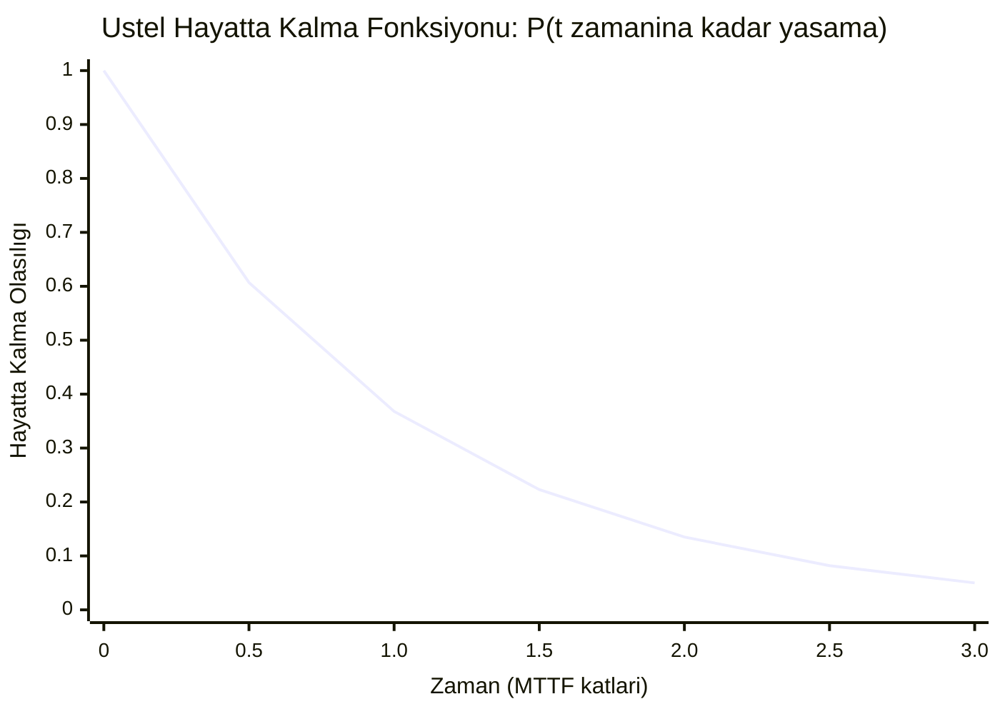
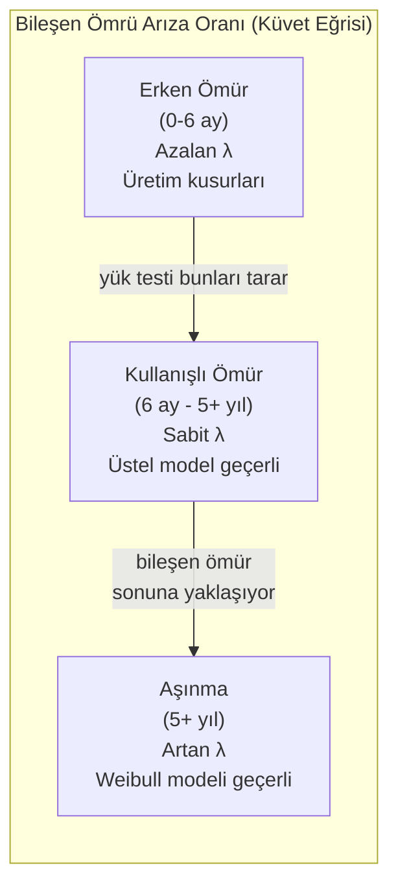
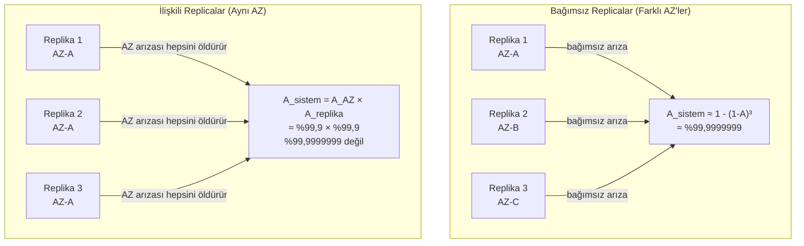
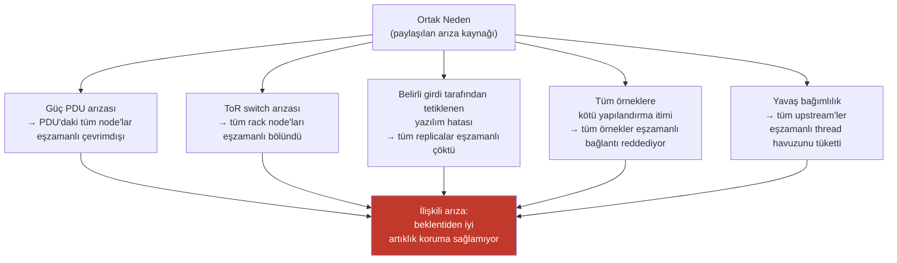
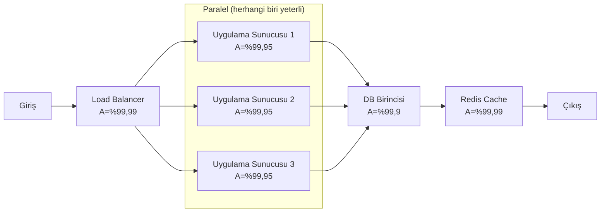

Şimdiye kadar ele alınan hata modelleri — crash-stop, crash-recovery, omission, Byzantine — **deterministiktir**: hangi tür arızaların meydana gelebileceğini ve doğru bir algoritmanın bunların varlığında hangi özellikleri koruması gerektiğini tanımlarlar. Arızaların *ne sıklıkla* meydana geldiği veya birden fazla bileşenin aynı anda başarısız olup olamayacağı hakkında hiçbir şey söylemezler. Algoritma doğruluk kanıtları için bu, soyutlamanın doğru düzeyidir. Kapasite planlaması, replikasyon faktörü kararları, SLO bütçelemesi ve altyapı maliyet optimizasyonu için tamamen yetersizdir.
 
**Olasılıksal hata modelleri**, arıza oranlarını, zaman içindeki arıza dağılımlarını ve farklı bileşenlerdeki arızalar arasındaki istatistiksel ilişkileri sayısallaştırarak deterministik modelleri tamamlar. Deterministik modellerin kasıtlı olarak yanıtsız bıraktığı soruları yanıtlarlar: bir parçanın üç replikasının tamamının aynı anda başarısız olma olasılığı nedir? Belirli bir mimari gerçekte kaç dokuzluk kullanılabilirlik sunar? 10.000 disk içeren bir kümede ilk disk arızasına kadar ne kadar süre geçer?
 
Bunlar akademik sorular değildir. Her replikasyon faktörü kararı, her SLO taahhüdü ve her kapasite rezervi örtük bir olasılıksal iddiadır. Bu iddiaları açık hale getirmek ve bunları doğru istatistiksel modellere dayandırmak, kullanılabilirlik hedeflerini karşılayan bir sistem tasarımı ile operatörlerini şaşırtacak biçimlerde başarısız olan bir sistem tasarımı arasındaki farktır.
 
## Üstel Dağılım: Belleksiz Bileşen
 
Donanım ve yazılım bileşeni arıza oranları için temel model **üstel dağılımdır**. `λ` (lambda) üstel arıza oranına (zaman birimi başına arıza) sahip bir bileşenin hayatta kalma fonksiyonu şöyledir:
 
```
P(bileşen t zamanına kadar hayatta kalır) = e^(-λt)
```
 
Üstel dağılımın benzersiz bir özelliği vardır: **belleksizlik**. Bir bileşenin gelecek saat içinde başarısız olma olasılığı, ne kadar süredir çalıştığından bağımsız olarak aynıdır. 10.000 saat çalışmış bir bileşen, yepyeni birinden daha fazla veya daha az başarısız olma olasılığına sahip değildir.
 
Bu, üstel dağılım için tüm zamanlarda sabit `λ` olan **arıza oranı** (tehlike fonksiyonu) ile yakalanır. Ortalama arıza süresi (MTTF) basitçe şöyledir:
 
```
MTTF = 1 / λ
```
 
1,5 milyon saatlik MTTF değerli bir sabit disk, `λ = 1 / 1.500.000 ≈ 6,67 × 10⁻⁷` arıza/saat değerine sahiptir. 10.000 bu tür diskten oluşan kümede:
 
```
Küme arıza oranı = 10.000 × λ = 10.000 / 1.500.000 ≈ 0,00667 arıza/saat
Kümede disk arızaları arasındaki beklenen süre = 1 / 0,00667 ≈ 150 saat ≈ 6,25 gün
```
 
Bu aritmetik, ölçekteki depolama sistemlerinin sürekli arka plan onarımı gerektirmesinin nedenidir: 10.000 sürücüyle, sürücü arızaları arasındaki beklenen aralık, her sürücünün ayrı ayrı mükemmel MTTF değerine bakılmaksızın bir haftadan azdır.
 

*Üstel hayatta kalma: t = MTTF zamanında, bileşenlerin yalnızca %36,8'i hâlâ çalışmaktadır — %50 değil. Yarı ömür 0,693 × MTTF'de gerçekleşir. 1 milyon saatlik MTTF değerli bir bileşenin 1 milyon saate ulaşmadan arıza yapma olasılığı %63,2'dir.*
 
Belleksizlik varsayımı, erken ömür arızaları (erken üretim kusurları) taranıp çıkarıldıktan ve aşınma başlamadan önce elektronik bileşenler için **kullanışlı ömür döneminde** doğrudur. Birikmiş aşınmanın arıza olasılığını artırdığı ömür sonu için daha az doğrudur — bu bölge Weibull dağılımıyla daha iyi tanımlanır.
 
### Küvet Eğrisi
 
Donanım bileşenlerinin ömürleri boyunca deneysel arıza oranı, üç fazlı karakteristik bir **küvet eğrisini** takip eder:
 
**Erken ömür fazı (azalan arıza oranı):** Üretim kusurları, lehim eklemi zayıflıkları ve erken dönem süreç değişkenlikleri, çalışmanın ilk haftalarından aylarına kadar yüksek arıza oranlarına neden olur. Kurumsal donanım satıcıları genellikle erken ömür arızalarını taramak amacıyla sevkiyat öncesinde bileşenleri yük testine tabi tutar.
 
**Kullanışlı ömür fazı (sabit arıza oranı):** Bileşen tasarlanmış çalışma rejiminde çalışır. Arızalar rasgeledir ve belleksizdir — üstel model burada geçerlidir.
 
**Aşınma fazı (artan arıza oranı):** Mekanik aşınma (dönen disk aktüatör yatakları, fan yatakları), iletken yollarındaki elektromigrasyon, kondansatör yaşlanması ve oksit bozunması arıza oranlarının artmasına neden olur. Program-silme (P/E) döngüsü cinsinden ölçülen SSD NAND flash aşınması, iyi karakterize edilmiş bir aşınma mekanizmasıdır: hücre başına 300 P/E döngüsü değerinde tüketici sınıfı TLC NAND SSD, bu limite yaklaştıkça artan düzeltilemez hata oranları gösterecektir.
 

*Küvet eğrisi: üstel (sabit arıza oranı) modeli yalnızca kullanışlı ömür fazında uygundur. Kurumsal yük testi, dağıtımdan önce erken ömür fazını ortadan kaldırır.*
 
## Weibull Dağılımı: Aşınmayı Modelleme
 
**Weibull dağılımı**, arıza oranının zaman içinde artıp artmadığını, sabit mi yoksa azalıp azalmadığını yakalayan bir `β` şekil parametresi ekleyerek üstel dağılımı genelleştirir:
 
```
Arıza oranı (tehlike fonksiyonu) h(t) = (β/η) × (t/η)^(β-1)
```
 
Burada `η` (eta) karakteristik ömür (ölçek parametresi) ve `β` (beta) şekil parametresidir:
 
- `β < 1`: Azalan arıza oranı (erken ömür fazı)
- `β = 1`: Sabit arıza oranı (üstel dağılıma indirgenir, kullanışlı ömür fazı)
- `β > 1`: Artan arıza oranı (aşınma fazı)
- `β ≈ 2-4`: Mekanik aşınma için tipik (yatak arızaları, aktüatör yorulması)
- `β ≈ 3-5`: SSD NAND aşınması, kondansatör yaşlanması için tipik
Kapasite planlaması amacıyla, Weibull modeli bilinen aşınma mekanizmaları olan bileşenlerde kullanılır — dönen disk sürücüsü yatakları, SSD P/E döngüsü limitleri, pil şarj kapasitesi bozunması ve fan yatak ömürleri, `β > 1`'in üstel modelden önemli ölçüde daha iyi arıza oranı öngörüleri sağladığı durumlardır.
 
```python
import numpy as np
from scipy.stats import weibull_min
 
def komponent_guvenilirlik_analizi(
    beta: float,      # Şekil parametresi
    eta: float,       # Ölçek parametresi (saatlerce karakteristik ömür)
    t: float          # Değerlendirme zamanı (saat)
) -> dict:
    """
    Weibull dağılımlı bileşen için temel güvenilirlik metriklerini hesaplar.
    
    beta=2.5, eta=40000 saat (4.6 yıl karakteristik ömür) diskli örnek için:
    - t=8760'ta hayatta kalma (1 yıl): ~%96,5
    - t=26280'de hayatta kalma (3 yıl): ~%73,4
    - t=43800'de hayatta kalma (5 yıl): ~%36,1
    """
    # Hayatta kalma fonksiyonu P(T > t)
    hayatta_kalma = np.exp(-(t / eta) ** beta)
 
    # Tehlike (t zamanındaki anlık arıza oranı)
    tehlike = (beta / eta) * (t / eta) ** (beta - 1)
 
    # Ortalama arıza süresi (Weibull MTTF)
    from scipy.special import gamma
    mttf = eta * gamma(1 + 1/beta)
 
    return {
        "hayatta_kalma_olasılığı": hayatta_kalma,
        "anlık_arıza_oranı_saat_başına": tehlike,
        "mttf_saat": mttf,
        "mttf_yıl": mttf / 8760,
    }
 
# Örnek: Aşınma özelliklerine sahip kurumsal SSD
ssd = komponent_guvenilirlik_analizi(beta=3.0, eta=50000, t=26280)
# 3 yıl sonra (26280 saat):
# hayatta kalma: ~%81,2, tehlike oranı yeni sürücüye göre artıyor
```
 
## Kullanılabilirlik: Doğru Çalışmanın Kararlı Durum Olasılığı
 
Tek bir bileşenin **kullanılabilirliği** `A`, doğru çalıştığı zamanın uzun vadeli kesridir:
 
```
A = MTTF / (MTTF + MTTR)
```
 
Burada MTTR **Ortalama Onarım Süresi** (Mean Time To Repair) olup bir arıza olayının ilk tespitinden tanı, onarım ve servise geri dönüşe kadar ortalama süresidir.
 
MTTF = 10.000 saat ve MTTR = 2 saat olan bir veritabanı birincisi için:
 
```
A = 10.000 / (10.000 + 2) = 0,9998 = %99,98 kullanılabilirlik
```
 
Bu mükemmel görünür; ta ki şunu düşünene kadar:
- %99,98 kullanılabilirlik, yılda 1,75 saat kesinti anlamına gelir.
- 100 tür birinciyle kümeleyerek, herhangi bir saatte kesinti yaşayan beklenen birincisi sayısı 100 × (1 - 0,9998) = 0,02 birincisi olur — yaklaşık her 50 saatte bir arıza veya küme genelinde yılda yaklaşık 175 arıza.
**Kesinti bütçesi** türetimi, kullanılabilirlik hedeflerini somut hale getirir:
 
| Kullanılabilirlik | Yıllık kesinti | Aylık kesinti |
|---|---|---|
| %99 ("iki dokuz") | 87,6 saat | 7,3 saat |
| %99,9 ("üç dokuz") | 8,76 saat | 43,8 dakika |
| %99,99 ("dört dokuz") | 52,6 dakika | 4,4 dakika |
| %99,999 ("beş dokuz") | 5,26 dakika | 26,3 saniye |
| %99,9999 ("altı dokuz") | 31,5 saniye | 2,6 saniye |
 
:::caution
Satıcı veri sayfalarındaki MTTF rakamları, kontrollü koşullar altında küçük örnekler üzerinde hızlandırılmış ömür testinden türetilir, ardından saha koşullarına ekstrapolasyon yapılır. Depolama cihazları için gerçek saha MTTF değeri, veri sayfası MTTF değerinden 2-5 kat farklılık gösterebilir; veri sayfası genellikle iyimserdir. Google'ın 2007 disk sürücüsü arıza çalışması (Pinheiro vd.), orta sıcaklıkta (30-45°C) çalışan sürücülerin üretici tarafından belirtilen AFR (Yıllık Arıza Oranı) rakamlarından 2-3 kat daha yüksek saha arıza oranlarına sahip olduğunu buldu. Kapasite planlaması, veri sayfaları değil operasyonel verilerden gerçek saha arıza oranlarını kullanmalıdır.
:::
 
## Kullanılabilirliğin Bileşimi: Seri ve Paralel Sistemler
 
Gerçek sistemler birden fazla bileşenden oluşur. Bağımsız bileşen kullanılabilirliklerinin nasıl birleştiği, sistemin hata toleransı mimarisine bağlıdır.
 
### Seri Sistemler (Tüm Bileşenler Gerekli)
 
Seri sistemde, sistemin çalışması için her bileşenin kullanılabilir olması gerekir. Herhangi bir bileşendeki kullanılamama, sistem kullanılamazlığına neden olur. Sistem kullanılabilirliği, bireysel kullanılabilirliklerinin çarpımıdır:
 
```
A_seri = A₁ × A₂ × A₃ × ... × Aₙ
```
 
Üç katmanlı sistem için (load balancer A=%99,99, uygulama sunucusu A=%99,95, veritabanı A=%99,9):
 
```
A_seri = 0,9999 × 0,9995 × 0,999 = 0,9984 = %99,84
```
 
En zayıf bileşen baskındır. Veritabanı sistemi %99,9 ile sınırlandırırken yüksek kullanılabilirlikli bir load balancer eklemek neredeyse hiç önem taşımaz.
 
### Paralel Sistemler (Artıklık)
 
Paralel sistemde, `n` yedekli bileşenden en az biri kullanılabilir olduğu sürece sistem kullanılabilirdir. Bağımsız arızalar varsayılarak:
 
```
A_paralel = 1 - (1 - A)ⁿ
```
 
Her biri A = %99,9 olan üç replika için:
 
```
A_paralel = 1 - (1 - 0,999)³ = 1 - (0,001)³ = 1 - 10⁻⁹ = %99,9999999
```
 
Bu sayı iki nedenden dolayı yanıltıcı biçimde iyimserdir.
 
**Bağımsızlık varsayımı neredeyse her zaman ihlal edilir.** Aynı güç dağıtım birimi, ağ switch'i, Kubernetes node havuzu veya bulut kullanılabilirlik bölgesini paylaşan replicalar bağımsız değildir — ortak arıza modlarını paylaşırlar. Bir replicayı öldüren güç kesintisi aynı rack'teki tüm replicaları öldürür. `1 - (1-A)ⁿ` formülü ortak nedenli arıza olmadığını varsayar; gerçeklik bunları bol miktarda içerir.
 
**MTTR sıfır değildir.** Formül, arızaların bağımsız ve tespiti ile onarımı anlık olduğunu varsayarak tüm replicaların rastgele bir anda eşzamanlı olarak kullanılamaz olma olasılığını hesaplar. Pratikte, ilk arızanın tespiti ile kurtarmanın tamamlanması arasındaki aralık sağlık kontrolü aralıklarını, otomatik failover gecikmelerini, yedek terfi süresini ve log yetişme süresini içerir. Bu MTTR penceresi süresince sistem azaltılmış artıklıkla çalışır — bu pencere sırasında ek bir tek arıza total kullanılamazlığa neden olur.
 

*Bağımsızlık varsayımı: farklı AZ'lerdeki replicalar bağımsızlık sağlar; aynı AZ'deki replicalar çarpım formülünü geçersiz kılan ilişkili arıza modunu paylaşır.*
 
## İlişkili Arızalar: Ölçekteki Baskın Risk
 
Pratikte, dağıtık sistemler için baskın kullanılabilirlik riski bağımsız bileşen arızası değil — **ilişkili arızadır**: birden fazla bileşenin aynı temel nedenden dolayı başarısız olması.
 
### Ortak Nedenli Arızalar
 
**Paylaşılan altyapı:** Güç dağıtım birimleri, soğutma sistemleri, ağ switch'leri ve rack üstü switch uplinkleri, arkasındaki tüm bileşenler için tek hata noktalarıdır. Rack düzeyinde güç kesintisi, o rack'teki tüm node'ları eşzamanlı olarak devre dışı bırakır. Bir ToR switch arızası rack'teki tüm node'ları eşzamanlı olarak izole eder.
 
**Yazılım hataları:** Belirli bir girdi üzerinde çöküşe neden olan veritabanı motoru, Kafka broker veya container runtime'daki bir hata, gerçekleşmeyi bekleyen ilişkili bir arızadır. Tüm replicalar aynı yazılım sürümünü çalıştırıyorsa ve hepsi aynı girdiyi alırsa, hepsi aynı anda çöker. Rolling deployment'lar güncellemeyi aşamalı hale getirerek bu riski azaltır; ancak canlı akıştaki bir veri örüntüsünün tetiklediği ilişkili çöküş, güncellemeyi almış tüm replicaları etkiler.
 
**Yapılandırma değişiklikleri:** Tüm örneklere eşzamanlı olarak itilen yanlış yapılandırılmış kaynak limiti, hatalı TLS sertifikası veya hatalı ağ politikası, ilişkili bir arızadır. Bu, büyük ölçekli kesintilerin en yaygın kaynağıdır: bireysel bileşen arızasına karşı koruma sağlayan artıklığı bozan, tüm bileşenlere eşzamanlı olarak uygulanan değişiklikler.
 
**Aşırı yük kaskadları:** Tek yavaş bağımlılığın tüm upstream servislerin thread havuzlarını eşzamanlı olarak tüketmesine neden olması ilişkili bir arızadır. Bağımlılığın yavaşlığı ortak nedendir; eşzamanlı tükenme ilişkili etkidir.
 

*Ortak nedenli arızalar bağımsız artıklığı bozar: arıza olasılığı bağımsız replika arıza olasılıklarının çarpımı değil, ortak nedenin olasılığıdır.*
 
### İlişkili Arızaları Modelleme: Beta-Binom Modeli
 
İlişkili arızalar için basit bir model, bağımsız arıza olasılığı `p`'yi, bir replika başarısız olduğunda diğer replicaların eşzamanlı olarak başarısız olma olasılığını yakalayan bir korelasyon parametresi `ρ` (rho) ile destekler.
 
Bağımsız arızalar altında, `n` replikadan `k`'sinin tamamının eşzamanlı başarısız olma olasılığı `p^k`'dır. `ρ` korelasyonlu arızalar altında:
 
```
P(k replicanın tamamı başarısız olur) ≈ ρ × p + (1 - ρ) × p^k
```
 
`ρ × p` terimi, ortak nedenli bir olayın tüm replicaları eşzamanlı başarısız kılma olasılığını temsil eder. Küçük `ρ = 0,01` ve bireysel replika arıza olasılığı `p = 0,001` için bile:
 
```
P(3 replicanın tamamı başarısız, bağımsız): 0,001³ = 10⁻⁹
P(3 replicanın tamamı başarısız, ρ=0,01): 0,01 × 0,001 + 0,99 × 0,001³
                                          = 0,00001 + ~0   ≈ 10⁻⁵
```
 
%1 korelasyon eklemek, toplam arıza olasılığını dört büyüklük mertebesi artırır. Pratik sonuç: **yüksek kullanılabilirliğe ulaşmak, yalnızca daha fazla replika eklemek değil, mimari izolasyon yoluyla korelasyonu minimize etmeyi gerektirir**.
 
## MTTF, MTTR ve Kurtarma Oranı
 
`A = MTTF / (MTTF + MTTR)` kullanılabilirlik formülü, hem MTTF hem de MTTR'nin tasarım değişkenleri olduğunu açıkça ortaya koyar. Çok yüksek kullanılabilirlik hedefleri için MTTR genellikle bağlayıcı kısıttır.
 
10.000 saatlik belirli bir MTTF ile %99,999 kullanılabilirlik (beş dokuz) hedefini ele alın:
 
```
0,99999 = 10.000 / (10.000 + MTTR)
10.000 + MTTR = 10.000 / 0,99999 = 10.000,1
MTTR = 0,1 saat = 6 dakika
```
 
**10.000 saatlik bileşen MTTF ile beş dokuzluk kullanılabilirlik hedefi, maksimum 6 dakikalık MTTR gerektirir.** Bu bir izleme ayarlama sorunu değil — mimari bir sorundur. Bileşenin ilk arızasından servisin tam restorasyonuna kadar altı dakika şunları gerektirir:
 
- Saniyenin altı hassasiyetle otomatik arıza tespiti (dakika değil, 1-5 saniyelik sağlık kontrolü aralıkları).
- İnsan müdahalesi olmaksızın otomatik failover (nöbetçi mühendis çağırmama).
- Terfide anında trafiğe hizmet verebilen önceden hazırlanmış standby örnekler.
- 2-3 dakikada tamamlanan replika yetişmesi (maksimum replikasyon gecikmesi ve WAL tekrar oynatma hızına kısıtlamalar getiriyor).
Bu nedenle beş dokuzluk sistemler neredeyse hiçbir zaman daha güvenilir bileşenlerin sonucu değildir — gereken bileşen arıza oranları ulaşılamaz derecede düşük olurdu. Bunlar kaçınılmaz olarak meydana gelen sık arızalardan hızlı otomatik kurtarmanın sonucudur.
 
```go
// Kullanılabilirlik modeli: belirli bir kullanılabilirlik hedefi için
// gereken MTTR'yi hesaplama
func gerekliMTTR(hedefKullanilabilirlik float64, mttfSaat float64) float64 {
    // A = MTTF / (MTTF + MTTR)'den:
    // MTTR = MTTF * (1/A - 1) = MTTF * (1 - A) / A
    return mttfSaat * (1 - hedefKullanilabilirlik) / hedefKullanilabilirlik
}
 
func kumeMTTF(bireyselMTTF float64, n int) float64 {
    // n özdeş bağımsız bileşenden oluşan kümede:
    // Küme MTTF = bireysel MTTF / n (ilk arıza 1/nλ'da beklenir)
    return bireyselMTTF / float64(n)
}
 
func main() {
    bireyselDiskMTTF := 1_500_000.0 // saat
    kumeBoyu := 10_000
 
    kumeIlkArizaMTTF := kumeMTTF(bireyselDiskMTTF, kumeBoyu)
    fmt.Printf("%d node'lu kümede disk arızaları arasındaki beklenen saat: %.1f (%.1f gün)\n",
        kumeBoyu, kumeIlkArizaMTTF, kumeIlkArizaMTTF/24)
 
    // Bu küme arıza oranıyla %99,99 kullanılabilirlik için gereken MTTR
    gerekliMTTRSaat := gerekliMTTR(0.9999, kumeIlkArizaMTTF)
    fmt.Printf("%%99.99 kullanılabilirlik için gereken MTTR: %.2f saat (%.0f dakika)\n",
        gerekliMTTRSaat, gerekliMTTRSaat*60)
    // Çıktı:
    // 10000 node'lu kümede disk arızaları arasındaki beklenen saat: 150.0 (6.3 gün)
    // %99.99 kullanılabilirlik için gereken MTTR: 0.02 saat (1 dakika)
}
```
 
## Güvenilirlik Blok Diyagramları ve Hata Ağaçları
 
Karışık seri ve paralel bileşenli karmaşık sistemler için **Güvenilirlik Blok Diyagramları (GBD)**, bileşen düzeyindeki kullanılabilirliklerden sistem kullanılabilirliğini hesaplamak için yapılandırılmış bir yöntem sağlar.
 
Bir GBD, sistemi şu şekilde bloklar (bileşenler) ağı olarak temsil eder:
- **Seri** bloklarda (sıralı yol) tüm bileşenler çalışmalıdır.
- **Paralel** bloklarda (yedekli yollar) herhangi biri yeterlidir.

*Güvenilirlik Blok Diyagramı: paralel uygulama sunucuları yüksek kullanılabilirliğe bileşenlenir; seri veritabanı birincisi sistemin kullanılabilirlik darboğazıdır.*
 
Bu GBD için:
```
A_uygulama_katmanı = 1 - (1 - 0,9995)³ = 1 - (0,0005)³ ≈ 1 - 1,25×10⁻¹⁰ ≈ %99,9999999
A_sistem = 0,9999 × 0,99999999 × 0,999 × 0,9999 ≈ 0,9988 = %99,88
```
 
%99,9'daki veritabanı birincisi baskındır ve kaç uygulama sunucusu eklenirse eklensin sistemi %99,88 ile sınırlandırır. Bu analiz doğru yatırımı gün yüzüne çıkarır: veritabanı kullanılabilirliğinin iyileştirilmesi (sıcak standby'a senkron replikasyon, aktif-aktif yapılandırma veya MTTR'yi azaltma) sistem kullanılabilirliğini, önceden yüksek kullanılabilirlikli bir katmana daha fazla uygulama sunucusu eklemekten çok daha fazla iyileştirir.
 
**Hata Ağacı Analizi (HAA)**, çift perspektif alır: istenmeyen üst düzey olaydan (sistem kullanılamazlığı) başlayarak onu neye yol açtığını belirlemek için VE/VEYA kapıları aracılığıyla geriye doğru çalışır. VE kapıları (üst olay için gereken tüm koşullar) seri bileşenlere karşılık gelir; VEYA kapıları (herhangi bir koşul yeterli) paralel bileşenlere karşılık gelir.
 
HAA özellikle **kesme kümeleri** tanımlamak için yararlıdır — sistem arızasına neden olan minimum bileşen arıza kümeleri. Tek elemanlı kesme kümesi tek hata noktasıdır. İki elemanlı kesme kümesi, kapasite planlamasında dikkate alınması gereken çift hata noktasıdır.
 
## Pratikte Olasılıksal Hata Modelleri: Replikasyon Faktörü Kararları
 
Dağıtık sistemlerde olasılıksal hata modellemesinin en doğrudan uygulaması, veri depolama için replikasyon faktörlerini seçmektir.
 
Soru şudur: `r` replikasının tamamının eşzamanlı olarak başarısız olma olasılığının belirli bir `p_max` eşiğinin altında olması için hangi `r` replikasyon faktörü gereklidir?
 
Replika başına yıllık arıza olasılığı `q` ile bağımsız arızalar altında:
 
```
P(W penceresi içinde r replicanın tamamı başarısız) ≈ q^r  (küçük q, kısa W için)
```
 
Replika başına yıllık arıza olasılığı q = 0,005 (%0,5 AFR) ile %99,999999999 (on bir dokuz veya on milyarda bir yıllık veri kaybı olasılığı) dayanıklılık hedefleyen depolama sistemi için:
 
```
0,005^r ≤ 10⁻¹¹
r × log(0,005) ≤ -11
r ≥ 11 / log(1/0,005) = 11 / 2,301 ≈ 4,78
```
 
Bağımsızlık varsayımı altında beş replika yeterlidir.
 
İlişkili arızaları hesaba katmak hesabı köklü biçimde değiştirir. Replicalar aynı veri merkezinde konumlandırılmışsa, yıllık `p_vm_arızası = 10⁻⁴` olasılıkla gerçekleşen veri merkezi düzeyindeki olay (güç kesintisi, yangın, soğutma arızası), replikasyon faktöründen bağımsız olarak tüm replicaları eşzamanlı başarısız kılar. `p_vm_arızası = 10⁻⁴` ile on bir dokuzluk dayanıklılık elde etmek için replicalar en az iki coğrafi olarak bağımsız veri merkezini kapsamalıdır:
 
```
P(veri kaybı) = P(her iki VD de W penceresi içinde başarısız olur) ≈ p_vd₁ × p_vd₂
              = 10⁻⁴ × 10⁻⁴ = 10⁻⁸
```
 
Hâlâ on bir dokuz değil. Üç bağımsız coğrafi konum:
```
P(veri kaybı) ≈ (10⁻⁴)³ = 10⁻¹² < 10⁻¹¹
```
 
Bu, dayanıklı depolama sistemleri için replicaları en az üç coğrafi olarak bağımsız arıza etki alanına dağıtma standart uygulamasının kantitatif temelidir.
 
:::note
Google Colossus, Amazon S3 ve Azure Blob Storage, uzun vadeli veri dayanıklılığı için basit replikasyon yerine silme kodlaması (Reed-Solomon veya benzeri) kullanır. `(n, k)` parametreli silme kodlaması, veriyi `k` veri parçacığı ve `n-k` eşlik parçacığı olarak depolar; `n` parçacıktan herhangi `k`'sı veriyi yeniden oluşturabilir. Bu, depolama yükü başına tam replikasyona kıyasla daha yüksek dayanıklılık sağlar. Örneğin RS(6,3) (6 veri + 3 eşlik parçacığı, herhangi 3 eşzamanlı parça kaybını tolere eder), 3× yerine 1,5× depolama yüküyle 3× replikasyona benzer veya daha iyi dayanıklılık elde eder.
:::
 
## Deterministik ve Olasılıksal Modeller Arasındaki İlişki
 
Deterministik ve olasılıksal hata modelleri rekabet eden çerçeveler değildir — farklı soyutlama düzeylerinde çalışır ve farklı soruları yanıtlarlar.
 
**Deterministik modeller** (crash-stop, omission, Byzantine) **doğruluk garantileri** oluşturur: bu en kötü durum arıza varsayımları altında algoritma doğru yanıt üretir. Sıklık hakkında hiçbir iddiada bulunmazlar.
 
**Olasılıksal modeller** **olasılık sınırları** oluşturur: gerçekçi arıza oranları ve korelasyonlar göz önüne alındığında, her arıza senaryosu ne kadar olasıdır ve zaman içinde beklenen sistem davranışı nedir?
 
Eksiksiz bir sistem analizi her ikisini gerektirir:
1. **Doğruluk analizi (deterministik):** `f` kadar bileşen arıza modeline göre başarısız olduğunda sistem doğru sonuçlar üretiyor mu? Yanıt hayırsa, olasılıktan bağımsız olarak algoritmayı düzeltin.
2. **Kullanılabilirlik analizi (olasılıksal):** Gerçek arıza oranları ve korelasyonlar göz önüne alındığında, sistem `f` veya daha fazla bileşenin başarısız olduğu duruma ne sıklıkla ulaşır? Bu, teorik hata toleransının nadiren mi yoksa sürekli mi kullanıldığını belirler.
Kombinasyon doğru mühendislik kararlarını verir: mükemmel BFT algoritma doğruluğuna sahip ama güç etki alanını paylaşan aynı yerde konumlandırılmış replicaları olan bir sistem, BFT garantilerini rutin olarak bozan ilişkili arızalar yaşar. Algoritma doğrudur; dağıtım yanlıştır.
 
| Soru | Model | Araç |
|---|---|---|
| f node Byzantine olduğunda algoritma yanlış sonuç üretebilir mi? | Deterministik | Byzantine anlaşma kanıtı |
| Bu kümede gerçekte f veya daha fazla node ne sıklıkla başarısız olur? | Olasılıksal | MTTF/kullanılabilirlik hesaplamaları |
| Toplam veri kaybı olasılığı nedir? | Olasılıksal | Replikasyon faktörü + korelasyon analizi |
| 3× replikasyon dayanıklılık SLA'mız için yeterli mi? | Olasılıksal | Dayanıklılık olasılığı hesabı |
| Uzlaşma algoritmamız bölünme sırasında güvenliği koruyor mu? | Deterministik | Güvenlik kanıtı (CAP/Raft değişmezleri) |
| Bu ağda bölünme ne kadar sürmesi muhtemel? | Olasılıksal | Ağ güvenilirliği istatistikleri |
 
Bağımsız olasılıksal arızaların retry fırtınaları ve kaynak tüketimi yoluyla ilişkili kesintilere nasıl yükseltildiği için bkz. [Hata Yayılımı: Kaskad Hata Analizi](/distributed-systems/tr/foundations/system-models/cascading-failure/).
Bu dayanıklılık olasılığı hesaplamalarının belirli replikasyon topolojisi kararlarına nasıl çevrildiği için bkz. [Replikasyon Stratejileri](/distributed-systems/tr/data-management/replication/).