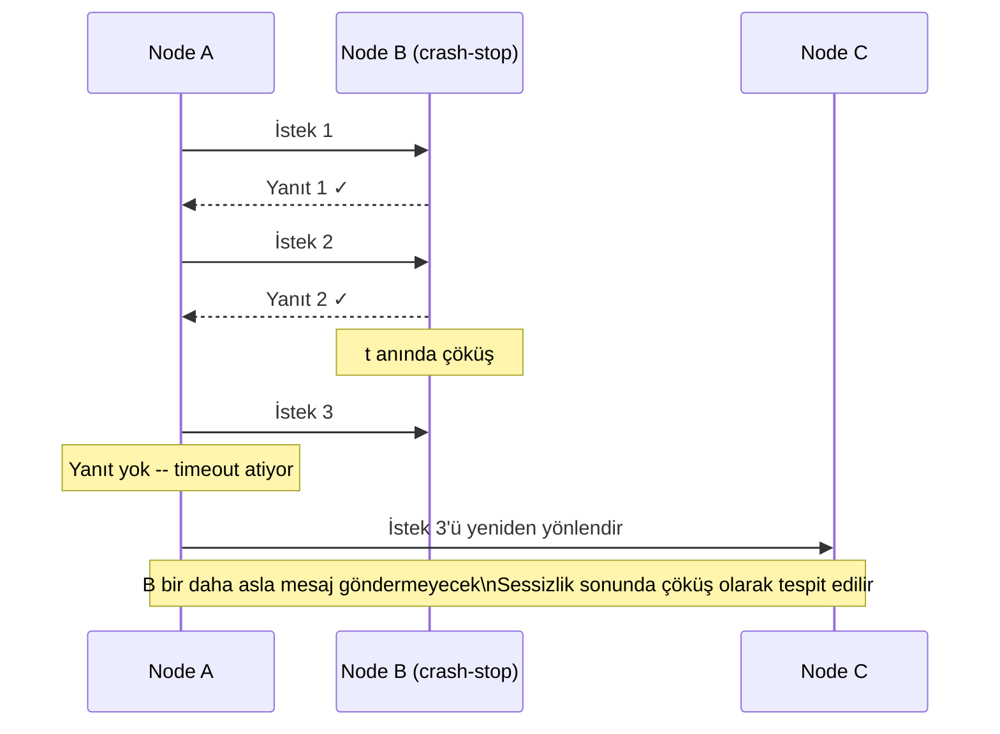
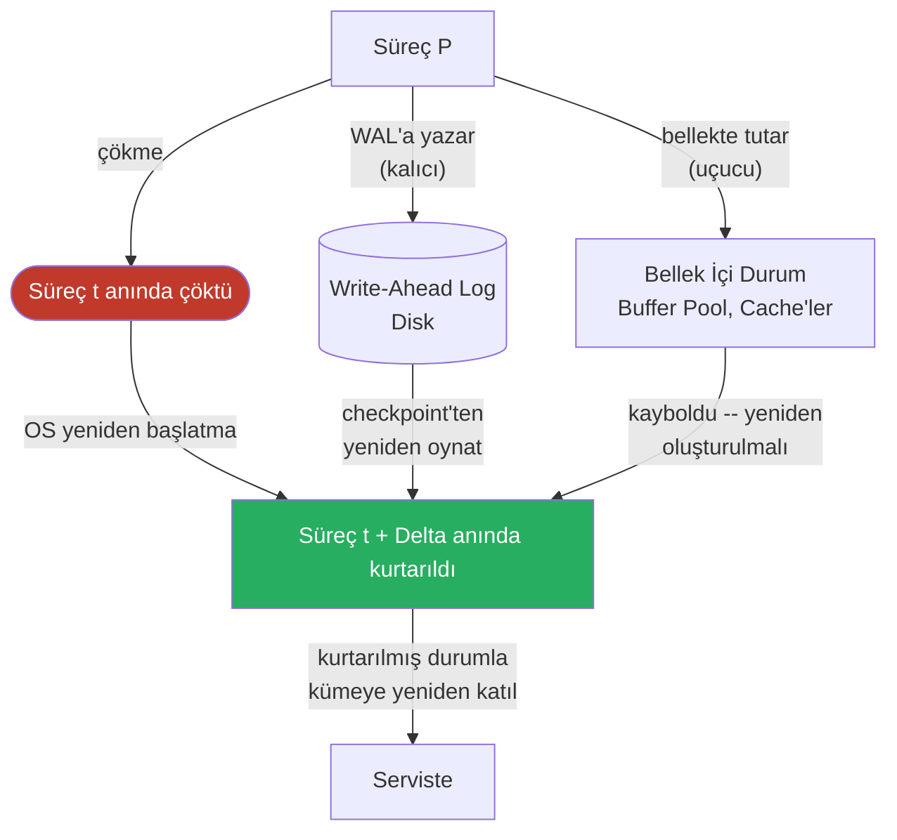
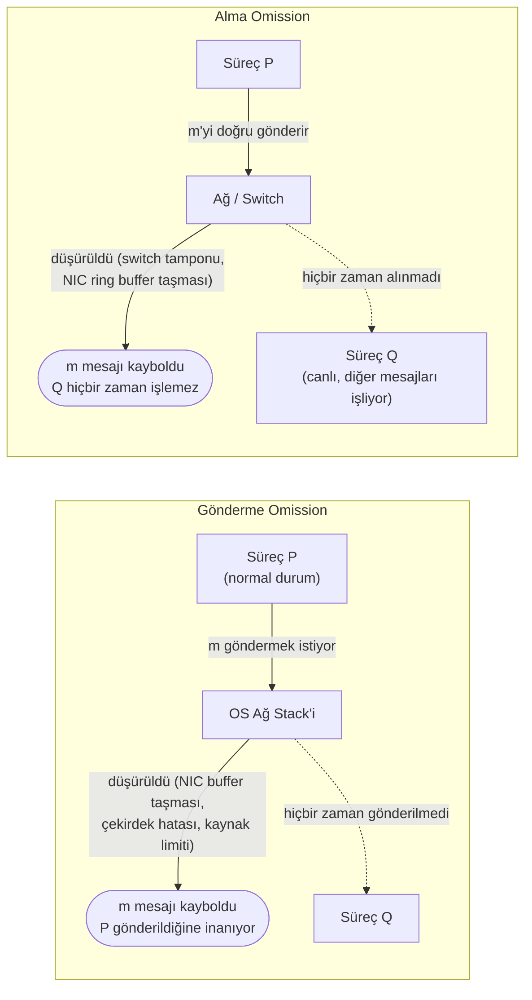
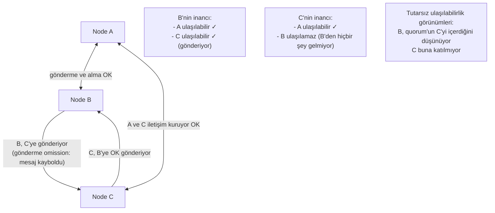
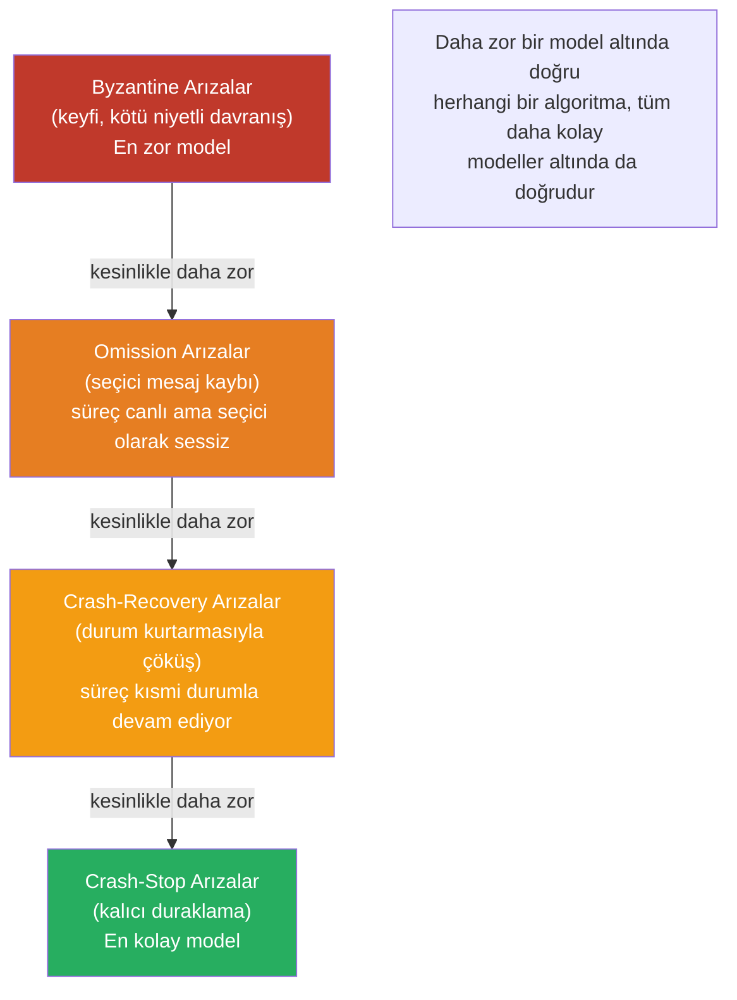

Dağıtık sistemler sürekli başarısız olur; ancak tüm arızalar eşdeğer değildir. Kalıcı olarak duran bir süreç, kısmi bellekle durup yeniden başlayan bir süreçten temelden farklı bir zorluk sunar; her ikisi de yürütmeye devam ederken mesajları seçici biçimde düşüren bir süreçten ayrılır. Bu ayrımlar sınıflandırma pedantrizmi değildir — bir sistemin tolere ettiği hata modeli, kullanılabilir algoritmaları, garanti edebileceği güvenlik özelliklerini ve arıza gerçekleştiğinde gerekli operasyonel yanıtı belirler.
 
Hata modelleri, varsayımlarının gücüne göre katı bir hiyerarşi oluşturur. Daha zayıf varsayımlar (tolere edilen daha fazla hata modu) daha karmaşık algoritmalar gerektirir ve daha güçlü gerçek dünya garantileri sağlar. Daha güçlü varsayımlar (tolere edilen daha az hata modu) daha basit algoritmaları mümkün kılar; ancak gerçeklik varsayımı ihlal ettiğinde çökerler. En yıkıcı üretim olayları tam bu sınırda gerçekleşir: daha basit hata modeli için tasarlanmış sistemler, daha zor bir modele ait arızayla karşılaştığında.
 
## Crash-Stop (Fail-Stop) Arızaları
 
**Crash-stop** modeli, **fail-stop** olarak da adlandırılır ve en basit ve en iyi huylu hata modelidir. Bu modeldeki bir süreç:
 
1. Belirli bir `t` anına kadar doğru çalışır.
2. `t` anında kalıcı olarak yürütmeyi durdurur — artık mesaj gönderilmez, artık durum geçişi gerçekleşmez.
3. Diğer süreçler çöküşü *sonunda* tespit edebilir (yeterli kalitede bir arıza dedektörü yardımıyla).
Tanımlayıcı özellik, kalıcılık ile tamamlılığın birleşimidir: bir süreç durduğunda asla yeniden başlamaz ve sessizliği sonunda yavaş bir süreçten ayırt edilebilir hale gelir (yeterli kalitede bir arıza dedektörü verildiğinde).
 

*Crash-stop davranışı: çöküş anına kadar normal çalışma; çöküşten sonra kısmi veya tutarsız yanıt olmaksızın kalıcı sessizlik.*
 
### Crash-Stop Altında Algoritmik Özellikler
 
Crash-stop modeli, algoritma tasarımcıları için çekicidir; çünkü bir belirsizlik sınıfını tümüyle ortadan kaldırır: çökmüş bir süreç asla yanlış mesaj göndermez. Gelen herhangi bir mesaj özgün ve doğrudur — endişe yalnızca eksik mesajlar hakkındadır, hatalı biçimlendirilmiş veya çelişkili olanlar hakkında değil.
 
Mükemmel bir arıza dedektörüyle (◇P) crash-stop altında **uzlaşma**, `f` çökme arızasını tolere eden `f+1` süreçle çözülebilir. En basit analizinde Paxos algoritması crash-stop semantiğini varsayar: hazırlama aşamasında bir acceptor'dan yanıt almayı durduran önerici, o acceptor'un çöktüğüne güvenle karar verebilir ve onu dışlayan bir quorum ile ilerleyebilir.
 
Crash-stop altında **güvenilir yayın**, tüm doğru süreçlere iletimi sağlamak için yalnızca `n` toplam süreçten `f+1` doğru süreç gerektirir. Standart **Eager Reliable Broadcast** protokolü, çökmüş kaynaklardan gelen mesajları yeniden iletir: bir süreç `p` kaynağından `m` mesajını ilk kez aldığında, `m`'yi herkese yeniden yayınlar. Bu, crash-stop altında işe yarar; çünkü çökmüş bir süreç kısmen tutarlı mesaj kümesi asla göndermez — ya çöküşten önce tam mesajı gönderdi ya da hiçbir şey göndermedi.
 
### İdealleştirme Sorunu
 
Crash-stop, gerçek sistemlerin yaklaştığı ama asla tam olarak karşılamadığı bir idealleştirmedir.
 
Bir süreç her zaman temiz biçimde çökmez. Şu durumlar gerçekleşebilir:
- Sokete yazarken çöküp, alıcının protokol durumunu bozan kısmi mesaj gönderir.
- Dağıtılmış kilit tutarken çöküp, bağımlı süreçlerin kilit zaman aşımına ulaşana kadar bloke olmasına neden olur.
- Disk yazımı ortasında çöküp, kalıcı durumu tutarsız ara formda bırakır.
- OS'unun soket temizliği kapsamında aktif bağlantılara TCP RST gönderebilmesi — bu, fail-stop davranışına daha yakındır.
Crash-stop'un "kalıcı" yönü de pratikte sıklıkla ihlal edilir. OS bellek yetersizliği nedeniyle öldürülen bir süreç, bir süreç denetçisi tarafından (systemd, Kubernetes) otomatik olarak yeniden başlatılabilir. Dağıtık algoritmanın bakış açısından, crash-stop arızası olarak görünen şey aslında kısa bir kurtarma penceresiyle crash-recovery arızasıdır. Algoritma çöken sürecin kalıcı olarak gittiği varsayımıyla kararlar aldıysa, bu kararlar yanlış olabilir.
 
:::caution
Kubernetes `Deployment` yeniden başlatmaları — çökmüş pod'un aynı servis kimliğine ama temiz duruma sahip yeni bir pod ile değiştirildiği — dağıtık sisteme crash-stop değil crash-recovery arızası olarak görünür. Çökmüş bir katılımcının asla geri dönmediğini varsayan algoritmalar bunu hesaba katmalıdır: Raft'ta yeniden başlayan node, quorum kararlarına katılmadan önce log'unu eşlerinden yeniden oynatmalıdır. ZooKeeper'da yeniden başlayan sunucu, ensemble'a yeniden katılmadan önce liderden veri ağacını senkronize etmelidir.
:::
 
## Crash-Recovery (Fail-Recovery) Arızaları
 
**Crash-recovery** modeli kalıcılık varsayımını gevşetir: bir süreç çökebilir ve sonra yürütmeye devam edebilir. Sürdürme şu noktadan başlayabilir:
 
- **Kalıcı durum**: çöküşten önce kalıcı depolamaya (disk, NVMe, uzak depolama) yazılan veriler kurtarma sırasında kullanılabilir.
- **Uçucu durum**: yalnızca bellekte tutulan veriler çöküş sınırında kaybolur.
Bu tek ayrım — çöküşten ne sağ çıkar — crash-recovery algoritmalarının tüm tasarımını belirler. Kalıcı yazmalar pahalıdır (fsync, write-ahead log, senkron replikasyon); soru, hangi yazmaların kalıcı olması gerektiği ve hangilerinin güvenle uçucu kalabileceğidir.
 

*Crash-recovery: kalıcı durum çöküş sınırını atlatır ve kurtarma sırasında yeniden oynatılır; uçucu durum yetkili kaynaklardan yeniden oluşturulmalıdır.*
 
### Kalıcı Olması Gerekenler
 
Crash-recovery tasarımındaki temel soru, **sistemin kaybetmeyi göze alamadığı şeyin** ne olduğudur. Yanıt, sistem bileşenlerini farklı kalıcılık katmanlarına böler:
 
**Katman 1 — Herhangi bir çöküşten koşulsuz kurtarmalı:**
- İstemcilere teyit edilmiş işlem log girişleri
- Devam eden işlemler için write-ahead log kayıtları
- Küme üyeliği ve yapılandırma durumu
- Lider seçimi dönem/terim numaraları (Raft'ın `currentTerm`'i, Paxos oy numaraları)
Raft'ın `currentTerm`'i çöküşte kaybolursa, yeniden başlayan node çoktan geçersiz hale gelmiş eski bir liderden gelen oy isteğini kabul edebilir — tek lider garantisini ihlal eder. Bu nedenle Raft, `currentTerm`, `votedFor` ve `log[]`'un kararlı (kalıcı) depolamada tutulmasını ve herhangi bir RPC'ye yanıt vermeden önce senkronize edilmesini gerektirir.
 
**Katman 2 — Kalıcı ama daha yüksek maliyetle yeniden oluşturulabilir:**
- Veritabanı sayfa önbelleği içerikleri (diskten yeniden oluşturulabilir ama yavaşça)
- İkincil indeks yapıları (birincil depolamadan yeniden oluşturulabilir)
- Sorgu sonucu cache'leri (yeniden hesaplanabilir)
**Katman 3 — Uçucu, kaybı kabul edilebilir:**
- Uçuştaki istek tamponları
- Bağlantı durumu
- Yalnızca performans için kullanılan önceden hesaplanmış toplamlar
```go
// Raft kalıcı durumu: herhangi bir RPC'ye yanıt vermeden önce
// Raft makale spesifikasyonuna göre kararlı depolamaya yazılmalıdır
type RaftPersistentState struct {
    CurrentTerm int64  // Görülen en son terim (monoton artan)
    VotedFor    *int64 // Mevcut terimde oy verilen adayın ID'si (yoksa nil)
    Log         []LogEntry // Log girişleri; her giriş komut + terim içerir
}
 
func (r *Raft) persist() error {
    // Bu fonksiyon dönmeden önce kalıcı bir yazma tamamlanmalıdır.
    // Verilerin kararlı depolamaya ulaşmasını sağlamak için fsync veya eşdeğeri kullanılır.
    state := RaftPersistentState{
        CurrentTerm: r.currentTerm,
        VotedFor:    r.votedFor,
        Log:         r.log,
    }
    data, err := encodeState(state)
    if err != nil {
        return fmt.Errorf("kalıcı durum kodlama: %w", err)
    }
    // WAL'a yaz, ardından fsync -- yalnızca write() değil
    if err := r.storage.WriteAndSync(data); err != nil {
        return fmt.Errorf("raft durumu kalıcı hale getirme: %w", err)
    }
    return nil
}
 
// RequestVote veya AppendEntries'e yanıt vermeden önce çağrılır
func (r *Raft) handleRequestVote(args RequestVoteArgs) (RequestVoteReply, error) {
    r.mu.Lock()
    defer r.mu.Unlock()
 
    // ... oy mantığı ...
 
    // Yanıt vermeden önce kalıcı hale getir -- bu sıralamayı ihlal etmek güvenliği bozar
    if err := r.persist(); err != nil {
        return RequestVoteReply{}, err
    }
    return reply, nil
}
```
 
### Kurtarma Protokolü Gereksinimleri
 
Crash-recovery altında algoritmalar, crash-stop altında ortaya çıkmayan üç farklı senaryoyu ele almalıdır:
 
**Kurtarmada eski durum.** Bir süreç, çöküş anındaki dünyayı yansıtan kalıcı durumla kurtarılır. Dünya o zamandan beri ilerlemiştir: diğer node'lar kararlar almış, log girişleri taahhüt edilmiş, küme üyeliği değişmiş olabilir. Kurtarılan süreç, quorum operasyonlarına güvenle katılabilmek için yetişmek zorundadır.
 
Raft'ta, kurtarılan bir follower mevcut liderden yetişmek için normal `AppendEntries` RPC'sini kullanır. Lider, follower'ın ayrıştığı noktadan log girişleri gönderir. Follower, taahhüt edilmiş tüm girişleri alıp uygulamamışsa oy kullanamaz veya okuma yapamaz.
 
**Zombi süreçler.** Çöken ve hızlıca kurtarılan bir süreç, diğer node'ların onu kalıcı olarak gitmiş varsayarak çoktan harekete geçtiğini görebilir — yeni lider seçilmiş, ISR'dan çıkarılmış, dağıtılmış kilidi sona erdirilmiş olabilir. Kurtarılan süreç, geçersiz kılındığını kabul etmeli ve önceki çöküş öncesi otoritesiyle hareket etmek yerine mevcut küme durumuna uymalıdır.
 
Standart mekanizma **dönem/nesil numaralandırmasıdır**: her yeni liderlik terimi, küme dönemi veya kilit nesli, monoton artan bir sayı taşır. `n` dönemiyle kurtarılan ve `n+3` döneminde çalışan kümeyi bulan bir süreç, üç durum geçişini kaçırdığını ve hareket etmek yerine yeniden senkronize olması gerektiğini bilir.
 
**Hafıza saldırıları.** Özellikle tehlikeli bir senaryo, bir sürecin dahili olarak tutarlı ama mevcut küme uzlaşmasına karşı hareket etmesine neden olabilecek güncel olmayan kalıcı durumla kurtarılmasıdır. Örneğin: 5. terimde `votedFor = Node A` olarak kaydeden, ardından Node B'nin seçimi kazandığını ve 5. ve 6. terimlerde girişleri taahhüt ettiğini öğrenmeden çöken bir Raft node'u. Kurtarmada, node doğru biçimde 5. terimde A'ya oy verdiğini bilir — ama küme 7. terime geçmiştir. Node hatalı olarak 5. terimde A'ya tekrar oy verebileceğini sonuçlandırırsa, Raft'ın güvenlik değişmezini ihlal edebilir.
 
Raft bunu terim numaraları aracılığıyla ele alır: herhangi bir RPC'yi kendi teriminden yüksek bir terimle alan node, terimini anında bu değere günceller ve follower durumuna geçer. Kalıcı `currentTerm`, bu kontrolün kurtarma sonrası doğru biçimde gerçekleştirilmesini sağlar.
 
### Pratikte Crash-Recovery: PostgreSQL ve fsync
 
PostgreSQL'in çöküş kurtarma protokolü, crash-recovery semantiğinin kanonik gerçek dünya uygulamasıdır. Write-Ahead Log (WAL), her taahhüt edilmiş işlemin, taahhüt teyidi istemciye gönderilmeden önce kalıcı olarak kaydedilmesini sağlar.
 
```sql
-- Dayanıklılık için PostgreSQL WAL yapılandırması
-- Bu ayarlar çöküş-kurtarma garantisini belirler
 
-- synchronous_commit: WAL'ın ne zaman temizleneceğini kontrol eder
-- 'on' (varsayılan): commit ACK'den önce WAL diske temizlenir -- tam çöküş güvenliği
-- 'local': WAL yerel olarak temizlenir ama senkron replikalara değil -- yerel çöküş güvenli
-- 'off': WAL tamponlanır -- çöküşte veri kaybı riski, ~3x yazma verimi kazancı
SET synchronous_commit = on;
 
-- wal_sync_method: WAL temizlemelerinin nasıl uygulandığı
-- 'fdatasync' veya 'fsync': OS düzeyinde dayanıklılık garantisi
-- 'open_datasync': doğrudan I/O -- OS tampon önbelleğini atlar
SHOW wal_sync_method;
 
-- checkpoint_completion_target: checkpoint aralığının kesri
-- checkpoint I/O'sunu yaymak için kullanılır, fsync spike gecikmesini azaltır
SET checkpoint_completion_target = 0.9;
```
 
2018 PostgreSQL `fsync` veri kaybı hatası, crash-recovery semantiğini ihlal etmenin sonucunu gösterdi: bazı Linux çekirdek sürümlerinde, başarısız `fsync` çağrısı başarı döndürürken WAL tamponunu sonraki yazmaların kurtaramayacağı bir durumda bıraktı. PostgreSQL'in `fsync` başarı döndürmesinin kalıcı yazma anlamına geldiği varsayımı ihlal edildi ve kurtarma sırasında veri bozulmasına yol açtı. Ders: crash-recovery garantileri, depolama katmanının gerçek dayanıklılık semantiği kadar güçlüdür.
 
## Omission (Atlama) Arızaları
 
**Omission hata modeli** farklı bir hata sınıfını kapsar: canlı ve aksi halde doğru olan, ancak bazı mesajları gönderme veya alma başarısız olan bir süreç. Omission arızaları, süreç yürütmeye devam ettiği için crash-stop arızalarından kesinlikle daha zordur — sessiz değil, seçici olarak sessizdir.
 
İki alt türü vardır:
 
**Gönderme omission:** Bir süreç göndermesi gereken bir mesajı göndermeyi başaramaz. Süreç normal biçimde geçiş yapar ve mesajı gönderdiğine inanır, ancak mesaj hiçbir zaman çıkmaz (ağ stack'inde, NIC tamponunda veya açık uygulama mantığı tarafından düşürülür).
 
**Alma omission:** Bir süreç kendisine gönderilen bir mesajı almayı başaramaz. Mesaj doğru biçimde iletilmiş, ancak sürecin uygulama katmanının işleyebilmesinden önce düşürülmüştür (bir switch tamponunda, NIC ring buffer'ında veya OS soket alma kuyruğunda kaybolmuştur).
 

*Gönderme omission: gönderici gönderdiğine inanır ama mesaj hiçbir zaman iletilmedi. Alma omission: mesaj iletildi ama hedef süreç tarafından hiçbir zaman alınmadı.*
 
### Omission'ın Crash-Stop'tan Neden Daha Zor Olduğu
 
Crash-stop altında, mesaj göndermeyi durduran bir süreç çökmüştür. Sessizliği güvenilir bir sinyaldir. Omission arızaları altında sessizlik belirsizdir: yanıt vermeyen bir süreç geçici olarak gönderemez durumda olabilir (gönderme omission), isteği almamış olabilir (alma omission) veya gerçekten çökmüş olabilir. Dışarıdan, açık yoklama olmaksızın bunlar ayırt edilemez.
 
Üstelik **omission arızaları süreçler arasında asimetrik olabilir**. Node A, Node B ile başarıyla mesaj alışverişi yapabilirken, Node C, Node B'nin onlara gönderdiğine inandığı halde Node B'den mesaj alamıyor olabilir. Bu, kimin nereye ulaşılabilir olduğuna dair tutarsız görünümler yaratır; bu tam olarak split-brain'i tehlikeli kılan koşuldur: çoğunlukta olduğuna inanan node'lar aslında olmayabilir.
 

*Asimetrik gönderme omission: B, C'ye ulaşabildiğine inanıyor; C, B'den hiçbir şey alamıyor. Farklı node'lar tutarsız ulaşılabilirlik görünümlerine sahip.*
 
### Omission ve İki Generalin Problemi
 
**İki Generalin Problemi** (Lamport, 1978), omission arızalarının dağıtık koordinasyona koyduğu temel sınırı gösterir. İki ordu bir saldırıyı koordine etmelidir: yalnızca iletilip iletilmeyeceği belli olmayan mesajlarla iletişim kurabilirler. Problem şunu kanıtlar: **herhangi bir mesaj kaybolabiliyorsa hiçbir protokol her iki ordunun aynı anda saldırmayı kabul etmesini garanti edemez**.
 
Kanıt tümevarımla yapılır: herhangi bir protokol sonlu bir mesaj dizisinden oluşur. Son mesaj kritikse (son onay), kaybolabilir — bu nedenle gönderici ona güvenemez. Ama o zaman sondan ikinci mesaj son onay haline gelir ve aynı argüman geçerli olur. Gerileme ilk mesaja kadar devam eder ve hiçbir deterministik protokolün keyfi mesaj kaybı altında anlaşmayı garanti edemeyeceğini kanıtlar.
 
İki Generalin Problemi yalnızca merak konusu değildir. Dağıtık sistemlerde tam olarak bir kez iletimin ek kısıtlamalar olmaksızın neden imkânsız olduğunun nedenidir. **En fazla bir kez** ve **en az bir kez** iletim ikisi de elde edilebilir; **tam olarak bir kez** ya güvenilir bir kanal (omission modelini ortadan kaldırır) ya da yinelenen iletimleri güvenli kılan uygulama düzeyinde idempotency gerektirir.
 
### Gerçek Sistemlerde Omission Arızaları
 
Omission arızaları köşe durumları değildir — ölçekteki üretim sistemlerinde günlük gerçeklerdir.
 
**NIC ring buffer taşmaları**, donanım düzeyinde gönderme ve alma omission arızalarıdır. Doymuş alma tamponu paketleri sessizce atar; süreç hiçbir zaman onların geldiğini öğrenmez. `ethtool -S <arayüz>` aracılığıyla `rx_missed_errors` ve `rx_fifo_errors` izlemek tek görünürlük yolunu sağlar.
 
**TCP soket gönderme tamponu doygunluğu**, uygulama düzeyinde gönderme omission'a neden olur. Çekirdeğin TCP gönderme tamponu dolu olduğunda (uzak alıcının penceresi kapalı veya bağlantı doymuş olduğu için), `write()` çağrısı bloke olur veya `EAGAIN` döndürür. Bunu doğru biçimde ele almayan uygulama — `write()` başarısının mesajın gönderildiği anlamına geldiğini varsayarak — uygulama düzeyinde gönderme omission yaşıyor demektir.
 
**`max.poll.interval.ms` aşılan Kafka tüketici gecikmesi** belirli bir omission örüntüsü üretir: partition tutan ama mesajları işlemekte çok yavaş olan tüketici, consumer group'tan çıkarılır. Broker'ın bakış açısından, tüketici heartbeat göndermeyi durdurdu — görünürde crash-stop. Tüketicinin bakış açısından, mesajları işliyordu ve hiçbir zaman kasıtlı olarak tüketmeyi durdurmadı. Partition'ın mesajları, tüketici yeniden katılana kadar o tüketicinin işlemesinden atlanır.
 
```java
// Kafka tüketicilerinde uygulama düzeyinde omission arızalarına karşı koruma:
// poll timeout aşımı ve yeniden dengeleme olaylarının açık biçimde ele alınması
 
consumer.subscribe(List.of("orders"), new ConsumerRebalanceListener() {
    @Override
    public void onPartitionsRevoked(Collection<TopicPartition> partitions) {
        // Kritik: partition yeniden atanmadan önce offset'leri senkron olarak taahhüt et.
        // Burada taahhüt etmemek yeniden işlemeye yol açar (en az bir kez), atlamaya değil.
        // Ama eski offset'leri taahhüt etmek sonraki mesajların atlanmasına neden olur.
        try {
            consumer.commitSync(currentOffsets);
        } catch (CommitFailedException e) {
            log.error("Yeniden dengeleme sırasında taahhüt başarısız -- mesajlar yeniden işlenebilir", e);
        }
    }
 
    @Override
    public void onPartitionsAssigned(Collection<TopicPartition> partitions) {
        // Yeni atanan partition'lar için işleme durumunu sıfırla
        partitions.forEach(tp -> currentOffsets.put(tp, 
            new OffsetAndMetadata(consumer.position(tp))));
    }
});
 
while (running) {
    // max.poll.interval.ms, çıkarılmadan önce poll'lar arasındaki süreyi kontrol eder
    // Bunu en kötü durum işleme sürenizi rahatça aşacak şekilde ayarlayın
    ConsumerRecords<String, String> records = consumer.poll(Duration.ofMillis(500));
    
    for (ConsumerRecord<String, String> record : records) {
        try {
            processRecord(record);
            currentOffsets.put(
                new TopicPartition(record.topic(), record.partition()),
                new OffsetAndMetadata(record.offset() + 1)
            );
        } catch (Exception e) {
            // Karar verin: bu kaydı atlayın (omission) mu, yeniden deneyin mi?
            // Sonsuza kadar yeniden denemek tüketici gecikmesinin büyümesine ve
            // nihayetinde çıkarılmaya neden olur.
            // DLQ'ya atlamak görünürlükle kasıtlı bir omission'dır.
            deadLetterQueue.send(record, e);
            log.error("İşleme başarısızlığından sonra kayıt DLQ'ya gönderildi", e);
        }
    }
}
```
 
### Kanal Omission ile Süreç Omission Karşılaştırması
 
Kesin bir sınıflandırma, omission arızalarının gerçekleştiği iki düzeyi ayırt eder:
 
**Kanal omission (ağ düzeyinde omission):** Mesajlar, doğru çalışan süreçler arasında aktarım sırasında kaybolur. Süreçlerin kendileri doğru biçimde yürütüyor; aralarındaki ağ yolu mesajları düşürüyor. TCP, onaylama ve yeniden iletim aracılığıyla kanal omission'ı ortadan kaldırır — güvenilmez IP katmanı üzerinde güvenilir sıralı iletim sağlar. UDP sağlamaz.
 
**Süreç omission:** Bir süreç mesajı alır ama işlemeyi başaramaz (alma omission) ya da işler ama yanıtı göndermeyi başaramaz (gönderme omission). Bu, TCP tarafından düzeltilemez; çünkü mesaj sürece ulaştı — omission süreç sınırı içinde gerçekleşti.
 
Kanal omission için tasarlanmış algoritmalar (güvenilir kanalları ama potansiyel olarak hatalı süreçleri varsayarak), süreç omission için algoritmalara göre kesinlikle daha basittir. Dağıtık sistemler literatüründeki çoğu uzlaşma algoritması **güvenilir kanalları** varsayar (aktarım sırasında mesaj kaybı yok) ve arızayı yalnızca süreç düzeyinde modeller. Pratikte TCP, güvenilmez ağ üzerinde bu güvenilir kanal soyutlamasını sağlar.
 
## Hata Modeli Hiyerarşisi
 
Bu üç model katı bir kapsama hiyerarşisi oluşturur. Omission arızalarını tolere eden bir algoritma aynı zamanda crash-stop arızalarını da ele alır (çökmüş bir süreç tüm gelecek mesajları basitçe atlar). Crash-recovery arızalarını ele alan bir algoritma crash-stop arızalarını da ele alır (asla kurtarılmayan bir süreç yalnızca sonsuz kurtarma süresiyle crash-stop'tur).
 

*Hata modeli hiyerarşisi: daha zor hata modelleri için tasarlanmış algoritmalar daha kolay olanlar altında doğru çalışır; tersi geçerli değildir.*
 
### Doğru Modeli Seçmek
 
Bir sistem için doğru hata modeli, sistemin ortamının gerçekçi biçimde üretebileceği *en zor* hata modudur. Ortamın sergileyebileceğinden daha zayıf bir model için tasarım yapmak, normal koşullar altında doğru ve tasarımlanmadığı arıza koşulları altında felaket biçimde yanlış olan bir sistem üretir.
 
| Sistem | Karşılaşılan hata modeli | Neden |
|---|---|---|
| Tek makineli süreç denetçisi (systemd) | Crash-stop | OS düzeyinde süreç ölümü; denetçi yeniden başlatmaları yeni süreçler olarak modellenir |
| WAL'lı veritabanı (PostgreSQL, MySQL InnoDB) | Crash-recovery | WAL, yeniden başlatma sonrası durum kurtarmayı sağlar; süreç kimliği devam eder |
| Kubernetes pod iş yükü | Crash-recovery | Pod yeniden başlatmaları kimliği geri yükler (StatefulSet) veya yeni kimlik yaratır (Deployment) |
| Mesaj kuyruğu tüketicisi | Omission | Tüketici canlı ama mesajları teyit edemeyebilir (yavaş tüketici çıkarma) |
| Ağ bölünmesi senaryosu | Omission | Her iki taraf da canlı; aralarındaki mesajlar kaybolmuş |
| Donanım DRAM bit çevrilmesi | Byzantine | Süreç çökmesi olmaksızın veri bozulması — yanlış sonuçlarda görünür |
| Ağdaki kötü niyetli aktör | Byzantine | Kasıtlı mesaj değişikliği, tekrar, veya seçici yönlendirme |
 
Hata modeli ayrıca **gereken minimum artıklığı** belirler. Crash-stop arızaları altında `f+1` replika, `f` arızayı tolere eder — `n` node'dan çoğunluk (quorum) olan `⌊n/2⌋ + 1`, uzlaşma için yeterlidir. Byzantine arızalar altında `f` arızayı tolere etmek için `3f+1` replika gerekir — üçte iki üst çoğunluk. Byzantine arızalarla karşılaşan bir sistem için crash-stop modelini seçmek, yalnızca doğru replikalların yarısının anlaşmasını gerektiren bir sistem ortaya çıkarır; bu da Byzantine aktörün dengeyi bozmasına izin verir.
 
:::danger
Paylaşılan kiracılık ortamında (genel bulut, çok kiracılı Kubernetes) çalışan, finansal işlemleri ele alan veya harici güvenilmez kaynaklardan veri işleyen dağıtık sistemler için crash-stop arıza semantiğini asla varsaymayın. DRAM'deki donanım bit çevrilmeleri, emtia donanımında saatte bit başına 10⁻⁷ oranında gerçekleşir — büyük bir dağıtık sistemde kritik bir veriyi aylar içinde bozacak kadar. NIC firmware hataları, sanallaştırma hypervisor hataları ve ağ ekipmanı firmware hataları, hiçbir crash-stop tasarımlı algoritmanın doğru ele almadığı omission veya Byzantine düzeyinde arızalar üretebilir.
:::
 
## Operasyonel Eşleme: Modelden Uyarıya
 
Her bileşenin hangi hata modelini sergileyebileceğini anlamak, doğrudan gözlemlenebilirlik ve uyarı stratejisini bilgilendirir.
 
**Crash-stop göstergeleri:**
- Süreç çıkış kodu (sıfır dışı veya sinyal sonlandırmalı)
- Sağlık kontrolü endpoint'i yanıt vermeyi durduruyor
- Heartbeat timeout'u `failure_timeout`'u aşıyor
- Log akışı aniden sona eriyor
**Crash-recovery göstergeleri:**
- Süreç yeniden başlatma sayacı artıyor (`kubectl describe pod`, `RESTARTS > 0` gösteriyor)
- Uygulama başlangıç log girişleri oturum ortasında görünüyor
- Bellek içi sayaç metrikleri sıfıra sıfırlanıyor (Prometheus sayaç sıfırlaması gösteriyor)
- Replikasyon gecikmesi artıyor ardından kurtarıyor (node log'dan yetişiyor)
**Omission arıza göstergeleri:**
- Monoton artan `rx_missed_errors` veya `rx_fifo_errors` (NIC düzeyinde omission)
- İstek başarı oranı, karşılık gelen hata oranı artışı olmaksızın düşüyor (istekler alınıyor ama yanıtlar sessizce düşürülüyor)
- Tüketici çökmesi olmaksızın tüketici gecikmesi büyüyor (Kafka omission örüntüsü)
- Circuit breaker belirli bir downstream'de açık duruma geçiyor (o hedefe gönderme omission)
- Nominal olarak iletişim kuran iki node arasında saat kayması (heartbeat'ler geliyor ama veri mesajları gelmiyor — asimetrik omission)
Byzantine arızalar için bkz. [Bizans Hataları: Kötü Niyetli veya Bozuk Aktörler](/distributed-systems/tr/foundations/system-models/byzantine-faults/).
Zamanlama modelinin hata modeliyle nasıl etkileşime girdiği için bkz. [Ağ Modelleri: Senkron, Asenkron ve Kısmen Senkron](/distributed-systems/tr/foundations/system-models/network-models/).
Bu modellerin gerçek kapasite planlamasında kullanılan olasılıksal arıza analizine uzantısı için bkz. [Deterministik ve Olasılıksal Hata Modelleri](/distributed-systems/tr/foundations/system-models/deterministic-vs-probabilistic/).