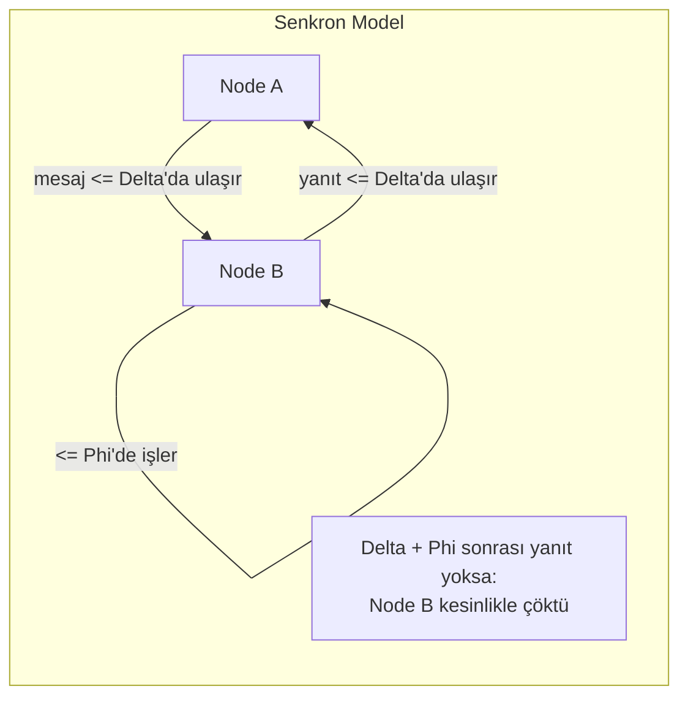
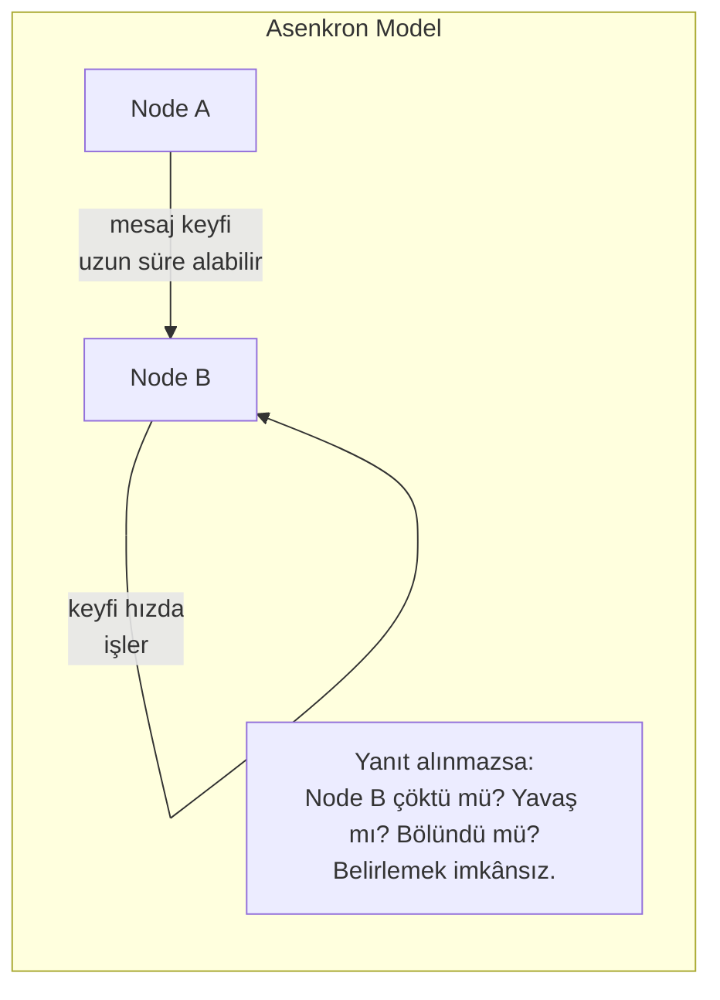
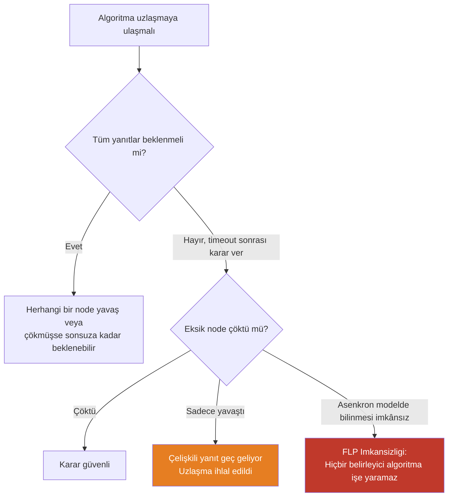
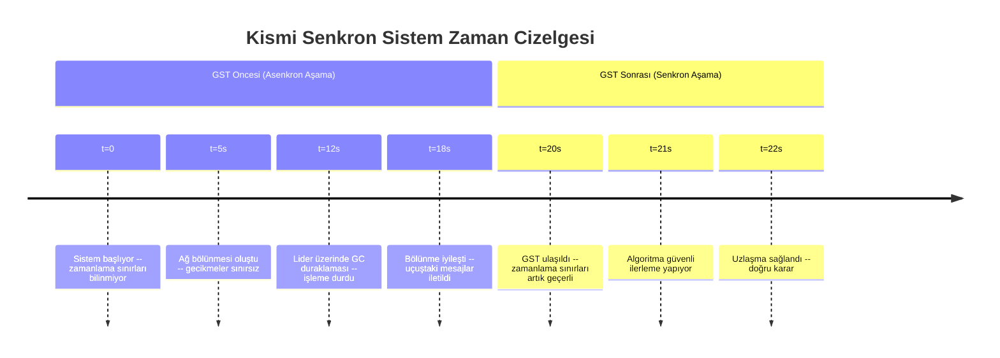
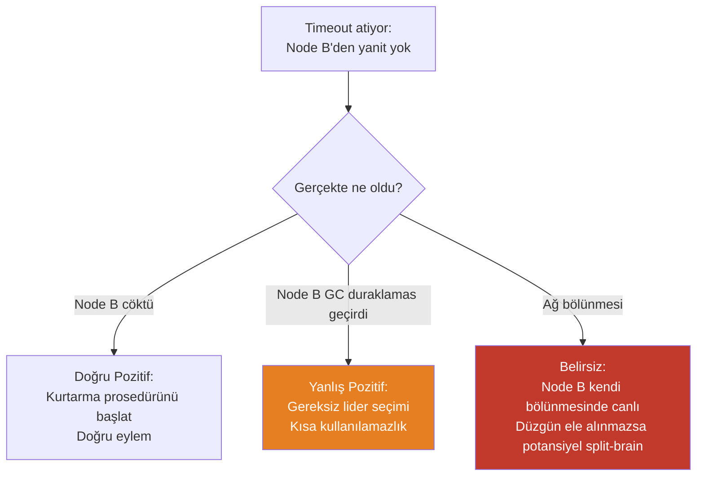
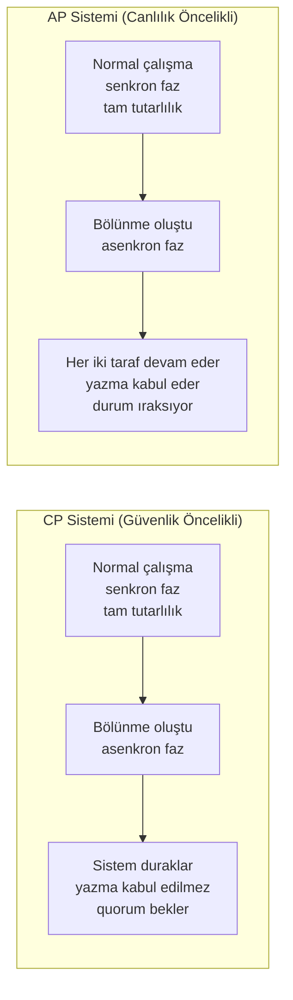

Her dağıtık algoritma zaman hakkında varsayımlar yapar. Bir mesaj ne kadar sürede ulaşabilir? Bir işlemci adımları ne kadar hızlı yürütür? Yavaş bir node'u ölü olandan ayırt edebilir miyiz? Bu soruların yanıtları yalnızca teorik kaygılar değildir — hangi algoritmaların doğru olduğunu, hangi güvenlik özelliklerinin erişilebilir olduğunu ve bir sistemin hangi hata modlarını tolere etmesi gerektiğini belirlerler. Üç ağ zamanlama modeli — **senkron**, **asenkron** ve **kısmen senkron** — bu soruların yanıtlandığı resmi çerçevedir.
 
Bu modeller belirli donanım veya protokollerin açıklamaları değildir. Bir sistem tasarımcısının güvenebileceği *en kötü durum* garantilerini tanımlayan soyutlamalardır. Bunları anlamak; neden uzlaşmanın (consensus) zor olduğunu, neden timeout'ların güvenilmez arıza dedektörleri olduğunu ve neden gerçek dağıtık sistemlerin teorik uçlar arasındaki rahatsız edici orta zeminde yer aldığını anlamanın ön koşuludur.
 
## Senkron Model
 
**Senkron modelde**, sistemin her bileşeni bilinen ve sınırlı süre içinde çalışır:
 
- Mesaj iletimi bilinen bir maksimum gecikme `Δ` (delta) içinde garanti edilir.
- Her işlem, algoritmasının her adımını bilinen bir maksimum süre `Φ` (fi) içinde yürütür.
- Node'lar arasındaki saat kayması bilinen bir sabit `ε` (epsilon) ile sınırlıdır.
Bu varsayımlar altında sistem **küresel zamansal tutarlılığa** sahiptir: `Δ + Φ` süresi içinde bir eşten haber almayan bir işlem, o eşin yalnızca yavaş olmadığını değil kesinlikle çöktüğünü çıkarabilir. Timeout'lar güvenilir arıza dedektörlerine dönüşür. Lider seçimi, uzlaşma ve dağıtık koordinasyon, daha zayıf modellerde imkânsız olan biçimlerde algoritmik olarak çözülebilir hale gelir.
 

*Senkron modelde, bilinen bir timeout sonrasındaki sessizlik belirsizlik değil kesin arıza kanıtıdır.*
 
Senkron model güçlü algoritmalar sağlar. `f` Byzantine hatayı `f+1` mesaj alışveriş turuyla tolere eden **Dolev-Strong Byzantine broadcast** algoritması senkroniye dayanır: her tur `Δ` içinde tamamlanır, dolayısıyla `f+1` tur toplamda `(f+1)Δ`'da tamamlanır. Sınırlı gecikme varsayımı olmadan algoritma, eksik bir mesajın yavaş bir node mu yoksa çökmüş bir node mu gösterdiğini belirleyemediğinden güvenli biçimde bir sonraki tura geçemez.
 
**Sorun:** Hiçbir gerçek ağ senkron modelin varsayımlarını karşılamaz. Paket gecikmeleri pratikte sınırsızdır — bir GC duraklaması, bir çekirdek sayfa hatası, bir switch buffer taşması veya bir TCP yeniden iletiminin her biri herhangi bir sabit `Δ`'yı aşan gecikmelere neden olabilir. Senkron model, algoritma analizi ve özelleşmiş donanım sistemleri (gerçek zamanlı gömülü sistemler, InfiniBand'li bazı HPC ortamları) için kullanışlıdır; ancak internet tabanlı dağıtık sistemleri tanımlamaz.
 
## Asenkron Model
 
**Asenkron model** tam zıt uçtur: hiçbir zamanlama varsayımı yapmaz.
 
- Mesajlar iletilmesi için keyfi uzun süre alabilir ama sonunda iletilir (mesaj kaybı yoktur).
- İşlemler keyfi hızlarda yürütülebilir.
- Zaman veya saat kavramı yoktur — yalnızca olayların sırası önemlidir.
Bu, mümkün olan en güçlü düşmanca modeldir. Asenkroni altında doğru olan bir algoritma, daha zayıf herhangi bir modelde (senkron veya kısmen senkron) de doğrudur. Bu, asenkron modeli teorik açıdan çekici kılar.
 

*Asenkron modelde sessizlik hiçbir bilgi taşımaz: yanıt vermeyen bir node çökmüş, hesaplıyor ya da yıllar sonra ulaşacak bir mesaj iletiyor olabilir.*
 
Asenkron model, dağıtık sistemler teorisindeki en önemli imkânsızlık sonucunu üretir.
 
### FLP İmkânsızlık Sonucu
 
1985'te Fischer, Lynch ve Paterson **FLP İmkânsızlığını** kanıtladı: tam asenkron bir sistemde, yalnızca tek bir olası çökme arızasıyla bile tek bir değer üzerinde anlaşmayı (uzlaşma) sağlayan belirleyici bir algoritma yoktur.
 
Kanıtın temel içgörüsü incedir. Asenkron bir sistemde, bir işlem çökmüş bir eşi yavaş bir eşten ayırt edemez. Timeout'tan sonra karar veren herhangi bir algoritma yanlış karar veriyor olabilir — "çökmüş" eş hâlâ hesaplıyor olabilir ve çelişkili bir yanıt iletebilir. Algoritma güvenli olmak için daha uzun beklerse, bir düşman hesaplamayı algoritmanın asla sonlanmamasını sağlayacak biçimde yavaşlatabilir. Hiçbir sabit bekleme stratejisi işe yaramaz; sonlu sürede uzlaşmaya ulaşılmasını engelleyen bir yürütme planı her zaman vardır.
 

*FLP ikilemi: tam asenkron modelde hiçbir bekleme stratejisi güvenli biçimde çökmeyi yavaşlıktan ayırt edemez; bu, belirleyici uzlaşmayı imkânsız kılar.*
 
FLP yalnızca akademik bir sonuç değildir. Her pratik uzlaşma algoritmasının — Paxos, Raft, Zab, PBFT — saf asenkron modelin ötesine geçen zamanlama varsayımlarına dayanmasının nedeni budur. Raft lider seçimi timeout'ları kullanır. Paxos tur zamanlayıcıları kullanır. Multi-Paxos heartbeat'ler kullanır. Bunların tümü, aksi halde tam asenkron olan bir sisteme kısmi senkroni enjekte etme mekanizmalarıdır.
 
FLP ayrıca **rastlantısal uzlaşma algoritmalarının** (Ben-Or'un algoritması ve türevleri gibi) imkânsızlıktan neden kaçınabildiğini açıklar: belirleyicilikten fedakârlık yaparlar. Bozuk para atarak, düşmanın en kötü durum yürütme planı oluşturma becerisini kırarlar. Ancak rastlantısal algoritmalar kendi karmaşıklıklarını getirir — mutlak garantiler yerine olasılıksal garantiler ve en kötü durum sınırları yerine beklenen süre sınırları.
 
:::note
FLP, *belirleyici* uzlaşmanın saf asenkroni altında tek bir çökme arızasıyla bile imkânsız olduğunu kanıtlar. Rastlantısallaştırmayla uzlaşmanın imkânsız olduğunu söylemez; zamanlama varsayımlarının yeterince uzun süre geçerli olduğu sistemler için de geçerli değildir. Pratik çıkarım "uzlaşma imkânsızdır" değil "uzlaşma ya zamanlama varsayımları ya da rastlantısallaştırma gerektirir — ve üretim sistemleri zamanlamayı kullanır."
:::
 
## Kısmen Senkron Model
 
1988'de Dwork, Lynch ve Stockmeyer (DLS) tarafından resmileştirilen **kısmen senkron model**, üretim ağlarının gerçekliğini yakalar: zamanlama sınırları var, ancak her zaman bilinmiyorlar ve her zaman geçerli olmuyorlar.
 
DLS iki özel varyant tanımladı:
 
**DLS Model 1 (Bilinmeyen sınırlar, her zaman geçerli):** Mesaj iletimi ve işlem hızı üzerinde sabit sınırlar `Δ` ve `Φ` vardır, ancak algoritma tasarımcısı bu sınırların ne olduğunu bilmez. Sistem senkrondur, ancak algoritma belirli bir `Δ` değerine güvenemez. Bu, *herhangi bir* zamanlama için çalışan algoritmalar gerektirir; uygun değerleri çalışma sürecinde keşfeder.
 
**DLS Model 2 (Bilinen sınırlar, sonunda geçerli olur):** `Δ` ve `Φ` sınırları bilinir, ancak yalnızca bilinmeyen bir **Küresel Stabilizasyon Zamanından (GST)** sonra geçerli olur. GST öncesinde sistem asenkron davranır — gecikmeler keyfi olabilir. GST sonrasında zamanlama sınırları geçerli olur ve uzlaşma sağlanabilir. Algoritma GST'nin ne zaman gerçekleştiğini bilemez, ancak her zaman güvenli (yanlış karar yok) ve GST sonrasında canlı (sonunda ilerleme) olmalıdır.
 
GST modeli en pratik açıdan kullanışlı resmileştirmedir: arıza olayları, ağ tıkanıklığı veya GC duraklamaları sırasında zaman zaman sınırsız gecikmeler yaşayan ancak çoğunlukla senkron davranan gerçek ağların deneyimini yakalar.
 

*GST modeli: güvenlik asenkron GST öncesi aşama boyunca geçerli olmalıdır; canlılık yalnızca GST'ye ulaşıldıktan sonra garanti edilir.*
 
### Üretim İçin Doğru Modelin Kısmi Senkroni Olmasının Nedeni
 
Gerçek dağıtık sistemler her zaman senkron davranmaz ve her zaman asenkron davranmaz. Salınım yaparlar:
 
- **Çoğu zaman:** mesajlar on ila yüzlerce milisaniye içinde ulaşır. İşleme hızla tamamlanır. Sistem kabaca senkron davranır.
- **Zaman zaman:** GC duraklaması bir işlemi 200ms-10s dondurur. Bir switch buffer taşması paket kaybının patlamasına neden olur. Bir ağ yeniden yapılandırması 30 saniyelik yüksek gecikmeye neden olur. Bu dönemlerde sistem asenkron davranır.
- **Nadiren:** bir ağ bölünmesi dakikalar ila saatler süren uzatılmış asenkron faz oluşturur.
Kısmi senkroni altında dağıtık algoritmalar için tasarım sözleşmesi şudur:
 
- **Güvenlik** (yanlış karar yok, veri bozulması yok, tutarlılık ihlali yok) koşulsuz geçerli olmalıdır — asenkron fazlar dahil.
- **Canlılık** (sonunda ilerleme kaydetmek, sonunda lider seçmek, sonunda işlem taahhüt etmek) yalnızca sistem kararlı senkron bir faza döndüğünde garanti edilir.
Bu tam olarak Raft ve Paxos'un karşıladığı sözleşmedir. Raft'ın güvenlik özellikleri (aynı dönemde iki lider yok, taahhüt edilen log girişleri asla üzerine yazılmaz) ağ bölünmeleri sırasında bile geçerlidir. Canlılık özellikleri (sonunda lider seçilir, log girişleri sonunda taahhüt edilir) yalnızca ağ heartbeat'lerin güvenilir biçimde ulaşması için yeterince kararlı olduğunda geçerlidir.
 
## Algoritma Tasarımı için Sonuçlar
 
Zamanlama modelinin seçimi, dağıtık algoritmalar için tasarım uzayını belirler. Sonuçlar somuttur ve her üretim uzlaşma sisteminde görünürdür.
 
### Yetersiz Arıza Dedektörleri Olarak Timeout'lar
 
Senkron bir sistemde timeout'lar mükemmel arıza dedektörleridir: `Δ + Φ` sonrasındaki timeout, çökmüş bir node'u kesin olarak tanımlar. Kısmen senkron bir sistemde timeout'lar, yanlış pozitifler (asenkron faz sırasında canlı node'u ölü ilan etmek) ve yanlış negatifler (çökmüş ancak ölümü henüz `Δ`'yı aşmadığı için tespit edilmemiş node) üreten **güvenilmez arıza dedektörleridir**.
 
Pratik sonuç: her üretim dağıtık sistemi yanlış arıza tespitlerini tolere etmek için tasarlanmalıdır. Liderinin öldüğüne yanlışlıkla inanan Raft kümesi seçim yapacak ve yeni bir lider seçilirken potansiyel kısa bir kullanılamazlık penceresi oluşacaktır. Bu yanlış tespit GC duraklaması sırasında gerçekleşirse, "ölü" lider kurtarılıp yerinde yeni bir lider bulabilir — Raft'ın bayat lider mesajlarını reddetmek için dönem numaraları kullanarak doğru biçimde ele aldığı bir durum.
 

*Kısmi senkroni altında timeout yorumlama: aynı timeout olayı üç farklı anlama gelebilir; bunlardan yalnızca biri beklenen senaryodur.*
 
### Timeout Kalibrasyon Dengeleri
 
Dağıtık sistemdeki timeout değerleri, yanlış pozitif hızı ile tespit gecikmesi arasında temel bir dengedir:
 
| Timeout çok kısa | Timeout çok uzun |
|---|---|
| GC duraklamaları, yavaş node'larda yanlış pozitifler | Gerçek arızalar için uzun tespit süresi |
| Gereksiz lider seçimleri ve yeniden yapılandırma | Gerçek bölünmeler sırasında uzatılmış kullanılamazlık |
| Yük altında seçim fırtınaları | Çökme kurtarması için büyük veri kaybı penceresi |
| Sık yeniden seçimlerden yüksek mesajlaşma yükü | Uygulamalar uzun timeout bekleme dönemleri yaşar |
 
**Pratik kalibrasyon:** etcd gibi sistemler için standart başlangıç noktası `heartbeat_interval = 150ms`, `election_timeout = 750ms-1500ms` (heartbeat aralığının 5-10 katı) şeklindedir. Bu, ~500ms'ye kadar GC duraklamalarını yanlış pozitif olmadan tolere edecek şekilde ayarlanmıştır; gerçek arızaları ise ~1-2 saniye içinde tespit eder. Daha sıkı kullanılabilirlik gereksinimleri olan uygulamalar daha sıkı timeout'lar kullanır ve daha yüksek yanlış pozitif oranlarını kabul eder — bu da durum makinelerinin anlık lider seçimlerini doğru biçimde işlemesini gerektirir.
 
### Asenkroni Altında Güvenlik ve Canlılık
 
CAP teoremi genellikle bölünmeler sırasında tutarlılık ve kullanılabilirlik arasındaki denge olarak tanımlanır. Zamanlama modelleri açısından bakıldığında daha kesin biçimde asenkroni altındaki güvenlik/canlılık dengesidir:
 
- **CP sistemleri** (güçlü tutarlılık modunda Cassandra, etcd, ZooKeeper), güvenliği önceliklendirir. Asenkron faz (bölünme) sırasında, yanlış karar verme riskini almak yerine (güvenliği ihlal eder) ilerlemeyi durdururlar (canlılığı ihlal eder). Senkroninin geri dönmesini beklerler.
- **AP sistemleri** (eventual consistency modunda Cassandra, eventual okumalarla DynamoDB), canlılığı önceliklendirir. Bölünme sırasında, potansiyel güvenlik ihlalleri pahasına ilerlemeyi sürdürürler (okuma ve yazmaları kabul ederler). Asenkroni sırasında yanlış karar verme riskini kabul ederler.
Hiçbir yaklaşım evrensel olarak doğru değildir. Seçim, "yanlış karar"ın belirli uygulama için ne anlama geldiğine bağlıdır: hesap bakiyesi tutarsızlığı (güvenlik kritik, CP kullanın) veya kısa süre bayat olabilecek görüntülenme sayacı (güvenlik gevşetilmiş, AP kabul edilebilir).
 

*Ağ bölünmesi altında CP ve AP: zamanlama modeli, asenkron faz sırasında hangi özelliğin feda edileceğini belirler.*
 
## Her Model Altında Uzlaşma Hiyerarşisi
 
Üç zamanlama modeli, hesapsal olarak neyin elde edilebileceğine dair katı bir hiyerarşi tanımlar:
 
| Problem | Senkron | Asenkron | Kısmen Senkron |
|---|---|---|---|
| **Güvenilir yayın (broadcast)** | Elde edilebilir | Elde edilebilir | Elde edilebilir |
| **Lider seçimi** | Elde edilebilir | İmkânsız (FLP varyantı) | GST sonrası elde edilebilir |
| **Uzlaşma (çökme arızaları)** | Elde edilebilir | İmkânsız (FLP) | GST sonrası elde edilebilir |
| **Uzlaşma (Byzantine arızalar)** | Elde edilebilir (`3f+1` node gerekir) | İmkânsız | GST sonrası elde edilebilir (`3f+1` node gerekir) |
| **Toplam sıra yayını** | Elde edilebilir | Uzlaşmaya eşdeğer → imkânsız | GST sonrası elde edilebilir |
| **Atomik commit (2PC)** | Elde edilebilir | Koordinatör çökmesinde bloke olur | Timeout tabanlı kurtarmayla elde edilebilir |
 
**Uzlaşma** ile **toplam sıra yayını** (Atomic Broadcast) arasındaki eşdeğerlik temel bir sonuçtur: birini çözen herhangi bir algoritma diğerini çözmek için dönüştürülebilir. Bu nedenle serileştirilebilir işlemler gerektiren dağıtık veritabanları ve log sıralaması gerektiren dağıtık sistemler temelde bir tür uzlaşma gerektirir — ve bunların tümü çalışmak için kısmi senkroni gerektirir.
 
## Pratik Kısmi Senkroni: Üretim Sistemlerinin Varsayımları
 
Hiçbir üretim dağıtık sistemi hangi DLS varyantı altında çalıştığını açıkça belirtmez. Ancak tasarım kararları varsayımları örtük biçimde kodlar.
 
**Raft**, kısmi senkroniyi (DLS Model 2) varsayar. Seçim timeout'ları "zamanlama sınırları sonunda geçerli olur" varsayımını uygular: ağ timeout'ların hiçbir zaman geçerli olmayacağı kadar kararsızsa, Raft asla kararlı bir lider seçemez (canlılık başarısız olur). Ama çelişen iki taahhüt edilmiş log girişi asla üretmez (güvenlik geçerlidir).
 
**Apache Kafka'nın ISR (In-Sync Replica) mekanizması**, replikasyon protokolü için kısmi senkroniyi varsayar. `replica.lag.time.max.ms`'den (varsayılan: 30 saniye) fazla geriye düşen replika ISR'dan çıkarılır — GC duraklamaları veya geçici gecikme artışları sırasında yanlış pozitifler üreten timeout tabanlı arıza tespiti, gereksiz ISR küçülmesine ve ardından yeniden genişlemeye neden olur.
 
**Google Spanner**, daha agresif bir zamanlama varsayımı yapar: bilinen, sınırlı belirsizlik aralığı `[t-ε, t+ε]` olan GPS senkronize saatlere dayanan TrueTime'ı kullanır. Belirsizlik aralığını hesaba katan zaman damgalarıyla işlemleri taahhüt ederek Spanner, kısmi senkroni sorununu yüksek güvenle çözebileceği bir forma dönüştürür. Bu tam senkroni değildir — sınırlar olasılıksaldır ve GPS kesintileri sırasında ihlal edilebilir — ama standart kısmen senkron modelden daha sıkıdır.
 
```go
// Kısmi senkroni farkındalığının pratik uygulaması:
// Asenkroni altında zarif biçimde bozulan lider heartbeat mekanizması
 
type LeaderHeartbeat struct {
    interval     time.Duration // Heartbeat ne sıklıkta gönderilir
    timeout      time.Duration // Lider ölü ilan edilmeden önce ne kadar beklenecek
    jitter       time.Duration // Senkronize seçimlerden kaçınmak için rastgeleleştir
    lastReceived time.Time
    mu           sync.Mutex
}
 
func (h *LeaderHeartbeat) IsLeaderAlive() bool {
    h.mu.Lock()
    defer h.mu.Unlock()
 
    elapsed := time.Since(h.lastReceived)
    // Timeout bir buluşsal yöntemdir, ölüm kanıtı değil.
    // Yanlış pozitifler (canlı lider ölü ilan edildi) dönem numaraları ile ele alınır.
    // Yanlış negatifler (ölü lider henüz tespit edilmedi) h.timeout ile sınırlıdır.
    return elapsed < h.timeout
}
 
func (h *LeaderHeartbeat) OnHeartbeatReceived() {
    h.mu.Lock()
    defer h.mu.Unlock()
    h.lastReceived = time.Now()
}
 
// Jitter'lı seçim timeout'u: birden fazla follower aynı lider timeout'unu
// aynı anda tespit ettiğinde senkronize seçimlerden kaçınır
func (h *LeaderHeartbeat) ElectionTimeout() time.Duration {
    // Seçimleri eşzamansızlaştırmak için [0, jitter) aralığında rastgele jitter ekle
    jitterVal := time.Duration(rand.Int63n(int64(h.jitter)))
    return h.timeout + jitterVal
}
```
 
:::caution
Dağıtık uzlaşma sistemlerini ayarlarken yapılan yaygın bir hata, failover süresini minimize etmek amacıyla seçim timeout'larını agresif biçimde kısa ayarlamaktır. JVM tabanlı sistemlerde (Kafka, ZooKeeper, Elasticsearch), G1GC veya ZGC ile bile 200ms-2s'lik GC duraklamaları yaygındır. 99. yüzdelik dilim GC duraklama süresinden kısa seçim timeout'u, yük altındaki kararsızlığı birleştiren sık yanlış lider seçimlerine yol açacaktır — tam kararlılığa en çok ihtiyaç duyulan koşullar.
:::
 
## Gerçek Dünya Modeli: Arıza Dedektörlü Kısmi Senkroni
 
Pratikte dağıtık sistemler, kısmi senkroniyi **arıza dedektörleriyle** destekler — işlem çökmesi hakkında ipuçları sağlayan modüller; bu ipuçları kusurlu olsa bile. Chandra ve Toueg (1996), arıza dedektörlerini iki özelliğe göre sınıflandırdı:
 
**Tamlık (Completeness):** Sonunda, her çökmüş işlem her doğru işlem tarafından şüphelenilir. (Hiçbir çökmüş işlem kalıcı olarak kaçırılmaz.)
 
**Doğruluk (Accuracy):** Hiçbir doğru işlem asla şüphelenilmez. (Yanlış pozitif yoktur.)
 
Mükemmel arıza dedektörleri (tam ve doğru) asenkroni altında mevcut değildir — bu, FLP'nin imkânsız olduğunu kanıtladığı uzlaşmayı çözmeye eşdeğerdir. Ama **sonunda güçlü doğruluk** (eventual strong accuracy) gösteren arıza dedektörleri (tam ve sonunda stabilizasyon zamanından sonra doğru) kısmi senkroni altında elde edilebilir ve uzlaşmayı çözmek için yeterlidir.
 
Bu, üretim heartbeat tabanlı arıza dedektörlerinin tam olarak uyguladığıdır: sonunda doğrudurlar (GC duraklamaları sırasındaki yanlış pozitifler, duraklama sona erdiğinde çözülür) ve sonunda tamdırlar (kalıcı olarak çökmüş node eninde sonunda tüm gözlemcilerin timeout'unu aşar). Bu kombinasyon, uzlaşma algoritmalarına tam senkroni gerektirmeden ihtiyaç duydukları arıza tespitini verir.
 
| Arıza Dedektörü Sınıfı | Tamlık | Doğruluk | Uzlaşma İçin Yeterli mi? |
|---|---|---|---|
| **Mükemmel (P)** | Güçlü | Güçlü | Evet (yalnızca senkron) |
| **Sonunda Mükemmel (◇P)** | Güçlü | Sonunda Güçlü | Evet (kısmen senkron) |
| **Güçlü (S)** | Güçlü | Zayıf (bir doğru node asla şüphelenilmez) | Evet |
| **Sonunda Güçlü (◇S)** | Güçlü | Sonunda Zayıf | Evet (en zayıf yeterli sınıf) |
| **Zayıf (W)** | Zayıf | Zayıf | Hayır |
 
Üretim sistemleri yaklaşık olarak **◇P (Sonunda Mükemmel)** uygular: heartbeat'ler yüksek olasılıkla arızaları tespit eder, yanlış pozitifler zamanlama stabilize olduğunda çözülür ve uzlaşma algoritması (Raft, Paxos) kalan belirsizliği dönem/terim numaralandırma şemasıyla ele alır.
 
Zamanlama modelinin hata modeli sınıflandırmasıyla nasıl etkileşime girdiği için bkz. [Hata Modelleri: Crash-Stop, Crash-Recovery, Omission](/distributed-systems/tr/foundations/system-models/failure-models/).
Hata modeli çökme arızalarının ötesine genişletildiğinde ortaya çıkan ek karmaşıklık için bkz. [Bizans Hataları: Kötü Niyetli veya Bozuk Aktörler](/distributed-systems/tr/foundations/system-models/byzantine-faults/).
Küresel zamana güvenilemediği asenkron sistemlerde nedenselliğin nasıl izlendiği için bkz. [Lamport Zaman Damgaları: Nedenselliği Yakalamak](/distributed-systems/tr/foundations/time-and-ordering/lamport-timestamps/).