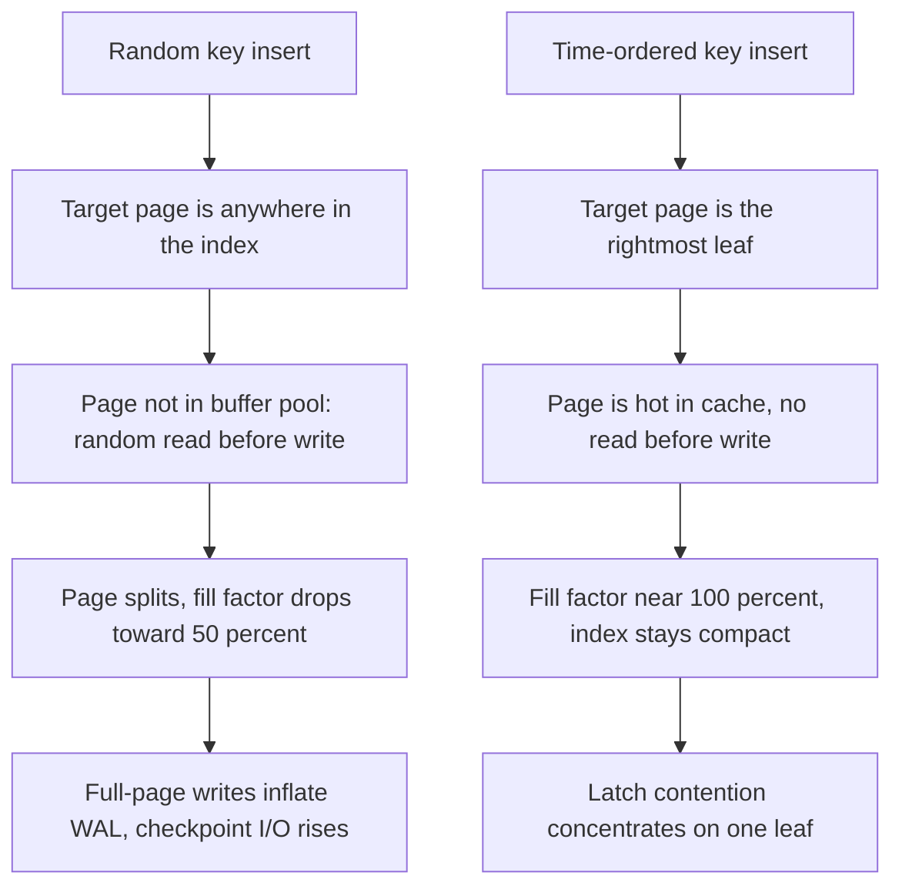

Bir tanımlayıcı şeması, benzersizliğin nereden geldiğine dair bir karardır ve her seçenek üç niceliği birbiriyle takas eder: üretim anındaki koordinasyon maliyeti, yazma anındaki indeks yerelliği ve ID'yi gören herkese sızan bilgi. Veritabanı sequence'i kusursuz yerellik ve sıfır sızıntı verir ama tek bir yazıcıya gidiş-dönüş gerektirir. Rastgele UUID'ler koordinasyon istemez ve hiçbir şey sızdırmaz ama yazma yerelliğini yok eder. Zaman sıralı şemalar ikisinin arasında durur ve popüler olanın bir değil üç tane olmasının sebebi, kalan takasları farklı biçimde çözmeleridir.
 
## Bit Yerleşimleri
 
Yerleşim, tasarımın kendisidir. Sonrasındaki her şey, yani sıralanabilirlik, üretim hızı, çakışma olasılığı ve sızıntı, bitlerin nasıl dağıtıldığından mekanik olarak türer.
 
```text
Snowflake (64 bits, signed int64)
 0 | 41 bits timestamp (ms since custom epoch) | 10 bits node | 12 bits seq |
   `- sign bit, always 0 so values stay positive in Java and SQL BIGINT
 
UUIDv7 (128 bits, RFC 9562)
| 48 bits unix_ts_ms | 4 ver | 12 bits rand_a | 2 var | 62 bits rand_b |
                       ^0111    ^ may hold sub-ms precision or a counter
 
ULID (128 bits, 26 chars Crockford base32)
| 48 bits unix_ts_ms | 80 bits randomness |
                       ^ monotonic variant increments this within the same ms
 
KSUID (160 bits)
| 32 bits seconds since custom epoch | 128 bits randomness |
```
 
**Snowflake**, açık bir node ID karşılığında düğüm başına tam monotonluk satın alır; bu da atanmış bir kimlik ve dolayısıyla dağıtım anında bir kereye mahsus koordinasyon gerektirir. On iki sequence biti bir düğümü milisaniyede 4096 ID ile, yani saniyede kabaca 4.1 milyonla sınırlar; 41 timestamp biti ise seçilen epoch'tan itibaren yaklaşık 69 yıl verir. Bir `BIGINT`'e sığar; 8 baytlık birincil anahtarın önemli olduğu sistemlerde hâlâ varsayılan olmasının sebebi budur.
 
**UUIDv7**, UUIDv4'ün yüksek rastgele bitlerini milisaniyelik bir zaman damgasıyla değiştirir; 128 bitlik formatı ve mevcut araç zincirini korur. RFC 9562 milisaniye altı sıralama için üç yaklaşıma izin verir: `rand_a` alanını milisaniye altı kesirle doldurmak, onu rastgele tohumlanmış bir sayaç olarak kullanmak veya `rand_b`'den bit ödünç almak. Milisaniye başına 62 rastgele bitle, çakışmalar makul hale gelmeden önce milisaniye başına devasa bir üretim hızı gerekir ve hiçbir düğüm kimliğine ihtiyaç duyulmaz.
 
**ULID**, aynı fikrin okunmak ve yazılmak üzere tasarlanmış halidir: 26 karakter Crockford base32, büyük-küçük harf duyarsız, tire yok, metin olarak sözlüksel sıralanabilir. Monotonik varyantı, aynı milisaniyeye düşen iki ID için 80 bitlik rastgele alanı artırır; bu sıralamayı korur ama bir sonraki değeri öncekinden tahmin edilebilir kılar.
 
| Boyut | UUIDv4 | Snowflake | UUIDv7 | ULID |
|---|---|---|---|---|
| Boyut, ikili | 16 B | 8 B | 16 B | 16 B |
| Boyut, metin | 36 karakter | 19'a kadar | 36 karakter | 26 karakter |
| Koordinasyon gerekir mi | Hayır | Node ID ataması | Hayır | Hayır |
| Oluşuma göre sıralanır mı | Hayır | Evet, düğüm başına tam | ms düzeyinde k-sortable | ms düzeyinde k-sortable |
| Hız tavanı | Yok | Düğüm başına ms'de 4096 | Pratikte yok | Pratikte yok |
| Oluşma zamanını sızdırır mı | Hayır | Evet | Evet | Evet |
| Hacim sızdırır mı | Hayır | Evet, sequence bitleriyle | Hayır | Yalnız monotonik modda |
| Ne zaman tercih edilir | Sıralama gerekmeyen opak genel token'lar | 8 baytlık PK, düğüm kimliği zaten yönetiliyorsa | Standart UUID araçları üzerindeki yeni sistemlerde varsayılan | İnsana görünen ID'ler, URL güvenli metin formu |
 
"k-sortable" ifadesi tam olarak kastedileni anlatır ve dikkatle söylenmelidir: farklı düğümlerin aynı milisaniyede ürettiği ID'ler birbirine göre keyfi sıralanır. Zaman sıralı ID'ler size indeks yerelliği verir, nedensel veya işlemsel bir sıra değil. İki olaydan hangisinin önce olduğuna ID karşılaştırmasıyla karar vermek, duvar saatlerinin yanlış olmasıyla aynı sebepten yanlıştır; bkz. [Happened-Before İlişkisi](/distributed-systems/tr/foundations/time-and-ordering/happened-before/).
 
## Kararı Yerellik Belirler
 
Rastgele bir birincil anahtarın neden acıttığı mekaniktir ve depolama motoruna göre değişir.
 

*B-tree ekleme yolları. Zaman sıralaması, rastgele I/O ve sayfa bölünmelerini tek bir sıcak yaprağa çevirir; bir darboğazı genellikle daha küçük bir başkasıyla takas eder.*
 
Bir B-tree'de rastgele anahtar eklemek, hedef yaprağın indeks boyunca düzgün dağılması demektir. İndeks buffer pool'u aştığında her ekleme rastgele bir okuma ardından bir yazma haline gelir, sayfa bölünmeleri yaprakları kabaca yarı dolu bırakır ve PostgreSQL'de checkpoint sonrası bir sayfaya ilk dokunuş WAL'a tam sayfa imajı yazar. InnoDB'deki gibi rastgele bir UUID üzerindeki clustered index, bunların hepsini yalnızca bir indekse değil tablo verisinin kendisine uygular. Sık alıntılanan sonuç, yani birkaç kat büyüyen bir indeks ve belleğe sığmayı bıraktığında bir mertebe yavaşlayan yazma, bu üç etkinin bileşiminden doğar.
 
Zaman sıralı anahtarlar sağ uca eklenir. Doluluk oranı yüksek kalır, sıcak yaprak önbellekte kalır ve yazmadan önce rastgele okuma olmaz. Bedeli, eşzamanlı tüm ekleyicilerin aynı yaprak latch'i için çekişmesidir; bu yalnızca yüksek yazma eşzamanlılığında görünür ve rastgele I/O'dan çok daha ucuzdur.
 
Bir [LSM ağacında](/distributed-systems/tr/data-management/storage-engines/lsm-tree-vs-b-tree/) etki, sayfa bölünmesinde değil compaction'da ortaya çıkar. Rastgele anahtarlar her flush edilen SSTable'ın tüm anahtar aralığına yayılmasına yol açar; her level-0 dosyası diğer her dosyayla örtüşür, okuma amplifikasyonu artar ve compaction alınan her bayt için daha fazla veri yeniden yazar. Zaman sıralı anahtarlar dar aralıklı, örtüşmeyen dosyalar üretir; compaction bunları ucuza halleder, bloom filtreleri ve aralık taramaları tüm dosyaları atlayabilir.
 
:::caution
Tek düğümlü depolamaya yarayan bu özellik, aralığa göre bölümlenmiş dağıtık depolara zarar verir. Zaman önekli bir anahtar tüm yazımları güncel zaman aralığına sahip shard'a gönderir ve HBase, Bigtable veya aralığa göre shard'lanmış bir DynamoDB indeksinde sıcak partition üretir. Standart çözüm, shard anahtarına bir salt veya hash öneki eklerken zaman sıralı ID'yi shard içindeki satır anahtarı olarak korumaktır; bkz. [Çarpıklık ve Hot-Spot Problemleri](/distributed-systems/tr/data-management/data-partitioning/skew-hot-spots/).
:::
 
## Uygulama
 
```go
package snowflake
 
import (
	"errors"
	"fmt"
	"sync"
	"time"
)
 
const (
	epochMillis = 1735689600000 // 2025-01-01T00:00:00Z. Never change this.
	nodeBits    = 10
	seqBits     = 12
	maxNode     = (1 << nodeBits) - 1
	maxSeq      = (1 << seqBits) - 1
	timeShift   = nodeBits + seqBits
	nodeShift   = seqBits
	maxElapsed  = (int64(1) << 41) - 1
)
 
var (
	ErrClockRollback = errors.New("snowflake: clock moved backwards")
	ErrEpochExceeded = errors.New("snowflake: timestamp exceeds 41 bits")
	ErrNodeID        = errors.New("snowflake: node ID out of range")
)
 
type Generator struct {
	mu        sync.Mutex
	node      int64
	lastMs    int64
	seq       int64
	tolerance time.Duration // Backward drift absorbed by waiting, not erroring.
	now       func() int64
}
 
// New requires an explicitly assigned node ID. Defaulting it to zero, to a
// hash of the hostname, or to a random value is the single most common way
// this scheme produces duplicate IDs in production.
func New(node int64, tolerance time.Duration, now func() int64) (*Generator, error) {
	if node < 0 || node > maxNode {
		return nil, fmt.Errorf("%w: %d not in [0,%d]", ErrNodeID, node, maxNode)
	}
	return &Generator{node: node, tolerance: tolerance, now: now}, nil
}
 
func (g *Generator) Next() (int64, error) {
	g.mu.Lock()
	defer g.mu.Unlock()
 
	ms := g.now()
	if ms < g.lastMs {
		drift := time.Duration(g.lastMs-ms) * time.Millisecond
		if drift > g.tolerance {
			// Emitting IDs from a rewound clock reuses (ms, node, seq)
			// triples that were already handed out. Fail loudly; a caller
			// retry after the clock resyncs is the only safe recovery.
			return 0, fmt.Errorf("%w by %s, tolerance %s", ErrClockRollback, drift, g.tolerance)
		}
		ms = g.waitUntil(g.lastMs)
	}
 
	if ms == g.lastMs {
		g.seq = (g.seq + 1) & maxSeq
		if g.seq == 0 {
			// 4096 IDs consumed within this millisecond. Spin to the next
			// one rather than borrowing bits from the timestamp.
			ms = g.waitUntil(g.lastMs)
		}
	} else {
		g.seq = 0
	}
 
	elapsed := ms - epochMillis
	if elapsed < 0 || elapsed > maxElapsed {
		return 0, fmt.Errorf("%w: elapsed=%d", ErrEpochExceeded, elapsed)
	}
	g.lastMs = ms
	return elapsed<<timeShift | g.node<<nodeShift | g.seq, nil
}
 
// waitUntil blocks until the clock strictly passes prev.
func (g *Generator) waitUntil(prev int64) int64 {
	for {
		ms := g.now()
		if ms > prev {
			return ms
		}
		time.Sleep(200 * time.Microsecond)
	}
}
```
 
Bunu naif sürümden ayıran iki ayrıntı var. `now` fonksiyonu, ham bir `CLOCK_REALTIME` çağrısı yerine duvar saatine demirlenmiş monotonik bir okuma üzerine kurulmalıdır; böylece bir NTP adımı her çağrıda geri sarma gibi görünmez. Ve geri sarma dalı, beklemeyle soğurulan küçük kaymayı gerçek bir geriye adımdan ayırır; ikincisi hata olmak zorundadır: otuz saniyelik bir geri sarmayı sessizce uyuyarak geçmek görünür bir hatayı otuz saniyelik bir donmaya, sessizce devam etmek ise mükerrer birincil anahtarlara çevirir.
 
## Hata Modları ve Operasyonel Tuzaklar
 
**Mükerrer node ID'leri.** Snowflake'in baskın kesinti sebebi budur. Node ID'sini bir config varsayılanından, küçük modüllü bir hostname hash'inden, yeniden zamanlamada sıfırlanan bir ordinal'den veya bir manifest'te eksik olan bir ortam değişkeninden türeten bir dağıtım, aynı ID ile iki generator çalıştırır. Yalnızca ikisi de aynı milisaniyede aynı sequence değeriyle üretim yaptığında çakışırlar; dolayısıyla belirti, başlangıçta temiz bir hata değil, yük altında nadir birincil anahtar ihlalleridir. Node ID'lerini lease'li bir koordinasyon servisinden atayın, atanan ID'yi başlangıçta log'layın ve filo genelinde gözlemlenen her mükerrer için alarm kurun.
 
**Yeniden başlatmalar arasında saat geri sarması.** Hiçbir şey kalıcılaştırmayan bir generator, saat ne diyorsa oradan devam eder. Süreç kapalıyken makinenin saati geriye düzeltildiyse, yeni süreç zaten kullandığı zaman damgalarını yeniden dağıtır. Son yayımlanan milisaniyeyi kalıcılaştırmak veya saat kayıtlı bir high-water mark'ı geçene kadar hizmet vermemek bunu kapatır. Bu, kalıcı olmayan bir [Lamport sayacıyla](/distributed-systems/tr/foundations/time-and-ordering/lamport-timestamps/) aynı dayanıklılık gereksinimidir.
 
**Yük patlamasında sequence tükenmesi.** Düğüm başına milisaniyede 4096, bir toplu içe aktarma veya bir retry fırtınası tek bir süreci bunun ötesine itene kadar büyük görünür. Generator o noktada spin'e girer ve gecikme, tam olarak 4096 ID başına bir milisaniyelik bir plato olarak belirir. Tespit: spin olayları için bir sayaç. Azaltma: daha çok düğüm veya UUIDv7 gibi milisaniye başına daha çok entropi taşıyan bir şema.
 
**UUID'leri metin olarak saklamak.** 36 karakterlik bir `CHAR(36)` sütunu, 16 baytlık ikili karşılığına kıyasla 36 bayt artı collation ek yüküdür ve fark, birincil anahtarı taşıyan her ikincil indeksle çarpılır. Rastgele sıralamayla birleşince bir tablonun indeksleri verisinin birkaç katına böyle çıkar. Yerel `uuid` tipini veya `BINARY(16)` kullanın.
 
**ID'leri sır sanmak.** Sıralı veya zaman sıralı ID'ler kaynak sayımını önemsizleştirir ve oluşma zamanlarını açığa çıkarır. Snowflake'in sequence bitleri ayrıca hacim sızdırır: bir aralık boyunca ID örneklemek bir rakibin kaç nesne oluşturduğunu ortaya koyar; bu, Alman tank probleminin tarif ettiği çıkarımın aynısıdır. Dışa açık tanımlayıcılar rastgele olmalı veya iç ID üzerinde opak bir eşleme olmalıdır ve yetkilendirme asla bir ID'nin tahmin edilemezliğine dayanmamalıdır.
 
**Epoch'u veya bit yerleşimini yayından sonra değiştirmek.** İkisi de tek yönlü kapıdır. Epoch'u kaydırmak mevcut ID'leri yenilere göre yeniden sıralar; bitleri node ile sequence arasında yeniden dağıtmak saklanan her değerin anlamını değiştirir. Yerleşimi versiyonlu bir wire format gibi ele alın ve 41 bitlik ufku 69'uncu yılda keşfetmek yerine bilinçli olarak kararlaştırın.
 
**ID sırasını olay sırası olarak kullanmak.** Aynı milisaniyede farklı düğümlerden gelen iki ID zamana göre değil node ID'sine göre sıralanır ve düğümler arası saat kayması ID'leri milisaniyeler arasında yeniden sıralar. Gerçek sıraya ihtiyaç duyan her mantık bir mantıksal saate ihtiyaç duyar; bkz. [Hibrit Mantıksal Saatler](/distributed-systems/tr/foundations/time-and-ordering/hybrid-logical-clocks/).
 
## Ne Zaman Kullanmalı, Ne Zaman Kullanmamalı
 
Yeni sistemlerde varsayılan olarak UUIDv7 kullanın: düğüm ataması gerektirmez, mevcut UUID sütunlarına ve kütüphanelerine olduğu gibi oturur ve operasyonel bir bağımlılık olmadan milisaniye yerelliği verir. 8 baytlık birincil anahtarın maddi olarak önemli olduğu, yani çok ikincil indeksli geniş tablolarda veya 8 bayta karşı 16 baytın çalışma kümesini değiştirdiği sıcak bir önbellekte ve zaten kararlı düğüm kimliği atayan bir mekanizmanız varsa Snowflake kullanın. Tanımlayıcılar URL'lerde, log'larda veya destek kayıtlarında göründüğünde ve kompakt, harf duyarsız metin formu araç uyumluluğundan daha değerliyse ULID kullanın.
 
Tanımlayıcı dışa açıksa ve oluşma zamanı dahil hiçbir şey sızdırmaması gerekiyorsa UUIDv4 kullanın; yazma yerelliği maliyetini kabul edin ya da onu bir iç sıralı anahtarla eşleyerek clustered index'in dışında tutun. Üretim zaten tek bir yazıcıdan geçiyorsa veritabanı sequence'i kullanın; her dağıtık şemadan daha küçük, daha hızlı ve daha az sızdırandır. Aralığa göre bölümlenmiş bir depoda hiçbir zaman sıralı ID'yi salt olmadan ham shard anahtarı olarak kullanmayın; hiçbirini nedensel sıralama, yetkilendirme token'ı veya versiyon numarası yerine geçirmeyin.