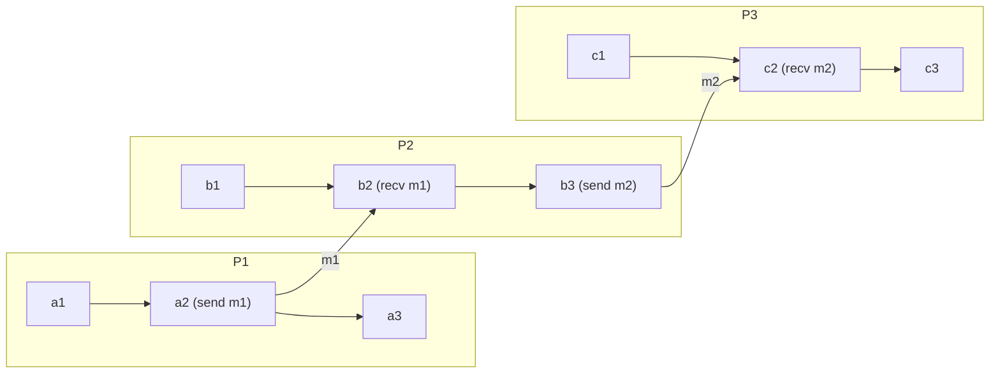

Dağıtık bir sistemde ortak saat de ortak bellek de yoktur; bu yüzden hiçbir süreç olayların küresel bir sırasını gözlemleyemez. Bir sürecin gözlemleyebildiği tam olarak iki şey vardır: yerel olarak yürüttüğü olayların sırası ve aldığı bir mesajın varmadan önce gönderilmiş olduğu gerçeği. Lamport'un **happened-before** ilişkisi, `a -> b` biçiminde yazılır ve bu iki gözlemin geçişlilik altındaki kapanışıdır; fiziksel zamana güvenmeden kurulabilecek en güçlü sıralamadır.
 
## Mesajlaşmanın Ürettiği Kısmi Sıralama
 
`->`, olaylar üzerinde şu üç kuralı sağlayan en küçük ilişkidir:
 
1. **Süreç sırası.** `a` ve `b` aynı süreçteki olaylarsa ve `a`, o sürecin yerel yürütme dizisinde `b`'den önce geliyorsa, `a -> b`.
2. **Mesaj sırası.** `a`, `m` mesajının gönderimi ve `b` aynı `m` mesajının alımıysa, `a -> b`.
3. **Geçişlilik.** `a -> b` ve `b -> c` ise, `a -> c`.
Ortaya çıkan ilişki bir **katı kısmi sıralamadır**: yansımasız, asimetrik ve geçişli. *Kısmi* olmasının sebebi tam olarak şudur: 1. ve 2. kurallar olay çiftlerinin çoğunu birbiriyle ilişkisiz bırakır. Ne `a -> b` ne de `b -> a` geçerliyse `a` ve `b` olayları **eşzamanlıdır** (`a || b`). Buradaki eşzamanlılık duvar saatine göre aynı anda olmakla ilgili değildir; aralarında bir bilgi yolunun bulunmamasıyla ilgilidir. Saatlerce arayla gerçekleşmiş iki olay, hiçbir yerel adım ve mesaj zinciri onları bağlamıyorsa eşzamanlıdır.
 

*Üç sürecin uzay-zaman diyagramı. `a1 -> c3` ilişkisi `a1 -> a2 -> b2 -> b3 -> c2 -> c3` zinciri üzerinden geçerlidir; buna karşılık `a3 || b1` ve `a3 || c1`, çünkü onları bağlayan hiçbir yol yoktur.*
 
`e -> x` sağlayan tüm `e` olaylarının kümesi `x`'in **nedensel geçmişidir** (causal history). Lamport'un başvurduğu özel görelilik benzetmesi budur: nedensel geçmiş geriye doğru bir ışık konisidir ve her iki koninin de dışında kalan her şey eşzamanlıdır. Pratik sonuç şudur: nedensel geçmiş, `x`'in etkilenmiş olabileceği yegane bilgidir. Bir olayın bağlı olduğu her durum mesaj kenarları üzerinden erişilebilir olmak zorundadır; etkinin bu kenarların dışından yayılmasına izin veren bir sistem modeli değil, modelin varsayımlarını değil sistemin kendisini bozmuştur.
 
`->` **potansiyel** nedenselliği yakalar, fiili nedenselliği değil. Bir süreç, ilgisiz bir yerel hesaplamanın hemen ardından mesaj gönderiyorsa, `->` uygulama mantığında hiç var olmayan bir bağımlılığı kaydeder. Bu aşırı yaklaşım güvenlidir (bağımlılık varken bağımsızlık iddia etmez) ama pahalıdır: çakışma meta verisini şişirir ve gereksiz teslim sıralaması dayatır. Bazı sistemler bunu açıkça daraltır; örneğin nedenselliği süreç başına değil anahtar veya aggregate başına izleyerek.
 
## Eşzamanlılık Geçişli Değildir
 
Sık yapılan bir modelleme hatası `||` ilişkisini denklik benzeri bir ilişki sanmaktır. Geçişli değildir. Yukarıdaki diyagramda `b1 || a3` ve `a3 || c1` geçerlidir, ancak bu `b1` ile `c1` hakkında hiçbir şey söylemez. Karşı örnek kurmak kolaydır: `a2 -> b2` ve `b2 -> b3` iken `b3` olayı `a3` ile eşzamanlıdır ve `a1`, `b1` ile eşzamanlıdır; buna rağmen `a1 -> b3` geçerlidir. Olayları "eşzamanlılık gruplarına" ayırıp her grubu bağımsız çözen her algoritma, var olmayan bir geçişliliğe yaslanır ve çiftlerin karşılaştırılma sırasına göre farklı sonuçlar üretir.
 
## Tutarlı Kesitler ve Anlık Görüntüler
 
**Kesit** (cut), süreç sırası altında kapalı bir olay kümesidir: her süreç için o sürecin yerel dizisinin bir önekini içerir. Bir kesit ayrıca `->` altında da kapalıysa **tutarlıdır**; yani kesitteki her `e` olayı ve `f -> e` sağlayan her `f` için `f` de kesitin içindedir. Tutarsız kesitler, karşılık gelen gönderimi olmayan bir mesaj alımı içerir; hiç var olmamış ve hiçbir yürütmenin üretemeyeceği bir küresel durumu tarif eder.
 
Chandy-Lamport anlık görüntü algoritmasının bu biçimde var olmasının sebebi budur: marker mesajları uygulama mesajlarıyla aynı kanallar üzerinden yayılır, böylece hiçbir süreç duraklamadan kaydedilen durumun `->` altında kapalı olması garanti edilir. Aynı gereklilik sharding uygulanmış veritabanlarında yedek tutarlılığını, dağıtık hata ayıklama ve replay'i, kilitlenme tespitini de belirler. Her shard'ın "aynı duvar saati anında" örneklenmesiyle alınan bir anlık görüntü, saat belirsizliği sınırlanıp hesaba katılmadıkça tutarlı bir kesit değildir; TrueTime'ın sattığı garanti tam olarak budur.
 
:::danger
Tutarsız bir kesiti geri yüklemek, sonuçları sebepleri olmadan diriltir. Gönderimi geri alınmış bir alımı uygulamış olan bir replika, diğer tüm replikalardan kalıcı olarak ayrışır ve her iki replika da kendi içinde tutarlı göründüğü için hiçbir read-repair veya anti-entropy geçişi bu ayrışmayı işaretlemez.
:::
 
## Saat Koşulu ve Zaman Damgalarının Kanıtlayabildiği
 
Mantıksal saat, her olaya bir sayı atayan `C` fonksiyonudur. `a -> b` olduğunda `C(a) < C(b)` sağlanıyorsa **saat koşulunu** karşılar. Lamport zaman damgaları bunu her yerel olayda artırarak ve alımda `max(yerel, gelen) + 1` alarak sağlar. Tersi geçerli değildir: `C(a) < C(b)` size hiçbir şey söylemez, çünkü eşzamanlı olaylar da sıralı zaman damgaları alır. Dolayısıyla Lamport zaman damgaları `->` ilişkisini bir tam sıralamaya *genişletebilir* (eşitlikleri süreç ID'siyle bozarak) ama onu *karar veremez*.
 
`->` ilişkisine karar vermek süreç başına sayaç gerektirir. Vektör saat her olaya N girdili bir vektör atar ve kesin karakterizasyonu verir: `VC(a) < VC(b)` (bileşen bazında `<=` ve en az birinde katı `<`) **ancak ve ancak** `a -> b` olduğunda geçerlidir; karşılaştırılamaz vektörler eşzamanlılık anlamına gelir. Bu kesinliğin bedeli, olay veya versiyon başına O(N) meta veridir; buradaki N nedensel olarak bağımsız yazıcı sayısıdır.
 
| Boyut | `->` kararı verir mi? | Olay başına meta veri | Yeniden başlatmada girdi yeniden kullanımı | Ne zaman tercih edilir |
|---|---|---|---|---|
| Lamport zaman damgası | Hayır (tek yönlü) | 1 tam sayı | Monotonikse güvenli | Tam sıralamada eşitlik bozma, karşılıklı dışlama, istek sıralama |
| Vektör saat | Evet | O(N) girdi | Incarnation ID gerektirir | Çakışma tespiti yapan multi-leader veya leaderless replikasyon |
| Version vector | Evet, anahtar bazında | Anahtar başına O(replika) | Incarnation ID gerektirir | N'in istemci değil replika sayısıyla sınırlı olduğu nesne bazlı izleme |
| Dotted version vector | Evet, anahtar + istemci yazımı | O(replika) artı dot'lar | Eşzamanlı istemci yazımlarını kaldırır | Anahtar başına çok istemcili Dynamo tarzı depolar |
| Interval tree clock | Evet | Uyarlanır, fork ve join yapar | Kimlik yönetimi yerleşik | Süreç ID'lerinin önceden bilinmediği dinamik üyelik |
| Hybrid logical clock | Evet, sınırlı skew ile | 1 zaman damgası artı sayaç | NTP sınırına bağlı | Hem nedensellik hem okunabilir zaman gereken sistemler |
 
Algoritmalar ve uç durumlar için [Lamport Zaman Damgaları](/distributed-systems/tr/foundations/time-and-ordering/lamport-timestamps/) ve [Vektör Saatler](/distributed-systems/tr/foundations/time-and-ordering/vector-clocks/) sayfalarına, fiziksel zamanla hibrit için [Hibrit Mantıksal Saatler](/distributed-systems/tr/foundations/time-and-ordering/hybrid-logical-clocks/) sayfasına bakın.
 
## Nedensel Teslimi Uygulamak
 
`->` ilişkisinin çalışma zamanındaki en yaygın kullanımı **nedensel teslimdir** (causal delivery): bir mesaj, kendisinden önce gerçekleşmiş her mesaj teslim edilmeden uygulamaya verilmez. Broadcast üzerinde uygulandığında bu, nedensel tutarlılığın altındaki mekanizmadır ve kontrol tamamen vektör saatler üzerinde aritmetiktir.
 
```go
package causal
 
import (
	"context"
	"errors"
	"fmt"
	"sync"
)
 
// VectorClock maps a process ID to the count of events that process has
// executed. Missing entries are implicitly zero.
type VectorClock map[string]uint64
 
// Message carries the sender's vector clock as observed at send time.
type Message struct {
	From    string
	Clock   VectorClock
	Payload []byte
}
 
var errDuplicate = errors.New("causal: message already delivered")
 
// Deliverer buffers messages until their causal dependencies are satisfied.
type Deliverer struct {
	mu         sync.Mutex
	self       string
	clock      VectorClock
	pending    []Message
	out        chan<- Message
	maxPending int
}
 
func NewDeliverer(self string, out chan<- Message, maxPending int) *Deliverer {
	return &Deliverer{
		self:       self,
		clock:      VectorClock{},
		out:        out,
		maxPending: maxPending,
	}
}
 
// deliverable applies the causal delivery test. A message from p is
// deliverable when it is the next one expected from p, and when every other
// entry in its clock is already covered by local state.
func (d *Deliverer) deliverable(m Message) (bool, error) {
	if m.From == d.self {
		return false, fmt.Errorf("causal: loopback message from %s", m.From)
	}
	want := d.clock[m.From] + 1
	switch got := m.Clock[m.From]; {
	case got < want:
		return false, errDuplicate
	case got > want:
		// Gap: an earlier message from the same sender has not arrived.
		return false, nil
	}
	for pid, n := range m.Clock {
		if pid == m.From {
			continue
		}
		if n > d.clock[pid] {
			// The sender saw an event from pid that we have not seen yet.
			return false, nil
		}
	}
	return true, nil
}
 
// Receive is safe for concurrent use. It either delivers immediately,
// buffers, or rejects when the buffer is exhausted.
func (d *Deliverer) Receive(ctx context.Context, m Message) error {
	d.mu.Lock()
	defer d.mu.Unlock()
 
	ok, err := d.deliverable(m)
	switch {
	case errors.Is(err, errDuplicate):
		return nil // At-least-once transport: silently idempotent.
	case err != nil:
		return err
	case ok:
		return d.deliverLocked(ctx, m)
	}
 
	if len(d.pending) >= d.maxPending {
		// Backpressure instead of unbounded growth. A permanently missing
		// dependency must surface as an error, not as a memory leak.
		return fmt.Errorf("causal: pending buffer full (%d), blocked on %s",
			d.maxPending, m.From)
	}
	d.pending = append(d.pending, m)
	return nil
}
 
// deliverLocked emits m, advances local state, then cascades through the
// buffer, since one delivery can unblock an arbitrary chain of others.
func (d *Deliverer) deliverLocked(ctx context.Context, m Message) error {
	for {
		select {
		case d.out <- m:
		case <-ctx.Done():
			return ctx.Err()
		}
		d.clock[m.From] = m.Clock[m.From]
 
		next := -1
		kept := d.pending[:0]
		for _, p := range d.pending {
			if next >= 0 {
				kept = append(kept, p)
				continue
			}
			ok, err := d.deliverable(p)
			if errors.Is(err, errDuplicate) {
				continue // Drop, do not re-buffer.
			}
			if err != nil {
				return err
			}
			if ok {
				next = 0
				m = p
				continue
			}
			kept = append(kept, p)
		}
		d.pending = kept
		if next < 0 {
			return nil
		}
	}
}
```
 
Operasyonel olarak önemli olan, boşluk (gap) testinin iki dalıdır. `got > want` boşluğu tek bir göndericinin kanalında kayıp veya yeniden sıralanma demektir ve genellikle geçicidir. Üçüncü bir `pid` süreci için bloke olmuş bir girdi ise eksik bir geçişli bağımlılık anlamına gelir ve o süreç bir eşe gönderdikten sonra diğerine göndermeden çöktüyse kalıcı olabilir.
 
## Hata Modları ve Operasyonel Tuzaklar
 
**Gizli kanallar modeli sessizce bozar.** `->` yalnızca sistemin kendi taşıdığı mesajları bilir. Replika A'da bir değeri okuyup ardından telefonla arayıp replika B'de yazan bir meslektaşına haber veren kullanıcı, sistemin göremediği gerçek bir nedensel bağımlılık yaratmıştır. Sistem iki yazımı eşzamanlı kaydeder ve ya sahte bir çakışma işaretler ya da daha kötüsü birini atar. Sistem dışı her yol böyle bir kanaldır: paylaşılan bir önbellek, paylaşılan bir dosya sistemi, bir tarayıcı sekmesi, izlenmeyen bir Kafka topic'i, elle script çalıştıran bir operatör. Olay sonrası tespit neredeyse imkansızdır; azaltma yolu, etkiyi izlenen kanallardan geçirmek veya yazımlara istemci tarafından sağlanan nedensel bağlamı iliştirmektir.
 
**Last-write-wins eşzamanlılığı tasarım gereği atar.** LWW fiziksel zaman damgalarını karşılaştırıp büyük olanı tutar; bu da her eşzamanlı çiftte bir güncellemenin hatasız ve metriksiz kaybolması demektir. Saat kayması altında, duvar saati anlamında kazananın *öncesinde gerçekleşmiş* ama daha düşük zaman damgasıyla gelmiş bir yazımı da atabilir. Belirti, kullanıcıların bildirdiği aralıklı ve tekrarlanamayan veri kaybıdır. Bu dengenin sayısallaştırılmış hali için [Nihai Tutarlılık ve LWW](/distributed-systems/tr/data-management/consistency-models/eventual-consistency/) sayfasına bakın.
 
**Yeniden kullanılan kimlik karşılaştırmayı bozar.** Bir süreç yeniden başlayıp sayacını sıfırlarsa veya yeni bir süreç emekliye ayrılmış bir ID'yi yeniden kullanırsa vektör girdileri geriye gider. Karşılaştırmalar eşzamanlılık varken `->` raporlar ve merge işlemleri versiyonları sessizce düşürür. Her kimlik, yeniden başlatmalar boyunca artan ve anahtarın parçası olan bir incarnation veya epoch numarası taşımalıdır.
 
**Meta veri büyümesi yükü geçer.** İstemciler nedensel aktör olduğunda N istemci sayısıdır ve vektörler açıkladıkları değerleri gölgede bırakır. Replika sayısıyla sınırlanan version vector'lar, eşzamanlı istemci yazımları için dotted version vector'lar ve küresel olarak onaylanmış bir watermark'ın altındaki girdilerin budanması standart çözümlerdir. Belirti yanlışlık değil, depolama amplifikasyonu ve artan deserialization CPU'sudur.
 
**Nedensel tamponlar kaybı gecikmeye çevirir.** Eksik bir bağımlılık, tampon dolana kadar hata olarak değil teslim gecikmesi olarak görünür. Tampon derinliğini, gönderici başına boşluk büyüklüğünü ve en eski bekleyen mesajın yaşını ölçün; alarmı derinliğe değil yaşa kurun, çünkü yavaş ve kalıcı bir tıkanma, iş işten geçene kadar sağlıklı bir yük patlamasından ayırt edilemez.
 
**Sıralama garantileri partition'lar arasında birleşmez.** Kafka partition içinde sıralar, partition'lar arasında değil; bağımsız RPC'ler hiçbir kenar yaratmaz; iki servise yapılan bir fan-out ve ardından bu servislerin paylaşılan bir depoya yazması, uygulama kodu sıralı okunsa bile gerçek eşzamanlılık üretir. Servisler arası `->` kenarları yalnızca bağlamın açıkça yayıldığı yerde vardır ve bir trace parent başlığının kodladığı şey tam olarak budur. Tek bir sıçramada yayılımı düşürmek, hem gözlemlenebilirlik grafiğinden hem de üzerine kurulu her nedensel tutarlılık mekanizmasından kenarları siler.
 
## Ne Zaman Happened-Before Üzerinden Düşünmeli
 
Eşzamanlı güncellemelerin sessizce çözülmesi değil **tespit edilmesi** gerektiğinde kullanın: multi-leader ve leaderless replikasyon, yeniden bağlandığında uzlaşan offline-first istemciler, CRDT merge fonksiyonları, ortak düzenleme ve bir güncellemeyi kaybetmenin kabul edilebilir bir yaklaşıklık değil doğruluk hatası olduğu her akış. Anlık görüntüler, shard'lara yayılan yedekler veya replay tabanlı hata ayıklama gibi tutarlı bir küresel duruma ihtiyaç duyduğunuzda kullanın. İstemci farklı bir replikaya yönlendirildiğinde read-your-writes ve monotonic reads gibi oturum garantilerinin ayakta kalması gerektiğinde kullanın; bkz. [Nedensel Tutarlılık ve Oturum Garantileri](/distributed-systems/tr/data-management/consistency-models/causal-consistency-session-guarantees/).
 
Partition başına tek lider zaten o partition'a yapılan her yazıma tam sıralama dayatıyorsa bedelini ödemeyin; log konumu `->` ilişkisini kapsar. Versiyon başına meta verinin değerin kendisini aştığı ve kaybedilen eşzamanlı bir güncellemenin iş açısından ihmal edilebilir maliyeti olduğu, çakışma olasılığı düşük yüksek kardinaliteli anahtarlarda da ödemeyin. Ve ondan **external consistency** sağlamasını beklemeyin: `->`, aralarında bilgi yolu olmayan olaylar hakkında hiçbir şey söylemez; dolayısıyla gerçek zamanda bir diğeri bittikten sonra commit eden bir işlem, üzerine sınırlı belirsizlik aralığına sahip fiziksel zaman katmanlanmadıkça keyfi sıralanabilir. [TrueTime ve Spanner](/distributed-systems/tr/foundations/time-and-ordering/truetime-spanner/) sayfasının tüm konusu budur.