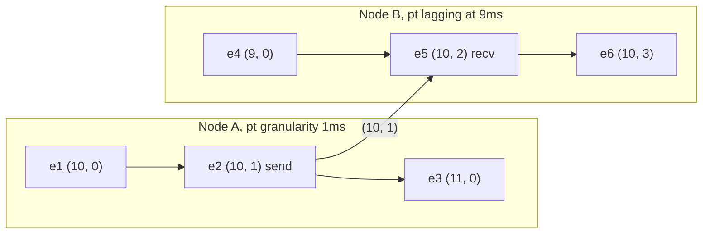
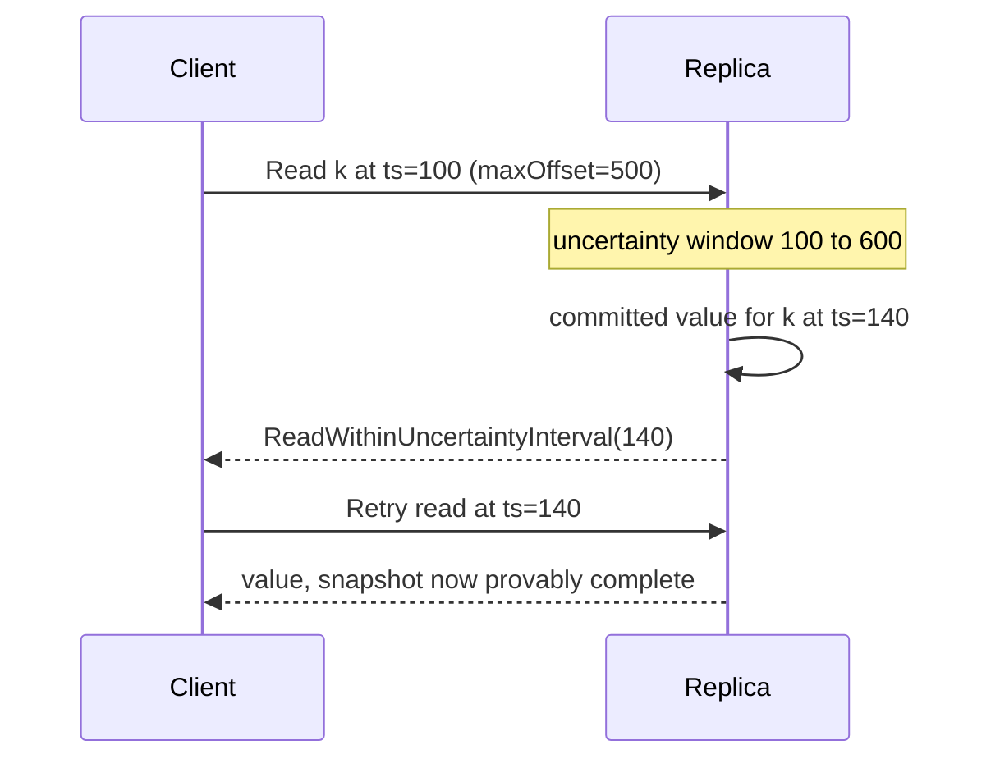

Hibrit mantıksal saat bir `(l, c)` çiftidir: `l` yalnızca ileri giden ve düğümün kendi duvar saatinin asla gerisinde kalmayan bir fiziksel zaman damgası, `c` ise `l` ilerlemediğinde eşitliği bozan mantıksal bir sayaçtır. Çift saat koşulunu sağlar, yani `a -> b` olduğunda `HLC(a) < HLC(b)` olur; bu sırada `l` gerçek zamanın NTP skew sınırı içinde kalır. Bu bileşim, HLC'yi CockroachDB, YugabyteDB, MongoDB ve Spanner sonrası kurulan çoğu dağıtık SQL motorunda varsayılan zaman damgası yapan şeydir: atomik saat olmadan nedensellik ve log'da insanın hâlâ okuyabildiği zaman damgaları.
 
## Güncelleme Kuralları
 
`pt`, düğümün seçilen birimdeki güncel fiziksel saat okuması olsun. Çifti iki işlem korur.
 
**Yerel olay veya gönderim:**
 
```text
l_new = max(l, pt)
if l_new == l:
    c = c + 1        // Physical clock did not advance; fall back to logical.
else:
    c = 0            // Physical clock advanced; the counter is not needed.
l = l_new
```
 
**`(lm, cm)` damgalı bir mesajın alımı:**
 
```text
l_new = max(l, lm, pt)
if   l_new == l and l_new == lm: c = max(c, cm) + 1
elif l_new == l:                 c = c + 1
elif l_new == lm:                c = cm + 1
else:                            c = 0     // pt is strictly the largest.
l = l_new
```
 
`max(l, lm, pt)`, üçüncü aday olarak yerel fiziksel okumanın eklendiği Lamport `max` işlemidir. Bütün fikir o üçüncü terimdedir: gerçek zaman sistemin gözlemlediği her şeyin ötesine geçtiğinde sayaç sıfırlanır ve `l` yeniden fiziksel zamana demir atar. Dolayısıyla sayaç yalnızca tek bir fiziksel saat tık'ının içine çok sayıda nedensel bağlı olayın sığdığı ya da bir eşin saatinin bizimkinden ileride olduğu aralıkta büyür. Her ikisi de sınırlıdır; `c`'nin küçük kalmasının sebebi budur.
 

*B'nin fiziksel saati 9 gösterirken `(10, 1)` damgalı bir mesaj gelir; `l` 10'a sıçrar ve sayaç göndericinin değerinden devam eder. B'deki sonraki yerel olaylar, B'nin kendi `pt` değeri 10'u geçene kadar yalnızca `c`'yi artırır.*
 
Doğrudan çıkan ve üretim sistemlerinde ikisi de yük taşıdığı için tam olarak söylenmesi gereken iki özellik vardır:
 
- **Fiziksel zamandan sınırlı sapma.** Her düğümün saati gerçek zamanın `eps` yakınındaysa, hiçbir düğümde `l` gerçek zamanı `eps`'ten fazla aşmaz. Bu yüzden HLC damgaları çıplak Lamport değerlerinin aksine duvar saati son tarihleriyle karşılaştırılabilir, TTL'lerde kullanılabilir ve log'da okunabilir.
- **Sınırlı sayaç.** `c`, saat granülaritesi artı skew penceresi içine sığan nedensel bağımlı olay sayısıyla sınırlıdır. Milisaniye granülaritesi ve 500ms offset bütçesiyle 16 bitlik bir sayaç fazlasıyla yeterlidir; 32 bitlik bir sayaçta taşma, yükten değil ancak gerçek bir skew olayından doğar.
## Kodlama ve Granülarite
 
Çift, depolama anahtarları ve indeks önekleri için tek bir karşılaştırılabilir değere sığmalıdır. İki kodlama baskındır:
 
- **Paketlenmiş 64 bit.** Örneğin epoch'tan bu yana 48 bit milisaniye ve 16 bit sayaç, ya da 44 bit ve 20 bit. Ham tam sayıyı sıralamak zaman damgasını sıralar; bir MVCC anahtar son ekinin ihtiyacı tam olarak budur. Risk, paketlemenin sayaç taşmasını meta veri olayından doğruluk olayına çevirmesidir.
- **Ayrık alanlar.** CockroachDB 64 bit nanosaniye wall time artı ayrı bir 32 bit mantıksal sayaç kullanır. Daha geniştir, ama taşma fiilen imkansızdır ve wall bileşeni doğrudan `time.Time` ile karşılaştırılabilir.
Granülarite bir biçimlendirme tercihi değil, gerçek bir dengedir. Daha kaba fiziksel birimler (milisaniye) daha çok olayın aynı `l` değerini paylaşması ve sıralamanın daha büyük kısmını sayacın taşıması demektir; bu zararsızdır ama zaman damgasının fiziksel olarak anlamlı kısmını azaltır. Daha ince birimler (nanosaniye) bit israf eder, çünkü hiçbir saat kaynağı nanosaniye doğruluğunda değildir, ve değer aralığını gereksiz şişirir.
 
## Uygulama
 
```go
package hlc
 
import (
	"errors"
	"fmt"
	"math"
	"sync"
	"time"
)
 
// Timestamp is the (physical, logical) pair. Comparison is lexicographic,
// which is why the packed form sorts correctly as a single integer.
type Timestamp struct {
	WallNanos int64
	Logical   uint32
}
 
func (t Timestamp) Less(o Timestamp) bool {
	if t.WallNanos != o.WallNanos {
		return t.WallNanos < o.WallNanos
	}
	return t.Logical < o.Logical
}
 
var (
	// ErrClockOffset means a peer's clock is outside the configured budget.
	// The correct response is to remove this node from service, not to
	// accept the timestamp: accepting it propagates the bad clock cluster
	// wide and cannot be undone.
	ErrClockOffset  = errors.New("hlc: peer clock beyond max offset")
	ErrLogicalOverf = errors.New("hlc: logical counter overflow")
)
 
type Clock struct {
	mu        sync.Mutex
	physical  func() int64 // Injected for tests; must be non-decreasing.
	maxOffset time.Duration
	ts        Timestamp
}
 
func New(physical func() int64, maxOffset time.Duration) *Clock {
	return &Clock{physical: physical, maxOffset: maxOffset}
}
 
// Now applies the local-event rule and returns the new timestamp.
func (c *Clock) Now() (Timestamp, error) {
	c.mu.Lock()
	defer c.mu.Unlock()
 
	pt := c.physical()
	if pt > c.ts.WallNanos {
		c.ts = Timestamp{WallNanos: pt}
		return c.ts, nil
	}
	// Physical clock has not advanced past l, including the case where it
	// jumped backwards. l never regresses; the counter absorbs the stall.
	if c.ts.Logical == math.MaxUint32 {
		return Timestamp{}, fmt.Errorf("%w at wall=%d", ErrLogicalOverf, c.ts.WallNanos)
	}
	c.ts.Logical++
	return c.ts, nil
}
 
// Update applies the receive rule against an inbound timestamp.
func (c *Clock) Update(m Timestamp) (Timestamp, error) {
	c.mu.Lock()
	defer c.mu.Unlock()
 
	pt := c.physical()
	if m.WallNanos-pt > int64(c.maxOffset) {
		return Timestamp{}, fmt.Errorf("%w: peer=%d local=%d budget=%s",
			ErrClockOffset, m.WallNanos, pt, c.maxOffset)
	}
 
	switch {
	case m.WallNanos > c.ts.WallNanos && m.WallNanos > pt:
		c.ts = Timestamp{WallNanos: m.WallNanos, Logical: m.Logical + 1}
	case pt > c.ts.WallNanos && pt > m.WallNanos:
		c.ts = Timestamp{WallNanos: pt}
	default:
		// Local l is the maximum. Take the larger counter on a tie.
		if m.WallNanos == c.ts.WallNanos && m.Logical > c.ts.Logical {
			c.ts.Logical = m.Logical
		}
		if c.ts.Logical == math.MaxUint32 {
			return Timestamp{}, fmt.Errorf("%w at wall=%d", ErrLogicalOverf, c.ts.WallNanos)
		}
		c.ts.Logical++
	}
	return c.ts, nil
}
```
 
`physical` fonksiyonu süreç içinde monotonik olmalıdır. Linux'ta bu, çıplak bir `CLOCK_REALTIME` okuması değil, fark için `CLOCK_MONOTONIC` ve periyodik olarak yeniden senkronize edilen bir wall çıpası demektir; aksi halde iki çağrı arasındaki geriye NTP adımı `l`'yi durdurur ve adım süresince sayaç alanını yakar. Go'nun `time.Now` fonksiyonu yalnızca süreç içinde çıkarma için geçerli olan monotonik bir okuma taşır; bu, fark için doğru primitiftir ama çıpa için değildir.
 
## Belirsizlik Aralıkları: HLC'nin Vermediği Şey
 
HLC nedensel sıralama ve yaklaşık fiziksel sıralama verir. **External consistency vermez**, çünkü aralarında hiç iletişim olmayan iki işlem gerçek zamanda `T1` sonra `T2` sırasıyla commit edip ters sırada zaman damgası alabilir; fark skew sınırı içinde kaldığı sürece bu mümkündür. Serileştirilebilir snapshot okumalarına ihtiyaç duyan sistemler boşluğu bir **belirsizlik aralığıyla** kapatır: `ts` zaman damgasındaki bir okuma `[ts, ts + maxOffset]` penceresini belirsiz sayar ve o pencerede bulunan her değer okumanın daha yüksek zaman damgasıyla yeniden denenmesine yol açar.
 

*Belirsizlik penceresi içindeki bir değerin eşzamanlı mı önce mi olduğu kanıtlanamaz; bu yüzden işlem eskimiş okuma riskini almak yerine gözlemlenen zaman damgasında yeniden başlar.*
 
Operasyonel maliyet şudur: daha büyük bir `maxOffset` pencereyi genişletir ve çekişme altında yeniden başlatma oranını artırır. Offset bütçesini daraltmak yeniden başlatmaları azaltır ama kümeyi gerçek saat kaymasına daha duyarlı kılar, çünkü bütçeyi aşan bir düğümün kendini hizmet dışına alması gerekir. TrueTime'ın sıkı sınırlanmış `eps` değerinin tüm gerekçesi bu gerilimdir; bkz. [Google TrueTime ve Spanner](/distributed-systems/tr/foundations/time-and-ordering/truetime-spanner/).
 
## Alternatiflerle Karşılaştırma
 
| Boyut | Duvar saati | Lamport | Vektör saat | HLC |
|---|---|---|---|---|
| Boyut | 8 bayt | 8 bayt | O(N) girdi | 8 ila 12 bayt |
| `a -> b` sırayı gerektirir mi | Hayır | Evet | Evet | Evet |
| Sıra `a -> b` gerektirir mi | Hayır | Hayır | Evet | Hayır |
| Eşzamanlılığı tespit eder mi | Hayır | Hayır | Evet | Hayır |
| Gerçek zamana yakın mı | Evet | Hayır | Hayır | Evet, `eps` içinde |
| Saat kaymasında güvenli mi | Hayır | Evet | Evet | Evet, `maxOffset`'e kadar |
| Ne zaman tercih edilir | Yalnız gösterim ve TTL | Term, ballot, fencing | Çok yazıcılı çakışma tespiti | MVCC damgaları, snapshot okumaları, CDC sıralama |
 
Üçüncü satıra dikkat: HLC eşzamanlılığa karar vermez. Karşılaştırılamaz iki olay her zaman sıralı HLC değerleri alır; dolayısıyla sibling'e ihtiyaç duyan bir deponun hâlâ [vektör saatlere](/distributed-systems/tr/foundations/time-and-ordering/vector-clocks/) ihtiyacı vardır. HLC skaler Lamport saatinin yerini alır, vektörün değil.
 
## Hata Modları ve Operasyonel Tuzaklar
 
**İleri bir saat sıçraması kümeyi kalıcı olarak zehirler.** Yanlış yapılandırılmış bir NTP sunucusu, ileri saatli bir snapshot'tan geri yüklenmiş bir VM veya elle çalıştırılmış bir `date` komutu, bir düğümün `pt` değerini saatlerce ileri alır. O düğüm olayları gelecekteki değerlerle damgalar, her eş bunları `max` üzerinden benimser ve `l` asla gerilemediği için gerçek zaman yetişene kadar tüm küme gelecekte sıkışır. Belirtiler: `now()` değerinin ilerisinde zaman damgalı yazımlar, erken veya hiç tetiklenmeyen TTL sona ermeleri, fırlayan belirsizlik yeniden başlatmaları, "şimdi eksi staleness" ile boş dönen follower read'ler. `Update` fonksiyonunun bütçe dışı bir damgayı kabul etmek yerine reddetmesinin ve CockroachDB düğümlerinin sürekli offset ihlalinde bilerek sonlanmasının sebebi budur. Kabul edilmiş bir sıçramadan kurtulmak, zaman damgalarını düzenlemek değil, yazımları durdurup beklemek demektir.
 
:::danger
`maxOffset` dışındaki bir eş zaman damgasını kabul etmek yerinde kurtarılamaz. Bozuk değer bir gossip turu içinde sistemdeki her `max` üzerinden yayılır ve sonraki hiçbir düzeltme monotonluğu ihlal etmeden `l`'yi geri çekemez. Mesajı reddedip düğümü hizmet dışına almak kesinlikle daha güvenli hatadır.
:::
 
**Kimliği doğrulanmamış zaman damgaları şişirmeye açıktır.** Mesaj gönderebilen her istemci `l`'yi ileri itebilir. MongoDB, güvenilmeyen bir sürücünün küme saatini ilerletememesi için `clusterTime` değerini tam olarak bu sebeple HMAC ile imzalar. HLC değerleri bir güven sınırını geçiyorsa ya imzalayın ya da sınırda kırpın.
 
**Geriye sıçramalar sayaç alanını sessizce yakar.** Geriye bir adım `l`'yi değiştirmeden bırakır, `c` ise her olayda artar. Sayaç genişliğine yaklaşana kadar hiçbir şey bozulmaz; dolayısıyla yüksek yazma hızında çok saniyelik geriye bir adım altında paketlenmiş 16 bitlik bir sayaç bir taşma olayıdır. Yalnızca wall bileşenini değil sayaç değerinin kendisini de ölçün ve sürekli sıfırdan farklı bir taban çizgisine alarm kurun.
 
**Artık saniye yönetimi filo genelinde aynı olmalıdır.** Aynı kümede smear edilmiş ve adımlı artık saniye yönetimini karıştırmak, bir gün boyunca garantili birkaç yüz milisaniyelik bir uyuşmazlık üretir. Ya tüm filo aynı NTP kaynağına karşı smear eder ya da hiçbiri etmez.
 
**Yeniden başlatmada hiçbir şey kalıcılaştırmamak.** Bir çökme sonrası düğüm fiziksel saatinden devam eder. O saat, çökmeden önce dağıttığı değerlerin gerisindeyse, başka olaylar için kullanılmış bir aralıkta zaman damgalarını yeniden dağıtabilir. Sistemler bunu bir high-water mark kalıcılaştırarak, hizmet vermeden önce `maxOffset` kadar bekleyerek veya ikisiyle birden ele alır. Bunu atlamak, kalıcı olmayan bir [Lamport sayacıyla](/distributed-systems/tr/foundations/time-and-ordering/lamport-timestamps/) aynı hata sınıfıdır.
 
**Nedensellik yine yalnızca izlenen kanallardan geçer.** HLC, altındaki ilişkinin gizli kanal sınırlamasını devralır. İki istemci arasındaki sistem dışı bir yol hiçbir yerde `max` üretmez; dolayısıyla sıralamayı yalnızca fiziksel saatler belirler ve sonuç ancak `eps` kadar iyidir; bkz. [Happened-Before İlişkisi](/distributed-systems/tr/foundations/time-and-ordering/happened-before/).
 
## Ne Zaman Kullanmalı, Ne Zaman Kullanmamalı
 
Hem nedensel olarak sağlam bir sıraya hem de duvar saatiyle karşılaştırılabilir bir değere ihtiyaç duyduğunuz yerde HLC'yi MVCC versiyonlarının, snapshot okumalarının ve sınırlı bayatlıkla follower read'lerin zaman damgası olarak kullanın; [CockroachDB](/distributed-systems/tr/case-studies/distributed-sql/cockroachdb-raft-hlc/) tasarımı budur. Tüketicilerin küresel bir sequencer olmadan "T zamanından önceki olaylar" üzerinde akıl yürütmesi gereken CDC akışlarını ve servisler arası olay log'larını sıralamak için kullanın. İstemciye replikalar arasında read-your-writes veren oturum token'ları için kullanın: istemci gördüğü en yüksek HLC'yi taşır, replikalar yetişene kadar bekler.
 
Uygulamanın eşzamanlı yazımları ayırt etmesi gerektiğinde kullanmayın; bu vektör gerektirir. Kaynak başına katı monoton bir sayacın daha basit ve saat yapılandırmasından tamamen bağışık olduğu fencing için kullanmayın. External consistency katı bir gereksinimse ve belirsizlik yeniden başlatmalarının bedelini ödeyemiyorsanız kullanmayın; TrueTime destekli tasarımların durumu budur. Ve zorunlu kılınmış bir saat offset bütçesi, ölçülen eş offset'i üzerinde izleme ve ihlalde kendini hizmet dışına alma politikası olmadan sahaya sürmeyin; bunlar olmadan algoritmanın güvenlik argümanının dayanağı yoktur.