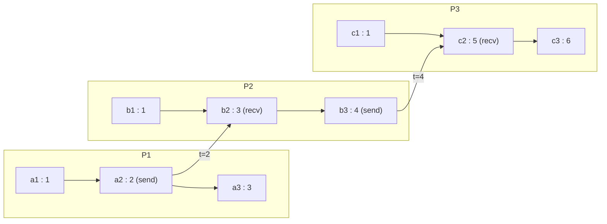

Lamport zaman damgası, süreç başına tek bir işaretsiz tam sayıdır; iki kuralla korunur ve `a -> b` olduğunda `C(a) < C(b)` olmasını garanti eder. **Saat koşulunu** sağlayan mümkün olan en ucuz mekanizmadır ve bu ucuzluğun bedeli, çıkarımın yalnızca tek yönde işlemesidir: elinizdeki iki zaman damgasına bakarak olayların nedensel olarak sıralı mı yoksa eşzamanlı mı olduğunu söyleyemezsiniz. Bu sayının neyi kanıtladığını, neyi yalnızca ima ettiğini tam olarak bilmek, doğru bir fencing token ile sessiz veri kaybı arasındaki farktır.
 
## Algoritma
 
Her `p` süreci sıfırdan başlayan bir `C_p` sayacı tutar ve iki kural uygular:
 
- **IR1 (yerel olay).** Gönderim dahil herhangi bir yerel olaya zaman damgası vermeden önce artır: `C_p = C_p + 1`.
- **IR2 (alım).** `t` zaman damgası taşıyan bir mesaj alındığında `C_p = max(C_p, t) + 1` yapılır ve alım olayı bu yeni değerle damgalanır.
IR2'deki `max` mekanizmanın tamamıdır. Alıcının sayacını, göndericinin gözlemlemiş olduğu her şeyin ötesine çeker; böylece göndericinin nedensel geçmişindeki her öğe artık alım olayının katı biçimde altında kalır. `max` sonrasındaki `+ 1` süs değildir: o olmadan bir gönderim ile ona karşılık gelen alım aynı zaman damgasını paylaşırdı ve `->` ilişkisi `<` yerine `<=` ilişkisine eşlenir, sonradan eşitlik bozmanın dayandığı katılık yok olurdu.
 

*IR1 ve IR2 altında sayaç yayılımı. `a3 : 3` ile `b2 : 3` nedensel olarak ilişkisiz oldukları halde aynı değeri paylaşır; `b1 || a3` olmasına rağmen `b1 : 1`, `a3 : 3` değerinden küçüktür.*
 
Bu diyagram skaler saatin iki hata modunu tek karede barındırır. Eşit zaman damgaları eşzamanlılık anlamına gelmez; sayaçların denk gelmesi anlamına gelir. Küçük bir zaman damgası "önce gerçekleşti" demek değildir; yalnızca "sonra gerçekleşmedi" demektir. Saatin fiilen belgelediği ilişki karşıt tersidir: `C(a) >= C(b)` ise `a -> b` imkansızdır. Bu gerçek ve kullanılabilir bir garantidir; Lamport saatlerini çakışma tespiti için işe yaramaz kılarken eskimiş işlemleri reddetmek için doğru kılan da tam olarak budur.
 
## Kalıcı Monotonluk ile Uygulama
 
Sayaç süreç yeniden başlatmalarından sağ çıkmalıdır; aksi halde yeniden başlayan süreç daha önce kullandığı zaman damgalarını yeniden dağıtır ve saat koşulu yeniden başlatma sınırında kırılır. Her olayda kalıcılaştırmak işlem başına bir `fsync` maliyeti getirdiğinden, üretim uygulamaları mevcut değerin önünde bir pencere rezerve eder ve yalnızca pencere tükendiğinde diske yazar; çökme sonrası ileri bir sıçramayı kabul eder.
 
```go
package lamport
 
import (
	"context"
	"fmt"
	"sync"
)
 
// Persister durably records a counter high-water mark. Store must not return
// nil until the value has reached stable storage.
type Persister interface {
	Store(ctx context.Context, highWater uint64) error
	Load(ctx context.Context) (uint64, error)
}
 
// Stamp is the totally ordered timestamp: the scalar counter plus the
// originating process ID used only to break ties.
type Stamp struct {
	Counter uint64
	PID     string
}
 
// Less implements the arbitrary but consistent total order that extends the
// happened-before partial order.
func (s Stamp) Less(o Stamp) bool {
	if s.Counter != o.Counter {
		return s.Counter < o.Counter
	}
	return s.PID < o.PID
}
 
func (s Stamp) String() string { return fmt.Sprintf("%d@%s", s.Counter, s.PID) }
 
type Clock struct {
	mu        sync.Mutex
	pid       string
	counter   uint64
	highWater uint64 // Persisted; counter is never allowed to exceed it.
	window    uint64 // Counters reserved per fsync. Tune against restart jump.
	store     Persister
}
 
func New(ctx context.Context, pid string, window uint64, store Persister) (*Clock, error) {
	if window == 0 {
		return nil, fmt.Errorf("lamport: window must be positive")
	}
	hw, err := store.Load(ctx)
	if err != nil {
		return nil, fmt.Errorf("lamport: load high-water mark: %w", err)
	}
	// Resume at the persisted mark, not at the last observed counter. The
	// gap is wasted counter space, which is free; reuse would not be.
	return &Clock{pid: pid, counter: hw, highWater: hw, window: window, store: store}, nil
}
 
// reserveLocked extends the durable window when the counter catches up to it.
func (c *Clock) reserveLocked(ctx context.Context) error {
	if c.counter <= c.highWater {
		return nil
	}
	next := c.counter + c.window
	if err := c.store.Store(ctx, next); err != nil {
		// Roll back so no timestamp escapes that is not covered by a
		// durable mark. Callers must treat this as a hard failure.
		c.counter = c.highWater
		return fmt.Errorf("lamport: reserve to %d: %w", next, err)
	}
	c.highWater = next
	return nil
}
 
// Tick applies IR1 for a local event or a send.
func (c *Clock) Tick(ctx context.Context) (Stamp, error) {
	c.mu.Lock()
	defer c.mu.Unlock()
	c.counter++
	if err := c.reserveLocked(ctx); err != nil {
		return Stamp{}, err
	}
	return Stamp{Counter: c.counter, PID: c.pid}, nil
}
 
// Update applies IR2 for a receive. remote is the timestamp carried by the
// inbound message.
func (c *Clock) Update(ctx context.Context, remote uint64) (Stamp, error) {
	c.mu.Lock()
	defer c.mu.Unlock()
	if remote > c.counter {
		c.counter = remote
	}
	c.counter++
	if err := c.reserveLocked(ctx); err != nil {
		return Stamp{}, err
	}
	return Stamp{Counter: c.counter, PID: c.pid}, nil
}
```
 
`reserveLocked` içindeki geri alma, kodun görünmeyen kritik noktasıdır. Kalıcı depolama başarısız olursa bellekteki sayaç kalıcı işaretin önünde kalmamalıdır; hemen ardından gelecek bir çökme, süreci daha düşük bir değerden ayağa kaldırır ve mükerrer zaman damgaları dağıtılır. Kalıcı bir işaretin kapsamadığı bir zaman damgası dağıtmak, WAL diske yazılmadan bir yazımı acknowledge etmekle aynı hata sınıfındadır.
 
## Kısmi Sıralamadan Tam Sıralamaya
 
Sayacı bir süreç ID'siyle eşleyip sözlüksel karşılaştırmak, yani `Stamp.Less`'in yaptığı şey, tüm olaylar üzerinde bir **tam sıralama** verir. Bu sıralama `->` ile tutarlıdır (her nedensel çift doğru sıralanır) ama bunun ötesinde keyfidir; eşzamanlı çiftler eşitlik bozma kuralı ne diyorsa ona göre sıralanır. Keyfilik burada kusur değil amaçtır: birçok algoritmanın *bir* üzerinde anlaşılmış diziye ihtiyacı vardır ve hangisi olduğu, tüm süreçler aynısını hesapladığı sürece önemsizdir.
 
Lamport'un özgün uygulaması dağıtık karşılıklı dışlamaydı: her süreç zaman damgalı bir istek yayınlar, tüm istekleri `Stamp` sırasına göre kuyruklar ve kendi isteği başa geldiğinde ve diğer her süreçten katı biçimde daha büyük damgalı bir mesaj aldığında kritik bölgeye girer. Doğruluk argümanı, pratikte nadiren tutan ve algoritmanın olduğu gibi kimse tarafından sahaya alınmamasının sebebi olan iki varsayıma dayanır:
 
- **Çift başına FIFO kanallar.** Sırasız teslim, bir sürecin eşinde bekleyen istek varken yokmuş gibi davranmasına yol açar.
- **Hata olmaması.** Tek bir çöken katılımcı diğer tüm süreçleri sonsuza dek bloke eder, çünkü "herkesten daha sonraki mesaj" koşulu bir daha asla sağlanamaz. Algoritmada lider de lease de zaman aşımı da yoktur.
Bu yüzden üretimde karşılıklı dışlama küresel istek kuyruğu yerine lease ve fencing kullanır; bkz. [Kiralama Tabanlı Kilitleme](/distributed-systems/tr/coordination/distributed-locking/lease-based-locking/) ve [Fencing Token'ları](/distributed-systems/tr/coordination/distributed-locking/fencing-tokens/).
 
## Lamport Saatleri Sahada Nerede Çalışır
 
Skaler saat kendi adıyla nadiren görünür, ancak bir sistemin eskimiş aktörleri reddeden monoton epoch'lara ihtiyaç duyduğu her yerde biçimi oradadır:
 
- **Raft term'leri.** Term her seçim girişiminde artar, her RPC ile taşınır ve daha yüksek bir term gören her düğüm onu benimseyip görevi bırakır. Bu, yan etkisi görevi bırakmak olan IR2'dir; daha düşük term taşıyan bir mesaj tam olarak `C(a) >= C(b)` göndericinin güncel durumu gözlemlemiş olamayacağını kanıtladığı için reddedilir. Bkz. [Raft](/distributed-systems/tr/coordination/consensus-algorithms/raft/).
- **Paxos ballot numaraları.** Ballot'lar sözlüksel karşılaştırılan `(sayaç, proposer_id)` çiftleridir, yani birebir `Stamp.Less`; bir acceptor'un verdiği söz, bu tam sıralamada geriye gitmeyi reddetmektir.
- **ZooKeeper zxid ve Kafka leader epoch'ları.** İkisi de tarihi çağlara bölen monoton sayaçlardır; eski bir epoch sunan replika fence'lenir. Epoch'un kalıcı olmasının sebebi `reserveLocked`'ın diske yazmasıyla aynıdır.
- **Depolama için fencing token'ları.** Kilit servisi katı biçimde artan bir token verir, depolama katmanı gördüğü en yüksek token'ın altında token taşıyan her yazımı reddeder. Bu, saat koşulunun saf karşıt ters kullanımıdır ve GC duraklamaları altında lease'ler sona erdiğinde bile fencing'i sağlam kılan şeydir.
| Özellik | Lamport zaman damgası | Vektör saat | Duvar saati damgası | Hybrid logical clock |
|---|---|---|---|---|
| Olay başına boyut | 1 sayaç | O(N) girdi | 1 zaman damgası | 1 damga artı sayaç |
| Değerlerden `a -> b` kanıtlar mı | Hayır | Evet | Hayır | Evet, skew sınırı içinde |
| Eşzamanlılığı tespit eder mi | Hayır | Evet | Hayır | Evet |
| Eskimiş aktörü reddeder mi | Evet | Evet, daha pahalı | Skew altında güvensiz | Evet |
| İnsan zamanıyla ilişkilendirilebilir mi | Hayır | Hayır | Evet | Evet |
| Ne zaman tercih edilir | Epoch, term, ballot, fencing, keyfi tam sıralama | Çok yazıcılı replikasyonda çakışma tespiti | Sıralama için asla; yalnız gösterim ve TTL | Nedensellik artı hata ayıklanabilir zaman |
 
## Hata Modları ve Operasyonel Tuzaklar
 
**Lamport sırasını merge semantiği olarak kullanmak.** Tam sıralama eşzamanlı olaylar arasında keyfi olduğundan, replika çakışmalarını "en yüksek Lamport damgası kazanır" diye çözmek gerçekten eşzamanlı iki güncellemeden birini sessizce atar ve hayatta kalanı, kullanıcı niyetiyle hiçbir ilgisi olmayan bir süreç ID'si eşitlik bozması belirler. Sıralama deterministik göründüğü için kayıp testlerde görünmez. Eşzamanlı güncellemeler korunacak veya yüzeye çıkarılacaksa meta veri skaler değil [vektör saat](/distributed-systems/tr/foundations/time-and-ordering/vector-clocks/) olmalıdır.
 
**Tek bir hızlı veya kötü niyetli eşten kaynaklanan sayaç şişmesi.** Sıkı döngüde tick eden tek bir süreç veya maksimuma yakın sayaç taşıyan bozuk bir mesaj, kümedeki her `max` üzerinden yayılır ve tüm sayaçları kalıcı olarak şişirir. `uint64` ile gerçekçi hiçbir ömür boyunca taşma riski yoktur, ancak 32 bitlik bir sayaçta veya epoch ile birlikte bir bit alanına paketlenmiş bir sayaçta bu bir wrap-around olayıdır. IR2 uygulamadan önce gelen zaman damgalarını makuliyet sınırına karşı doğrulayın ve bir düğümün sayacı ile mesaj hızı arasındaki farka alarm kurun.
 
:::caution
Bir Lamport sayacını sabit bir bit alanına paketlemek, örneğin düğüm ID'si ve epoch yanında 22 bit sayaç, şişmeyi kozmetik bir sorundan doğruluk sorununa çevirir. Bir kez wrap ettiğinde saat koşulu ihlal edilir ve eskimiş aktörler her fencing kontrolünden geçer. Bit genişliğini yerel olay hızına değil, *şişmiş* hıza göre bütçeleyin.
:::
 
**Gönderimlerde IR1'i atlamak veya IR2'yi artırmadan uygulamak.** Her iki hata da çoğunlukla çalışan bir saat üretir. Gönderimde IR1'in eksikliği, nedensel olarak sıralı iki olayın aynı değeri taşımasına yol açar; IR2'deki `+ 1` eksikliği ise bir alımın kendi gönderimiyle aynı damgayı paylaşmasına. İkisi de düşük eşzamanlılıkta görünmez, yük altında nadir ve tekrarlanamayan sıralama ihlalleri olarak ortaya çıkar. Regresyon testi örnek testi değil, her nedensel zincir boyunca katı monotonluğu doğrulayan bir property test olmalıdır.
 
**Yeniden başlatma sonrası kalıcı olmayan sayaçlar.** Sıfırdan başlayan bir süreç, eşlerin çoktan aştığı düşük zaman damgalarını yeniden dağıtır. Mesajları ya fencing mantığı tarafından yok sayılır (erişilebilirlik kaybı) ya da daha kötüsü, yalnızca kendi yerel sayacıyla karşılaştıran her bileşen tarafından kabul edilir (doğruluk kaybı). Belirti, sağlıklı görünen, trafik gönderen ve gönderdiği hiçbir şey etki etmeyen bir düğümdür.
 
**Gerçek zamanla herhangi bir ilişki varsaymak.** Lamport değerleri birimsizdir. 4 milyonluk bir damga olayın ne zaman gerçekleştiği hakkında hiçbir şey söylemez, hiç mesajlaşmayan ayrık kümeler arasında karşılaştırılamaz ve TTL, saklama veya sona erme mantığını süremez. Her iki özelliğe birden ihtiyaç duyan sistemler, `max` kuralını koruyup değeri fiziksel zamana yakın sabitleyen [Hibrit Mantıksal Saatlere](/distributed-systems/tr/foundations/time-and-ordering/hybrid-logical-clocks/) yönelir.
 
**Kümeler arası karşılaştırma.** Hiç haberleşmeyen iki kümenin sayaçları keyfi biçimde ayrışır. Olay loglarını Lamport sırasına göre birleştirmek, hiçbir kümenin gerçek tarihiyle tutarlı olmayan bir dizi üretir. Her federasyon sınırı ortak bir epoch veya fiziksel bir çıpa gerektirir.
 
## Ne Zaman Kullanmalı, Ne Zaman Kullanmamalı
 
Alıcının, eskimiş bir aktörün üretmiş olabileceği her şeyi reddetmesini sağlayan bir **monoton epoch**'a ihtiyacınız olduğunda Lamport zaman damgası kullanın: lider term'leri, konfigürasyon versiyonları, kilit nesilleri, depolama fencing token'ları, önbellek nesil sayaçları. İstekler üzerinde deterministik, küme genelinde bir tam sıralamaya ihtiyaç duyduğunuzda ve eşzamanlı istekler arasındaki özgül sıra anlamsal olarak önemsizken kullanın; örneğin işlemleri replike bir log'a dizerken. Meta veri boyutuna olay başına ek yükün hakim olduğu ve yazıcı sayısının O(N) vektörleri karşılanamaz kılacak kadar büyük olduğu durumlarda kullanın.
 
Uygulamanın iki güncellemenin eşzamanlı olup olmadığını bilmesi gerektiğinde kullanmayın; skaler tam olarak o bilgiyi kaybeder. Partition başına tek lider zaten log offset'i atıyorsa kullanmayın, çünkü offset daha güçlü ve daha ucuz bir sıralamadır. İnsan zamanıyla veya mesajlaşma sisteminin dışındaki olaylarla ilişkilendirilmesi gereken hiçbir şey için kullanmayın. Ve benzersiz tanımlayıcı olarak kullanmayın: `(sayaç, pid)` çiftleri benzersizdir ama çıplak sayaçlar tasarım gereği süreçler arasında çakışır; [dağıtık ID üretimi](/distributed-systems/tr/foundations/time-and-ordering/distributed-id-generation/) şemalarının her zaman bir düğüm tanımlayıcısı gömmesinin sebebi budur.