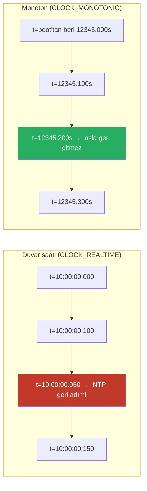
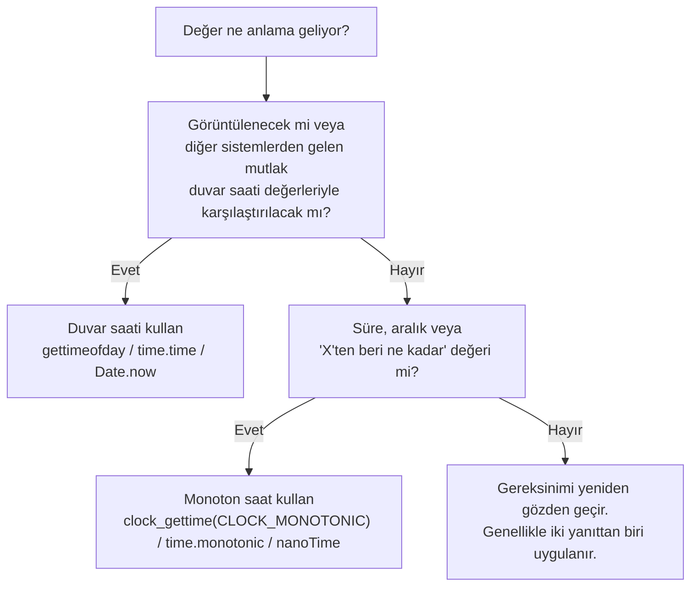

İşletim sistemleri, farklı semantikler, farklı garantiler ve tamamen farklı hata modlarına sahip en az iki farklı saati uygulamalara sunar. İsimler platforma göre değişir — Linux'ta `CLOCK_REALTIME` ve `CLOCK_MONOTONIC`, Java'da `System.currentTimeMillis()` ve `System.nanoTime()`, Python'da `time.time()` ve `time.monotonic()`, Go'da her iki okumayı da döndüren `time.Now()` — ancak altta yatan ayrım aynıdır: biri duvar saati zamanını (insanların "şimdi" dediği şey) izler, diğeri geçen zamanı (belirsiz bir andan bu yana ne kadar süre geçtiğini) izler. Yanlışını kullanmak, dağıtık sistemlerdeki en yaygın ince üretim hatalarından biridir ve hata genellikle yalnızca belirli bir çevresel olay sırasında ortaya çıkar: NTP ayarlaması, artık saniye, gün ışığından yararlanma saati geçişi veya node'lar arası saat kayması.
 
Karar kuralı söylemek kolaydır ama pratikte yanlış yapmak da öyle: **duvar saati zamanı insanlara göstermek için, monoton zaman diğer her şey için**. Bu kuralın arkasındaki mantık ve doğru uygulamak için kullanılacak belirli API'ler bu sayfanın konusudur.
 
## Her Saatin Gerçekte Ölçtüğü Şey
 
**Duvar saati** (time-of-day) saati, sistemin Unix başlangıç noktasının ne zaman gerçekleştiğine dair fikri artı o zamandan bu yana NTP ve açık saat ayarlama işlemleriyle ayarlanmış geçen zamandan türetilerek mevcut UTC zamanını bildirmeye çalışır. "Zamana" karşılık gelmesi amaçlanır — bir kişinin bir belgeye yazacağı veya bir log girişinin yazdıracağı aynı değer.
 
**Monoton saat**, belirsiz bir referans noktasından bu yana geçen zamanı bildirir (tipik olarak sistem başlatma, ancak belirli sıfır noktası tasarım gereği önemsizdir). Ardışık okumaların hiçbir zaman azalan değerler döndürmemesini ve ilerleme oranının geçen fiziksel zamanı yaklaşık olarak izlemesini garanti eder. Süreleri, aralıkları ve "X'ten bu yana ne kadar süre" hesaplamalarını ölçmek için tasarlanmıştır.
 
Kritik garantiler farklıdır:
 
| Özellik | Duvar saati | Monoton |
|---|---|---|
| Mevcut UTC zamanını bildirir | Evet | Hayır |
| Geri NTP adımını geri gitmeden atlatır | Hayır | Evet |
| NTP kayması sırasında ilerlemeye devam eder | Evet (değiştirilmiş oranda) | Evet (düzeltilmiş oranda) |
| Gün ışığından yararlanma geçişlerinden etkilenir | Bazen (timezone API'sine bağlı) | Hayır |
| Artık saniyelerden etkilenir | Evet | Uygulama tanımlı |
| Referans dönemi | Unix başlangıcı (1970-01-01 UTC) | Belirsiz (tipik olarak boot) |
| Makineler arası karşılaştırma için uygun | Yaklaşık (saat kayması sınırları içinde) | Hayır (makine başına farklı referans) |
| Geçen zamanı ölçmek için uygun | Hayır | Evet |
 
En önemli fark ve en çok üretim hatasına neden olan: **duvar saati zamanı geri gidebilir**. NTP bir sunucunun saatinin doğru zamandan 200ms ileride olduğunu keşfettiğinde, saati 200ms geri adımlatabilir — yani `gettimeofday()`'e ardışık iki çağrı, ikincinin birinciden önce olduğu değerler döndürebilir.
 

*Duvar saati NTP düzeltmesi sırasında geri adım atabilir; monoton saat asla atmaz. İki okuma tamamen farklı soyutlamaları yansıtır.*
 
## Süreler için Duvar Saati Kullanmanın Hata Modları
 
Aralıkları ölçmek için duvar saati zamanını kullanmak — bir isteğin süresi, kiralamanın sona ermesine kadar geçen süre, önbellek girişinin yaşı — yalnızca belirli çevresel olaylar sırasında ortaya çıktıkları için teşhis edilmesi son derece zor olan bir hata sınıfı üretir.
 
### Negatif Süreler
 
En basit hata: bir süre hesaplaması negatif değer üretir.
 
```python
# YANLIŞ: süre için duvar saati zamanı kullanımı
start = time.time()  # Başlangıçtan bu yana duvar saati saniyeleri döndürür
do_work()
elapsed = time.time() - start
 
# do_work() sırasında NTP geri adımlandıysa, elapsed negatiftir.
# elapsed >= 0 varsayan downstream kod sürpriz biçimlerde başarısız olur:
if elapsed < timeout:
    # Bu dal negatif elapsed ile alınır --
    # istek "anlık olarak daha hızlı tamamlandı"
    pass
```
 
Negatif süreler şuralara yayılır:
- Histogramlar ve metrikler (Prometheus'un `Histogram.observe(negatif_değer)` tanımsız davranıştır)
- Rate limiter token bucket yeniden doldurma hesaplamaları (yeniden dolma = geçen × hız; negatif geçen, negatif token eklendiği anlamına gelir)
- Önbellek TTL hesaplamaları (yaş = şimdi - eklendi_zaman; negatif yaş "asla sona ermez" anlamına gelir)
- SLA gecikme raporları (P99 hesaplamalarındaki negatif gecikmeler toplamları çarpıtır)
### Görünürde Sonsuz Döngüler
 
Duvar saati zamanını kullanan bir timeout döngüsü, ileri saat adımından sonra sonsuz döngüye dönüşebilir.
 
```python
# YANLIŞ: timeout yoklama için duvar saati zamanı kullanımı
deadline = time.time() + 30  # 30 saniyelik son tarih
 
while time.time() < deadline:
    if check_condition():
        return True
    time.sleep(0.1)
 
return False  # Timeout
```
 
NTP bu döngü başladığı anda saati 60 saniye ileri adımlarsa, `deadline` amaçlanandan 60 saniye daha uzağa ayarlanır. Döngü 30 değil 90 saniye çalışacaktır. Saat döngü ortasında 60 saniye geri adımlarsa, döngü farklı bir nedenle 90 saniye çalışır — zaman geriye doğru akıyor gibi görünür, son tarihi göreceli olarak daha uzağa uzatır. Her iki şekilde de timeout yanlıştır.
 
### Kiralama ve Kilit Süre Dolumu Hataları
 
Duvar saati tabanlı dağıtık kilitler özellikle tehlikelidir; çünkü zamanlama varsayımları makine sınırlarını aşar.
 
```python
# Duvar saati TTL ile dağıtık kilit -- TEHLİKELİ
def acquire_lock(key, ttl_seconds=30):
    expiry = time.time() + ttl_seconds  # Duvar saati süre dolumu
    redis.set(key, "locked", nx=True, exat=int(expiry))
    return expiry
 
def is_lock_still_held(expiry):
    # Duvar saati ileri adım atarsa, bu False'u zamansız döndürür
    # Duvar saati geri adım atarsa, bu gerçek süre dolumundan sonra True döndürür
    return time.time() < expiry
```
 
İki node, duvar saatleri zıt yönlerde kaydığında aynı kilidi tuttuklarına eşzamanlı inanabilir. Bu, Martin Kleppmann'ın 2016 yılındaki Redlock algoritmasına ilişkin eleştirisinde analiz ettiği hata modudur: saati biraz hızlı çalışan bir node kilidinin sona erdiğine inanır ve serbest bırakır; başka bir node kilidi alır; birinci node — kira jetonunu kullanarak — hâlâ kilidi tuttuğuna inanır ve ikinci node'un da yazdığı verileri yazar.
 
:::danger
Duvar saati TTL'lerine dayalı dağıtık kilitler, node'lar arasında saat kayması varlığında temelde güvensizdir. Fencing token'ları (kilit servisinin her edinmede yayınladığı monoton artan dizi numaraları), iki istemcinin aynı kilidi eşzamanlı tuttuklarına inanmasını önleyen tek mekanizmadır. Her node içinde monoton saatler bile olsa, node'lar arasındaki kilitler zaman tabanlı süre dolumundan daha güçlü bir şey gerektirir. Bkz. [Fencing Token'ları](/distributed-systems/tr/coordination/distributed-locking/fencing-tokens/).
:::
 
### Zaman Tabanlı Sıralama Hataları
 
Yaygın bir desen, zaman damgalarını çakışma çözümünde tiebreaker olarak kullanır: "daha yeni zaman damgalı yazma kazanır." Bu, Cassandra, DynamoDB ve birçok CRDT uygulamasının kullandığı **Last Write Wins (LWW)** stratejisidir. Temelden duvar saati zamanına bağlıdır ve dolayısıyla tüm duvar saati hata modlarına tabidir.
 
İki node eşzamanlı yazarsa ve daha yavaş saatli node (gerçek zamanda) ikinci yazıyor ancak (duvar saatinde) daha erken zaman damgasıyla yazıyorsa, sistem sessizce daha eski yazmayı saklar — herhangi bir hata göstergesi olmaksızın veri kaybeder. Artık saniye sırasında 2012 Cassandra olayı tam olarak buydu: JVM'in saati 1 saniye geri adımladı, sonraki yazmaların yakın zamanda yazılan veriden "daha eski" görünmesine neden oldu ve gossip protokolü eski veriyi yetkili olarak yayınladı.
 
## Duvar Saati Zamanının Doğru Yanıt Olduğu Durumlar
 
Duvar saati zamanı, değerin *anlamı* "insanların anladığı şekliyle zaman" olduğunda doğru seçimdir. Özellikle:
 
**İnsanların okuması için log zaman damgaları.** `2025-07-14T15:43:21.847Z user_id=12345 action=login` log satırı duvar saati zamanıyla doğrudur. Log zaman damgasındaki 100ms kayma doğruluk sorunu değildir — log girişini biraz yanlış kılar, bu da kabul edilebilirdir.
 
**Mutlak zamanlarda zamanlanmış olaylar.** "Bu raporu her gün UTC 03:00'te çalıştır" duvar saati zamanı gerektirir. Cron arka plan programı, Kubernetes CronJobs ve benzeri zamanlayıcılar duvar saati zamanını kullanmalıdır; çünkü kullanıcının niyeti duvar saati terimleriyle ifade edilir.
 
**Kullanıcılar için belge zaman damgaları.** Veritabanlarında saklanan created-at ve updated-at zaman damgaları duvar saati değerleridir; çünkü kullanıcılar bunların insan anlamında "zamana" karşılık gelmesini bekler.
 
**Denetim izleri ve uyumluluk.** Düzenleyici ve güvenlik gereksinimleri tipik olarak duvar saati zaman damgalarını belirtir. Monoton zamana göre hafif kesinsizlik denetim amaçları için kabul edilebilirdir.
 
**1 saniyelik belirsizliğin tolere edilebileceği kaba taneli TTL'ler.** 60 saniyelik önbellek girişi, 1 saatlik oturum, 24 saatlik token — bunlar için duvar saati tabanlı süre dolumu uygundur; çünkü hata modu (önbellek girişinin 100ms erken veya geç sona ermesi) yanlış davranış üretmez.
 
Ortak nokta: duvar saati zamanı, değer *görüntüleneceği* veya *insan-anlamlı mutlak zamanlara karşı semantik olarak karşılaştırılacağı* zaman ve küçük kesinsizlikler doğruluk sorunlarına neden olmadığında uygundur.
 
## Monoton Zamanın Doğru Yanıt Olduğu Durumlar
 
Monoton zaman, değerin *anlamı* "X'ten bu yana ne kadar süre" olduğunda doğru seçimdir. Özellikle:
 
**Süreleri ölçme.** İstek gecikmeleri, fonksiyon yürütme süreleri, veritabanı sorgu süreleri, ağ round-trip süreleri — hesaplanan değerin "zaman" değil "geçen zaman" olduğu her şey.
 
**Timeout'lar ve son tarihler.** 30 saniyelik istek timeout'u "isteğin başladığı andan itibaren 30 saniyelik geçen duvar-saati-oran zamanı" anlamına gelir, "duvar saati belirli bir andan 30 saniye sonra okuyana kadar" değil. Monoton zaman ilkini doğru yakalar.
 
**Rate limiter'lar ve token bucket'lar.** Yeniden doldurma oranları "geçen zamanın saniyesi başına token" olarak ifade edilir. Token bucket uygulaması geçen zamanı monoton saatler kullanarak hesaplamalıdır; aksi takdirde NTP adımları yanlış yeniden doldurma miktarlarına neden olur.
 
**Retry'larda geri çekilme zamanlaması.** Jitter'lı üstel geri çekilme bekleme sürelerini geçen-zaman süreleri olarak hesaplar. Bunlar monoton zaman kullanmalıdır.
 
**Sağlık kontrolü aralıkları.** "Her 5 saniyede bir heartbeat gönder" her 5 saniye geçen zaman anlamına gelir. Duvar saati geri adım atarsa, duvar saati tabanlı sağlık kontrolcü adım süresi boyunca duraklatır.
 
**Dağıtık uzlaşma zamanlayıcıları.** Raft seçim timeout'ları, ZooKeeper oturum timeout'ları ve benzeri protokol zamanlayıcıları monoton zaman kullanmalıdır. Tüm follower'ların lider heartbeat'lerini gecikmiş saymasına neden olan eşzamanlı duvar saati adımlarının tetiklediği lider seçim fırtınaları, üretim olaylarına neden olmuştur.
 
**Performans benchmark'ları ve profilleme.** "Bu ne kadar sürdü" ölçen herhangi bir kod, ölçümün anlamlı olması için monoton zaman kullanmalıdır.
 

*Saat seçimi karar ağacı: şüphede olduğunda, değerin anlamının "zaman" mı yoksa "geçen zaman" mı olduğunu sorun.*
 
## Platforma Özgü API Referansı
 
İsimlendirme ve semantik dil ve platforma göre değişir. Aşağıdaki her yaygın ortam için doğru API seçimleri:
 
### C / POSIX
 
`clock_gettime()` fonksiyonu, hangi saatin okunacağını belirten bir saat kimliği alır:
 
```c
#include <time.h>
 
struct timespec wall_ts, mono_ts;
 
// Duvar saati zamanı, NTP tarafından ayarlanabilir, geri gidebilir
clock_gettime(CLOCK_REALTIME, &wall_ts);
 
// Monoton zaman, asla geri gitmez, NTP adımlarından etkilenmez
clock_gettime(CLOCK_MONOTONIC, &mono_ts);
 
// Sistem askıya alındığında ilerlemeyen monoton zaman
// (Linux'a özgü, bazı gömülü senaryolar için yararlı)
clock_gettime(CLOCK_MONOTONIC_RAW, &mono_ts);
 
// CLOCK_BOOTTIME askıya alma sırasında ilerler (Linux'a özgü)
// Uyku olayları boyunca gerçek geçen zamanı ölçmek için yararlı
clock_gettime(CLOCK_BOOTTIME, &mono_ts);
```
 
`CLOCK_MONOTONIC`, süre ölçümü için standart seçimdir. `CLOCK_MONOTONIC_RAW`, NTP kaymasına tabi olmayan bir saat sağlar; özellikle donanım-oranlı geçen zaman istediğinizde yararlıdır. `CLOCK_BOOTTIME`, herhangi bir sistem askıya alma süresini içermesi gereken süreleri ölçmek için yararlıdır (örn. uyuyabilecek bir mobil cihazda).
 
### Java / JVM
 
```java
// Süreler için YANLIŞ -- duvar saati, geri gidebilir
long startMs = System.currentTimeMillis();
doWork();
long elapsedMs = System.currentTimeMillis() - startMs;  // Negatif olabilir!
 
// Süreler için DOĞRU -- monoton, asla geri gitmez
long startNs = System.nanoTime();
doWork();
long elapsedNs = System.nanoTime() - startNs;  // Her zaman negatif olmayan
 
// java.time paketi: Instant varsayılan olarak duvar saati kullanır
Instant now = Instant.now();  // CLOCK_REALTIME eşdeğeri kullanır
 
// Instant'lar arasındaki süreler için Duration tercih et
Duration timeout = Duration.ofSeconds(30);
 
// Java 9+: kodu test edilebilir ve açık hale getirmek için Clock kullan
Clock systemUtc = Clock.systemUTC();  // Duvar saati
// Yerleşik monoton Clock yoktur -- doğrudan System.nanoTime() kullan
```
 
En yaygın Java hatası: timeout son tarihleri veya süre ölçümleri için `System.currentTimeMillis()` kullanmak. `System.nanoTime()` bunlar için doğru API'dir.
 
### Go
 
Go'nun `time.Now()`'u, hem duvar saati okumasını *hem de* monoton okumayı içeren bir `time.Time` değeri akıllıca döndürür. `time.Time` değerleri arasındaki farkları hesaplayan işlemler, mevcut olduğunda monoton bileşeni otomatik olarak kullanır:
 
```go
import "time"
 
// time.Now(), hem duvar saati hem de monoton okumalı Time döndürür
start := time.Now()
doWork()
 
// time.Since monoton bileşeni otomatik olarak kullanır -- doğru süre
elapsed := time.Since(start)  // time.Now().Sub(start) ile eşdeğer
 
// time.Now()'dan iki time.Time değerinin karşılaştırılması monoton bileşeni kullanır
later := time.Now()
if later.After(start) {  // Monoton kullanarak doğru karşılaştırma
    // ...
}
 
// UYARI: JSON'a serileştirilen veya DB'de saklanan time.Time değerleri
// monoton bileşeni kaybeder. Seriden çıkarıldığında karşılaştırmalar duvar saati kullanır.
// Kalıcı zaman damgaları için bunları duvar saati değerleri olarak ele alın.
serialized, _ := start.MarshalJSON()
var restored time.Time
restored.UnmarshalJSON(serialized)
// restored monoton okumaya SAHİP DEĞİL -- sonraki karşılaştırmalar duvar saati kullanır
 
// Monoton okumayı açıkça çıkarmak için:
wallOnly := start.Round(0)
```
 
Go'nun tasarımı, en yaygın monoton-vs-duvar-saati hatalarını varsayılan olarak ortadan kaldırır: süre hesaplaması için `time.Since`, `time.Until` veya `t1.Sub(t2)` kullandığınız sürece, doğru monoton davranışı otomatik olarak alırsınız. Tuzak, serileştirme yoluyla monoton bileşenini kaybeden değerlerdir.
 
### Python
 
```python
import time
 
# Süreler için YANLIŞ -- duvar saati
start = time.time()
do_work()
elapsed = time.time() - start  # NTP ayarlaması sırasında negatif olabilir veya atlayabilir
 
# Süreler için DOĞRU -- Python 3.3'ten beri monoton
start = time.monotonic()
do_work()
elapsed = time.monotonic() - start  # Her zaman negatif olmayan
 
# Daha yüksek hassasiyet (Python 3.7+)
start = time.monotonic_ns()  # Tamsayı nanosaniye, float hassasiyet kaybı yok
do_work()
elapsed_ns = time.monotonic_ns() - start
 
# Zaman dilimi bilinçli datetime ile duvar saati için
from datetime import datetime, timezone
now = datetime.now(timezone.utc)  # Duvar saati UTC
```
 
### JavaScript / Node.js
 
```javascript
// Süreler için YANLIŞ -- duvar saati
const start = Date.now();
await doWork();
const elapsed = Date.now() - start;  // Saat ayarından sonra negatif olabilir
 
// Süreler için DOĞRU -- monoton yüksek çözünürlüklü zaman
const start = performance.now();  // DOMHighResTimeStamp döndürür (alt-ms hassasiyetli ms)
await doWork();
const elapsed = performance.now() - start;  // Her zaman negatif olmayan
 
// Node.js'e özgü: nanosaniye hassasiyeti için process.hrtime.bigint()
const start = process.hrtime.bigint();
await doWork();
const elapsed = process.hrtime.bigint() - start;  // BigInt nanosaniye
```
 
### Rust
 
```rust
use std::time::{Instant, SystemTime, UNIX_EPOCH};
 
// Süreler için DOĞRU -- Instant tanım gereği monotondur
let start = Instant::now();
do_work();
let elapsed = start.elapsed();  // Duration, her zaman negatif olmayan
 
// Gerektiğinde duvar saati (nadir)
let now = SystemTime::now();
let since_epoch = now.duration_since(UNIX_EPOCH)
    .expect("Zaman geriye gitti");  // Evet, bu başarısız olabilir!
```
 
Rust'ın standart kütüphanesi bunları iki farklı türe ayırır: `Instant` yalnızca monotondur ve duvar saati zamanına/zamanından dönüştürülemez; `SystemTime` ise duvar saatidir ve duvar saati aritmetiğinin başarısız olabileceğini kabul etmek için karşılaştırma işlemlerinden açıkça `Result` döndürür. Bu tür düzeyindeki ayrım, "yanlış saati kullandık" hatalarının tüm sınıfını derleme zamanında önler.
 
## Her İki Saati Birleştirmek: Monoton İzlemeyle Duvar Saati Okuması
 
Bazı senaryolar her ikisini de gerektirir: bir olayın yaklaşık olarak hangi duvar saati zamanında gerçekleştiğini bilmek ve aynı zamanda geçen zamanı doğru bir şekilde hesaplayabilmek. Desen, her iki okumayı da başlangıçta yakalamak ve bunları yalnızca uygun şekilde kullanmaktır:
 
```go
type Event struct {
    WallTime    time.Time     // Görüntüleme, log korelasyonu, kalıcılık için
    MonoTime    time.Time     // time.Now()'dan yakalanan -- monoton okumalı
}
 
func NewEvent() *Event {
    now := time.Now()
    return &Event{
        WallTime: now,
        MonoTime: now,  // Aynı değer ama farklı amaçlar için kullanılır
    }
}
 
func (e *Event) AgeForLogging() string {
    // İnsan tarafından okunabilir log çıktısı için duvar saati yaşı
    return time.Since(e.WallTime).String()  // Kesin değil ama loglar için tamam
}
 
func (e *Event) AgeForExpiry() time.Duration {
    // Doğruluk açısından kritik süre dolumu kararları için monoton yaş
    return time.Since(e.MonoTime)  // Hassas, NTP adımı güvenli
}
```
 
Go'da `time.Now()` bu davranışı zaten tek değerde sağlar. Bu tasarımı olmayan diğer dillerde her iki okumayı da açıkça yakalamanız gerekir:
 
```python
import time
from dataclasses import dataclass
 
@dataclass
class TimestampedEvent:
    wall_time: float  # Başlangıçtan bu yana duvar saati saniyeleri -- görüntüleme için
    mono_time: float  # Referanstan bu yana monoton saniye -- geçen zaman matematiği için
 
    @classmethod
    def now(cls):
        # Her ikisini atomik olarak yakala -- birbirine çok yakın olmalı
        return cls(
            wall_time=time.time(),
            mono_time=time.monotonic(),
        )
 
    def age(self) -> float:
        # Doğruluk için monoton kullan
        return time.monotonic() - self.mono_time
 
    def __str__(self) -> str:
        # Görüntüleme için duvar saati kullan
        return f"Event at {time.ctime(self.wall_time)}"
```
 
## Özel Durum: Makineler Arası Karşılaştırmalar
 
Monoton saat garantileri makineler arası uzanmaz. Her makinenin kendi referans dönemiyle kendi monoton saati vardır (tipik olarak sistem başlatma zamanı). A makinesinden bir monoton zaman damgası B makinesinden bir monoton zaman damgasıyla anlamlı biçimde karşılaştırılamaz — farklı sıfır noktalarına atıfta bulunurlar.
 
Makineler arası olay sıralaması için tek başına ne duvar saati ne de monoton zaman yeterlidir:
 
- **Duvar saati**, makineler arası saat kaymasına (tipik olarak 1-10 ms, en kötü durum 100+ ms) ve yukarıda belgelenen hata modlarına tabidir.
- **Monoton** yalnızca makine başınadır; paylaşılan referans yoktur.
Makineler arası sıralama için doğru mekanizmalar **mantıksal saatler** (Lamport zaman damgaları), **vektör saatler**, **hibrit mantıksal saatler (HLC)** veya **açık belirsizlik aralıklarına sahip fiziksel olarak senkronize saatlerdir** (Google Spanner'ın TrueTime'ı). Bunlar sonraki konularda ele alınır. İlke aynı kalır: makineler arası nedensel sıralama için duvar saati zaman damgaları kullanmayın ve monoton saatlerin makineler arasında karşılaştırılabileceğini varsaymayın.
 
:::tip
Hibrit Mantıksal Saatler (HLC) her iki dünyanın en iyilerini birleştirir: zaman damgalarının insan tarafından okunabilir zamanla yaklaşık olarak eşleşmesi için duvar saati okumasını içerirler ve aynı zamanda mantıksal saatlerin monoton sıralama garantilerini sağlarlar. CockroachDB, YugabyteDB ve diğer birçok dağıtık veritabanı işlem sıralaması için HLC kullanır. HLC'nin uzantısı olduğu temel mantıksal saat yaklaşımı için bkz. [Lamport Zaman Damgaları](/distributed-systems/tr/foundations/time-and-ordering/lamport-timestamps/).
:::
 
## Pratik Denetim Kontrol Listesi
 
Mevcut kodu devraldığınızda veya incelediğinizde, aşağıdaki denetim çoğu saat ilgili hatayı tanımlar:
 
1. **Duvar saati değerleri döndüren zaman API'leri için grep yapın:** `currentTimeMillis`, `gettimeofday`, `time.time()`, `Date.now()`, `Date()`, `Time.now()`, `DateTime.now()`. Her oluşum için sorun: "Bu değer başka bir zamandan çıkarılıyor mu, timeout için kullanılıyor mu, süre dolumu için kullanılıyor mu veya sıralama için karşılaştırılıyor mu?" Yanıt evet ise, bu bir hatadır — monoton eşdeğeriyle değiştirin.
2. **Mutlak zaman kullanan `sleep` ve zamanlayıcı kurulumu için grep yapın:** `sleep_until(belirli_duvar_zamanı)`, `setTimeout(..., mutlakZaman)`, belirli duvar saati zamanlarında zamanlanmış işler. Zamanlama niyetinin "bu mutlak zamanda" (doğru) yerine "bu kadar saniye geçtikten sonra" (monoton kullanın) olduğunu doğrulayın.
3. **Dağıtık kira/kilit TTL kodu arayın:** Saklanan süre dolumu zaman damgasını mevcut zamana karşı karşılaştıran herhangi bir kod, zaman damgaları duvar saati ise şüphelidir. Senkronize saatlerle bile, bu makineler arasında güvensizdir ve ek mekanizmalar gerektirir (fencing token'lar, kira yenileme protokolleri).
4. **Serileştirme sınırlarını kontrol edin:** Go'da, bir `time.Time` JSON'a serileştirildiğinde, veritabanına kalıcı hale getirildiğinde veya ağ üzerinden gönderildiğinde, monoton bileşenini kaybeder. Seriden çıkarıldıktan sonraki karşılaştırmalar duvar saati kullanır — istediğiniz şeyin bu olduğundan emin olun.
5. **"Son aktivite" veya "oturum timeout" mantığı arayın:** Yaygın bir desen, her istekte `last_activity = current_time()` saklar ve `current_time() - last_activity > timeout` olduğunda oturumları sona erdirir. Duvar saati zamanı kullanılırsa, NTP adımları oturumları erken sona erdirebilir veya süresiz olarak uzatabilir.
6. **Cron / zamanlanmış iş tanımlarını denetleyin:** Duvar saati burada doğrudur (kullanıcı "sabah 3'te" demek istiyor), ancak sistemin DST geçişlerini doğru şekilde ele aldığından emin olun. Çoğu cron uygulaması iyi belgelenmiş DST davranışına sahiptir; belgelenmiş davranışın niyetinize uyduğunu doğrulayın.
Monoton saatleri gerekli kılan donanım ve protokol bağlamı için bkz. [Fiziksel Saatler: Quartz Kayması, NTP Sınırları, Artık Saniye Problemi](/distributed-systems/tr/foundations/time-and-ordering/physical-clocks/).
Hiçbir fiziksel saatin yeterli olmadığı makineler arasında olayları sıralamaya izin veren soyutlama için bkz. [Happened-Before İlişkisi: Nedenselliğin Temeli](/distributed-systems/tr/foundations/time-and-ordering/happened-before/).
Dağıtık kilitler için zaman tabanlı süre dolumunun yerine geçen doğru mekanizma için bkz. [Fencing Token'ları: Eski Kilit Sahiplerini Engellemek](/distributed-systems/tr/coordination/distributed-locking/fencing-tokens/).