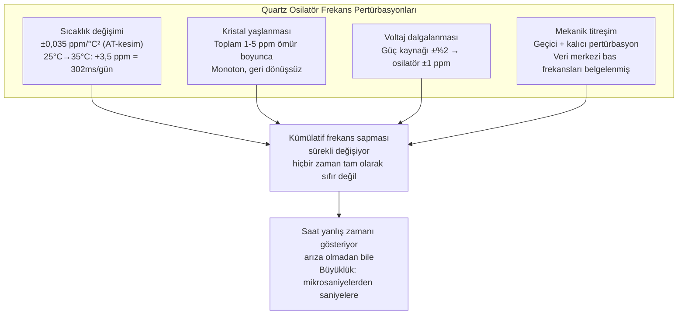
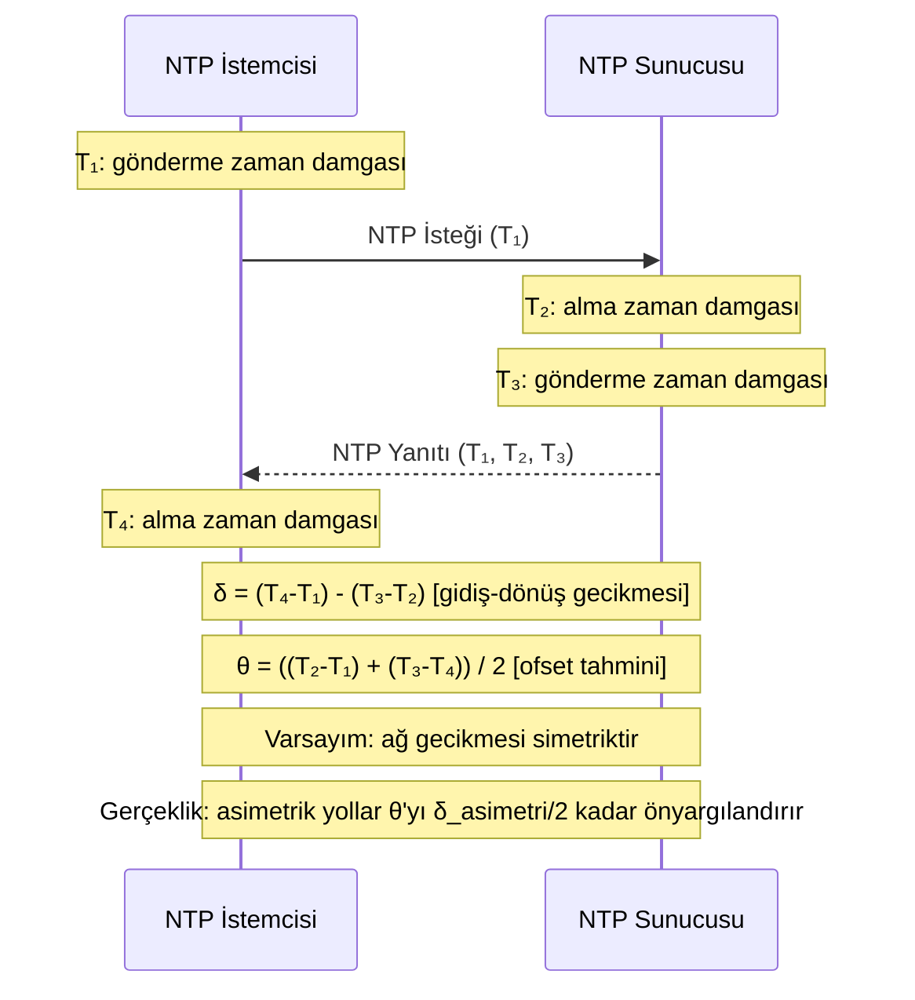

Her sunucunun bir saati vardır. Sıralama, timeout'lar, kiralamalar ve süre dolumu içeren her dağıtık sistem sorunu, bu saatin tutarlı bir şey ifade ettiğini varsayar. Etmez. Emtia sunucularındaki fiziksel saatler, kayan quartz osilatörlerdir; periyodik olarak güvenilmez bir ağ üzerinden NTP tarafından düzeltilir ve Dünya'nın dönüşü ile atom zamanı arasındaki uyuşmazlığı gidermek için zaman zaman süreksiz sıçramalara tabi tutulur. Herhangi bir anda, aynı veri merkezindeki iki sunucu milisaniyeler ile saniyeler arasında farklı zamanlarda anlaşmazlığa düşebilir ve ne kadar farklılaştığını bilmenin güvenilir bir bant içi mekanizması yoktur.
 
Bu, genel durumda çözülebilir bir problem değildir — dağıtık sistemlerin etrafında tasarım yapması gereken fiziksel bir kısıttır. Donanım ve protokol düzeyinde saat güvenilmezliğinin mekanizmalarını anlamak; mantıksal saatlerin, vektör saatlerin ve hibrit mantıksal saatlerin neden var olduğunu ve Google'ın neden TrueTime'ı inşa ettiğini anlamanın ön koşuludur.
 
## Quartz Osilatör Kayması: Fizik
 
Sunucu zaman tutma işlemi bir quartz kristal osilatörle başlar. Quartz kristal, bir elektrik alanına maruz kaldığında fiziksel boyutları tarafından belirlenen bir frekansta titreşir — gerçek zamanlı saat (RTC) kristalleri için tipik olarak 32,768 kHz veya sistem osilatörleri için 10-100 MHz. OS, osilatör tiklerini sayar ve bunlardan duvar saati zamanını türetir.
 
Sorun, titreşim frekansının mükemmel biçimde kararlı olmamasıdır. Şunlara göre değişir:
 
**Sıcaklık.** Quartz frekansının, tipik olarak 25-30°C yakınında bir tepe noktasıyla parabolik eğri olarak ifade edilen iyi karakterize edilmiş sıcaklık bağımlılığı vardır. Standart AT-kesim quartz kristali (en yaygın RTC türü), dönüş sıcaklığı etrafında yaklaşık ±0,035 ppm/°C² sıcaklık katsayısına sahiptir. 25°C yerine 35°C'de çalışan bir veri merkezi sunucusu yaklaşık şu frekans sapmasını getirir:
 
```
Δf/f ≈ 0,035 ppm/°C² × (35 - 25)² = 3,5 ppm
```
 
3,5 ppm kaymayla saat saniyede 3,5 mikrosaniye kazanır veya kaybeder — günde yaklaşık 302 milisaniye veya yılda yaklaşık 110 saniye. Ağ bağlantısını 24 saat kaybeden ve yalnızca yerel osilatörüne dayanan bir sunucu, gerçek zamandan ~300ms kayar.
 
**Yaşlanma.** Quartz kristaller ömürleri boyunca kristal yüzeyindeki kütlesel transfer, montaj yapılarındaki gerilim rahatlaması ve yüzey kirliliğindeki değişiklikler nedeniyle yavaş frekans kayması yaşar. Tipik bir emtia osilatörü ömrü boyunca 1-5 ppm kayarken; hassas sınıf osilatörler yılda < 0,1 ppm kayar. Yaşlanma kayması monoton ve yaklaşık doğrusaldır, ancak oranı aynı üretim partisindeki bireysel kristaller arasında bile değişir.
 
**Mekanik stres ve titreşim.** Sunucu kasasına fiziksel darbe, titreşim durduğunda da devam eden bir frekans pertürbasyonuna neden olabilir. Bu, veri merkezi titreşimi belgelenmiş olgusunun arkasındaki mekanizmadır — depolama sunucusu yakınında ses çalma kaynaklı bas frekanslar disk erişim gecikme artışlarıyla ilişkilendirilmiştir; çünkü yerel osilatördeki titreşim kaynaklı frekans pertürbasyonları zamanlama devrelerini etkilemiştir.
 
**Voltaj değişimi.** Güç kaynağı dalgalanmaları, gerilim kontrollü osilatörlerde kullanılan varaktor diyotlar aracılığıyla osilatör frekansını modüle eder. Nominal 3,3V ama ±%2 dalgalanan bir güç kaynağı bunu yaparken osilatör frekansı değişimine yol açar.
 

*Dört bağımsız fiziksel mekanizma quartz osilatör frekans sapmasına neden olur: saat hiçbir zaman tam olarak doğru değil, yalnızca yaklaşık olarak öyle.*
 
### TCXO ve OCXO: Daha İyi Osilatörler
 
Sıcaklık Telafi Edilmiş Kristal Osilatörler (TCXO) ve Fırın Kontrollü Kristal Osilatörler (OCXO), sıcaklık duyarlılığını büyüklük mertebeleri azaltır. TCXO, geniş sıcaklık aralığında ±0,5-2 ppm kararlılık elde ederek sıcaklık sensörü okumasına dayalı telafi voltajı uygular. OCXO, kristali sabit sıcaklıkta hassas bir fırında kapatarak ±0,001-0,1 ppm kararlılık elde eder. Her ikisi de telekomünikasyon ekipmanlarında, GPS alıcılarında ve özelleşmiş ölçüm donanımlarında kullanılır — maliyet kısıtlarının standart AT-kesim kristalleri gerektirdiği emtia sunucu anakartlarında değil.
 
Pratik ayrım: GPS alıcısının TCXO'su, GPS kilidi olmadan saatlerce UTC'ye göre ±100 nanosaniye saat doğruluğu elde edebilir. 25°C çalışma sıcaklığındaki emtia sunucu anakartı ±3 ppm'de kayar — günde yaklaşık ±260 milisaniye. Değişken veri merkezi sıcaklıklarında (soğuk ve sıcak koridorlarda 15-45°C), kayma önemli ölçüde daha kötüdür.
 
## NTP: Düzeltme Mekanizması ve Hata Bütçesi
 
Ağ Zaman Protokolü (NTP), sunucu saatlerini atom saatlerine (Stratum 0) dayanan zaman hiyerarşisiyle senkronize etmek için standart mekanizmadır. Hiyerarşi:
 
- **Stratum 0:** Atom saatleri (sezyum, rubidyum), PPS çıkışlı GPS alıcıları — nanosaniyelere kadar doğru
- **Stratum 1:** Stratum 0 kaynaklara doğrudan bağlı sunucular — tipik olarak ±1-50 µs doğruluk
- **Stratum 2:** Stratum 1'e senkronize sunucular — tipik olarak ±1-10 ms doğruluk
- **Stratum 3+:** Daha uzak sunucular, her atlamada doğruluk bozulur
Bulut ortamlarındaki emtia sunucuları tipik olarak Stratum 3-4'tür ve bulut sağlayıcısı NTP altyapısıyla senkronize edilir. Elde edilebilir senkronizasyon doğruluğu, istemci ile sunucu arasındaki ağ yolunun kalitesine ve kararlılığına bağlıdır.
 
### NTP Senkronizasyon Algoritması
 
NTP, bir dizi zaman damgası alışverişi kullanarak saat ofsetini tahmin eder. İstemci `T₁` zamanında istek gönderir, sunucu `T₂`'de alır, `T₃`'te yanıt gönderir ve istemci `T₄`'te yanıtı alır. Gidiş-dönüş gecikmesi ve saat ofseti şöyle tahmin edilir:
 
```
Gidiş-dönüş gecikmesi δ = (T₄ - T₁) - (T₃ - T₂)
Saat ofseti θ = ((T₂ - T₁) + (T₃ - T₄)) / 2
```
 
Ofset tahmini, simetrik ağ gecikmesini varsayar: gidiş-dönüş gecikmesinin yarısı her yönde gitti. Bu varsayım pratikte başarısız olur. Asimetrik yönlendirme, ağ cihazlarındaki asimetrik kuyruk derinlikleri ve asimetrik iletim ortamı (gönderme ve alma için farklı hızlar) NTP ofset tahmininde sistematik yanlılığa yol açar.
 
Yerel ağ üzerinden tipik bir Stratum 2 NTP sunucusu, ofset tahmini için ±1-5 ms senkronizasyon doğruluğu elde eder. Genel internet üzerinden ±10-100 ms yaygındır. Düşük gecikmeli veri merkezi içi yol üzerinden bulut sağlayıcısının dahili NTP hizmeti ±100-500 µs elde eder.
 

*NTP dört zaman damgası alışverişi: ofset hesabı simetrik ağ gecikmesini varsayar. Asimetrik yönlendirme, NTP'nin tespit edip düzeltemeyeceği sistematik yanlılık getirir.*
 
### NTP Hata Kaynakları ve Büyüklükleri
 
**Ağ yolu asimetrisi.** 10 ms gidiş-dönüş yolunda 7 ms ileri ve 3 ms geri gidiyorsa, NTP her yönün 5 ms olduğunu varsayarak `θ`'yı hesaplar — sistematik 2 ms yanlılık. Bu rastgele hata değil; NTP'nin gerçek saat kaymasından ayırt edemeyeceği sabit bir ofstir. Ağ yolu değişiklikleri (rota dalgalanmaları, ECMP yeniden karması), asimetriyi süreksiz biçimde değiştirerek saat ofsetinde ani görünür değişime neden olabilir.
 
**NTP zaman damgası çözünürlüğü.** NTP, 32 bitlik kesirli saniye alanıyla 64 bitlik zaman damgaları kullanır — teorik çözünürlük 2⁻³² saniye ≈ 232 pikosaniye. Pratik çözünürlük sistem saatinin tik çözünürlüğüyle sınırlıdır (eski çekirdeklerde tipik olarak 1 ms veya 10 ms, donanım zaman damgalı NIC'ler ile `CLOCK_REALTIME` kullanan modern çekirdeklerde 1 µs).
 
**Çekirdek zamanlama değişkeni.** NTP'nin kullanıcı uzayı arka plan programı (`ntpd`, `chronyd`) sistemi saatini bir syscall aracılığıyla okur. NTP paketinin NIC'e ulaşması ile çekirdeğin işlemek üzere `ntpd`'yi zamanlaması arasındaki süre zamanlama değişkenidir — yüklü bir sistemde tipik olarak 0,1-1 ms, CPU çakışması altında 10 ms'ye kadar. Bu değişken, ofset ölçümünde gürültü olarak görünür ve senkronizasyon doğruluğunu sınırlandırır.
 
**Saat adımlama ve kayma.** NTP büyük bir ofset tespit ettiğinde iki düzeltme stratejisi vardır:
- **Kayma (Slewing):** Süreksiz atlama olmadan doğru zamana yakınsemak için saat oranını kademeli olarak ayarlama (tipik olarak ±500 ppm). 500 ppm'de 500 ms ofseti düzeltmek 1.000 saniye — yaklaşık 16 dakika alır.
- **Adımlama (Stepping):** Saati düzeltilmiş değere anında ayarlama. Bu, zaman damgalarının geri gitmesine veya yüzlerce milisaniye ileriye atlamasına neden olabilen süreksiz saat sıçramasına neden olur.
Her iki strateji de dağıtık sistemler için sorun yaratır. Kayma, potansiyel olarak uzun bir yakınsama döneminde saatin yanlış olduğu anlamına gelir. Adımlama monoton olmayan zaman okumalarına neden olur.
 
:::danger
Olayları sıralamak, benzersiz kimlikler üretmek veya kiralama süresi dolumu kararları almak için `gettimeofday()` veya `System.currentTimeMillis()` kullanan herhangi bir dağıtık sistem, NTP saat adımlamalarına karşı savunmasızdır. Geriye doğru adım aynı zaman damgasının iki kez verilmesine neden olur. İleriye doğru adım zaman damgası dizisinde boşluk yaratır. Her ikisi de çağrıyı yapan uygulama kodu tarafından tespit edilemez. Süreleri ve aralıkları ölçmek için monoton saatler kullanın (C'de `clock_gettime(CLOCK_MONOTONIC)`, Go'da `time.Now()`, Java'da `System.nanoTime()`); göreli sıralama için duvar saati zamanını asla kullanmayın.
:::
 
### Chrony ve ntpd: Modern NTP İstemcileri
 
`chrony`, modern Linux dağıtımları için tercih edilen NTP istemcisidir ve geleneksel `ntpd`'nin yerini almıştır. Dağıtık sistemler için temel avantajları:
 
**Daha hızlı yakınsama.** `chrony` daha büyük NTP kaynak havuzu ve daha agresif yoklama stratejisi kullanarak, `ntpd`'nin muhafazakâr yaklaşımının gerektirdiği dakikalar yerine başlangıçtan saniyeler içinde senkronizasyon sağlar.
 
**Aralıklı bağlantıyı daha iyi ele alır.** `ntpd`, ölçülen ofset panik eşiğini (varsayılan: 1000 saniye) aşarsa başlangıç saat disiplini sırasında NTP yanıtlarını reddedebilir. `chrony`, büyük başlangıç ofsetlerini daha zarif biçimde ele alır.
 
**Donanım zaman damgası desteği.** `chrony`, `SO_TIMESTAMPING` destekleyen NIC'lerden donanım zaman damgalaması kullanabilir; çekirdek zamanlama değişkenini atlayarak yerel ağ üzerinden mikrosaniye altı senkronizasyon doğruluğu elde eder.
 
```ini
# /etc/chrony.conf -- yüksek doğruluklu senkronizasyon için üretim yapılandırması
# Sağlamlık için birden fazla NTP kaynağı kullan
server 169.254.169.123 prefer iburst  # AWS EC2 Zaman Senkronizasyon Hizmeti
server time1.google.com iburst
server time2.google.com iburst
 
# Maksimum saat kayma oranı (ppm)
# Daha yüksek değer = daha hızlı yakınsama ama daha fazla sürekli oran kararsızlığı
maxdistance 1.5
 
# Saati yalnızca başlangıçta adımlamaya izin ver (normal çalışma sırasında değil)
# makestep eşik maksimum-güncelleme
makestep 1.0 3  # İlk 3 saat güncellemesi için 1 saniyelik adımlamaya izin ver
 
# Kayma telafisi için izleme istatistiklerini kaydet
driftfile /var/lib/chrony/drift
 
# Donanım zaman damgalaması (NIC SO_TIMESTAMPING destekliyorsa)
hwtimestamp eth0
 
# Gözlemlenebilirlik için saat ayarlamalarını kaydet
log tracking measurements statistics
```
 
## Artık Saniye Problemi
 
**Artık saniye** (leap second), UTC'yi UT1 ile (Dünya'nın dönüşüne dayalı astronomik zaman) hizalı tutmak için UTC'ye zaman zaman eklenen (veya çıkarılan) 1 saniyelik ektir. Dünya'nın dönüşü düzensizdir — Ay ile gelgit sürtünmesi nedeniyle yavaşlar ve kütleyi Dünya'nın merkezine doğru yeniden dağıtan büyük depremlerden sonra hızlanır. Uluslararası Dünya Dönüşü ve Referans Sistemleri Servisi (IERS), artık saniyeleri yaklaşık 6 ay önceden duyurur.
 
1972 ile 2016 arasında 27 pozitif artık saniye eklendi. Pozitif artık saniyenin gerçekleştiği günde, UTC saati 00:00:00'a ilerlemeden önce 23:59:60 okur — normal zaman tutmada mevcut olmayan bir saniye.
 
Temel sorun: bilgisayarlar 61 saniyelik bir dakikayı işleyemez. POSIX zaman standardı zamanı Unix başlangıç noktasından bu yana geçen saniye olarak tanımlar ve artık saniyeleri sayımın dışında bırakır — yani POSIX zamanı geçen saniyelerin doğru sayımı değildir ve bir POSIX zaman damgasının artık saniyeyi kapsayıp kapsamadığını bilmenin standart bir bant içi yolu yoktur.
 
### Artık Saniye Olayları Sırasındaki Hata Modları
 
**Linux çekirdek 2.6.x artık saniye hatası (2012).** Linux çekirdeğinin hrtimer alt sistemindeki bir hata, artık saniye eklendiğinde `clock_nanosleep()` ve `CLOCK_REALTIME` zaman aşımlı `futex`'in %100 CPU ile döngüye girmesine neden oldu. Neden: çekirdeğin artık saniye işleme düzeltmeyi `nanoseconds` alanına yayması, zamanlayıcının her değerlendirmede anında sona ermesine neden olan bir durum yarattı. Bu, Cassandra'yı, Java uygulamalarını ve futex tabanlı senkronizasyon kullanan herhangi bir servisi etkiledi. Birden fazla şirkette yüzlerce üretim sistemi, artık saniyeden sonra saniyelerden saatlere kadar CPU doygunluğu yaşadı.
 
**Artık saniye ve Cassandra (2012 ve 2015).** Apache Cassandra yazma zaman damgaları için `System.currentTimeMillis()` kullanır. Artık saniye olayı sırasında JVM, `System.currentTimeMillis()`'in hemen önceki çağrılara kıyasla 1 saniye geride değerler döndürmesine neden olan bir zaman düzeltmesi aldı. Hangi replicanın verisinin en yeni olduğuna karar vermek için zaman damgaları kullanan Cassandra'nın gossip protokolü, artık saniyeyi takip eden pencerede eski veriyi son veriden daha yeni olarak değerlendirdi. Bu, manuel müdahaleye kadar devam eden sessiz veri bozulmasına (eski verilerle üzerine yazılan yeni yazmalar) neden oldu.
 
**Google'ın Artık Saniye Yaymalaması (Leap Smear).** Google, altyapılarındaki artık saniye sorununu tek süreksiz saniye eklemek yerine 1 saniyelik düzeltmeyi 24 saatlik pencereye dağıtarak çözdü — yaymalama penceresi sırasında her saniyeye yaklaşık 11,6 mikrosaniye ekleyerek. Sonuç: Google altyapısındaki UTC saatleri yaymalama sırasında hiçbir zaman tam olarak doğru değildir, ama monoton biçimde artmaktadır ve hata hiçbir zaman 1 saniyeyi aşmaz.
 
Amazon Web Services 2015'te aynı yaklaşımı benimsedi. Bu yeni bir sorun yaratır: yaymalama dönemi boyunca AWS sunucuları tarafından bildirilen zaman, yaymalanmamış sistemler tarafından bildirilen zamandan 24 saatlik yaymalanın orta noktasında 500 ms'ye kadar farklılık gösterir. Yaymalanmış ve yaymalanmamış sistemlerden gelen zaman damgaları doğrudan karşılaştırılamaz.
 
```mermaid
timeline
    title Artik Saniye Zaman Cizelgesi -- 30 Haziran 2015 23:59:00 UTC
    section UTC Standardı
        23:59:58 : Normal saniye
        23:59:59 : Normal saniye
        23:59:60 : ARTIK SANİYE (ekstra saniye eklendi)
        00:00:00 : Sonraki gün başlıyor
    section Linux (yaymalanmamış)
        23:59:58 : Normal -- unixtime = 1435708798
        23:59:59 : Normal -- unixtime = 1435708799
        23:59:60 : Saat TEKRAR 23:59:59 okuyor -- unixtime = 1435708799 (tekrar)
        00:00:00 : unixtime = 1435708800 (tekrardan sonra 1 atlıyor)
    section Google/AWS Yaymalama
        23:00:00 : Yaymalama başlıyor -- saniyeye +11,6µs ekleniyor
        23:59:59 : Bu noktada saatler 500ms geride
        00:00:00 : Yaymalama 00:59:00'a kadar devam ediyor
        00:59:00 : Yaymalama tamamlandı -- saatler tekrar doğru
```
*Artık saniye işleme stratejileri: standart Linux bir zaman damgasını tekrar eder; Google/AWS yaymalama 24 saatlik sistematik yavaşlama penceresi yaratır. Her ikisi de süreç boyunca doğru UTC üretmez.*
 
### Artık Saniyenin Kaldırılması
 
Kasım 2022'de Ağırlıklar ve Ölçümler Genel Konferansı (CGPM), artık saniyeleri 2035'e kadar kaldırmak için oy kullandı. UTC'nin UT1'den mevcut 0,9 saniyelik limiti aşmasına izin verilecek ve gelecekte daha büyük bir düzeltme uygulanacak (önerilen: yüzyılda bir veya fark bir eşiğe ulaştığında). Motivasyon tam olarak yukarıda açıklanan dağıtık sistemler sorunlarıydı.
 
2035'e kadar artık saniyeler tehlike olmaya devam eder. Duyurulan her artık saniye için üretim kontrol listesi:
 
```shell
# chrony/ntpd'nin artık saniye yaymalama için yapılandırıldığını doğrula (AWS/GCP altyapısında)
chronyc tracking | grep "Leap status"
# Beklenen: normal çalışmada "Normal", yaymalanmamış altyapıda artık saniye yakınında "Insert second"
 
# Çekirdeğin artık saniye bayrağının ayarlı olup olmadığını kontrol et
adjtimex | grep status
# 4. bit (değer 16) ayarlı = çekirdek artık saniyenin beklemede olduğuna inanıyor
 
# Java'nın zamanlama için CLOCK_MONOTONIC kullandığını doğrula (artık saniye adımlarından etkilenmez)
# JVM'de: System.nanoTime() -> CLOCK_MONOTONIC (güvenli)
#          System.currentTimeMillis() -> CLOCK_REALTIME (artık saniye sırasında güvensiz)
 
# Kafka, Cassandra, ZooKeeper için monoton saat kullandıklarını doğrula
# ZooKeeper 3.4.6+ timeout'lar için System.nanoTime() kullanır
# Kafka 0.10+ dahili zamanlama için CLOCK_MONOTONIC kullanır
```
 
## Saat Belirsizliği ve Dağıtık Sistemler için Sonuçlar
 
Osilatör kayması, NTP senkronizasyon hatası ve artık saniye olaylarının birleşik etkisi, emtia sunucusundaki duvar saati zamanının son NTP senkronizasyonundan bu yana geçen süreye, ağ yolu kalitesine ve artık saniye durumuna bağlı olarak değişen derecede belirsiz olduğudur.
 
Tipik bir bulut sunucusu için gerçekçi belirsizlik bütçesi:
 
| Kaynak | Tipik büyüklük | En kötü durum |
|---|---|---|
| Quartz osilatör kayması (son senkronizasyondan bu yana) | ±0,1-1 ms | ±10-100 ms (NTP erişilemezse) |
| NTP senkronizasyon hatası | ±0,5-5 ms | ±50 ms (genel internet) |
| Ağ yolu asimetrisi (sistematik) | ±0,5-2 ms | ±10 ms (uydu bağlantısı) |
| Çekirdek zamanlama değişkeni | ±0,1-1 ms | ±10 ms (ağır yük) |
| Artık saniye adımı (kısa olay) | ±0 ms | ±1.000 ms |
| **Toplam tipik belirsizlik** | **±1-10 ms** | **±100 ms** |
 
:::tip
AWS, GCP ve Azure'un tümü, genel NTP yolunu atlayan yüksek doğruluklu zaman senkronizasyon hizmetleri sunar:
- **AWS:** `169.254.169.123`'teki EC2 Zaman Senkronizasyon Hizmeti (link-local), çoğu örnek için ±1 ms, donanım zaman damgalı Nitro örnekleri için ±100 µs senkronizasyon sağlar.
- **GCP:** `metadata.google.internal`'daki metadata sunucusu, GCP'de ±100 µs doğruluk sağlar.
- **Azure:** Windows Zaman Hizmeti, ±1 ms doğruluk.
Saat doğruluğu hakkında herhangi bir varsayım yapan dağıtık sistemler için genel NTP havuzları yerine bu hizmetleri kullanın. Milisaniye altı saat doğruluğu gerektiren sistemler (dağıtık veritabanları, finansal sistemler) için donanım zaman damgası desteğine sahip örnekleri değerlendirin.
:::
 
### Uygulamaların Güvenebileceği ve Güvenemeyeceği Şeyler
 
**Güvenebilecekleriniz:**
- **Tek bir işlem içinde monoton saat sıralama.** `CLOCK_MONOTONIC`, bir süreç ömrü içinde asla geri gitmez. Süreleri, timeout'ları ve göreli aralıkları ölçmek için uygundur.
- **Yaklaşık geçerli zaman.** Günlükler, metrikler ve denetim izlerindeki insan tarafından okunabilir zaman damgaları için, duvar saati zamanı milisaniye düzeyindeki belirsizlikte bile tamamen yeterlidir.
- **Kaba taneli TTL süresi dolumu.** 60 saniyelik TTL'li önbellek girişi, amaçlanan süre dolumunun ±10 ms içinde doğru biçimde sona erdirilir — çoğu önbellekleme kullanım durumu için tolere edilebilir.
**Güvenemeyecekleriniz:**
- **Makineler arası olay sıralaması.** Farklı makinelerden duvar saati zamanıyla damgalanan iki olay, birbirinden ~10 ms içinde gerçekleşmişlerse güvenilir biçimde sıralanamaz.
- **Dağıtık kiralama geçerliliği.** Duvar saati zamanı `T`'de sona eren bir kiralama, `ε`'nun maksimum saat belirsizliği olduğu `T + 2ε`'ya kadar diğer makinelerin bakış açısından sona ermiş güvenli biçimde varsayılamaz. Google Spanner bunu açıkça kullanır — bir işlem `T_commit + ε_max` taahhüt eden sunucuda geçene kadar taahhüt edilmek için güvenli değildir.
- **Zaman damgasından benzersiz kimlik üretme.** Milisaniye zaman damgası bileşeni içeren Snowflake tarzı kimlikler, iki kimlik üretme çağrısı arasında geriye doğru saat adımı oluşursa yinelenen kimlikler üretebilir.
```go
// Doğru: süreleri ve timeout'ları ölçmek için monoton saat kullan
func süreOl() {
    başlangıç := time.Now() // Go'nun time.Now()'u monoton okuma içeren değer döndürür
    iş Yap()
    geçen := time.Since(başlangıç) // NTP adımından sonra bile doğru olan monoton bileşeni kullanır
    log.Printf("iş %v sürdü", geçen)
}
 
// Doğru: duvar saatini yalnızca insan tarafından okunabilir zaman damgaları için kullan
func olayıKaydet(olay string) {
    // time.Now().UTC().Format() günlük zaman damgaları için uygundur
    // Farklı makinelerdeki iki olayın 10 ms içinde belirsiz sıralaması olduğunu kabul et
    log.Printf("[%s] %s", time.Now().UTC().Format(time.RFC3339Nano), olay)
}
 
// YANLIŞ: makineler arası sıralama veya benzersiz kimlikler için duvar saati kullanımı
func güvensizKimlikÜret() int64 {
    // Saat geri adım atarsa iki çağrı aynı değeri döndürebilir
    // veya dizi geri gidebilir
    return time.Now().UnixNano() // Küresel benzersiz, monoton kimlikler için GÜVENLİ DEĞİL
}
 
// DOĞRU: duvar saati dönemli monoton dizi kullanımı
// (saat adımı tespitli Snowflake tarzı)
type SnowflakeÜretici struct {
    mu         sync.Mutex
    sonZaman   int64
    dizi       int64
    işçiKimliği int64
}
 
func (g *SnowflakeÜretici) Sonraki() int64 {
    g.mu.Lock()
    defer g.mu.Unlock()
 
    şimdi := time.Now().UnixMilli()
 
    if şimdi < g.sonZaman {
        // Saat geri adım attı -- yinelenen veya sıra dışı kimlikler yerine
        // saatin yetişmesini bekle
        time.Sleep(time.Duration(g.sonZaman-şimdi) * time.Millisecond)
        şimdi = g.sonZaman
    }
 
    if şimdi == g.sonZaman {
        g.dizi = (g.dizi + 1) & 0xFFF // 12 bitlik dizi
        if g.dizi == 0 {
            // Dizi bu milisaniyede tükendi -- bir sonraki ms için bekle
            for şimdi <= g.sonZaman {
                şimdi = time.Now().UnixMilli()
            }
        }
    } else {
        g.dizi = 0
    }
 
    g.sonZaman = şimdi
    return (şimdi << 22) | (g.işçiKimliği << 12) | g.dizi
}
```
 
Bu saat sınırlamalarından kaynaklanan pratik programlama modeli için bkz. [Monotonic Saatler ve Günlük Saat: Hangisini Kullanmalı](/distributed-systems/tr/foundations/time-and-ordering/monotonic-vs-time-of-day/).
Fiziksel saatlerin çözemediği sıralama sorununu mantıksal saatlerin nasıl çözdüğü için bkz. [Happened-Before İlişkisi: Nedenselliğin Temeli](/distributed-systems/tr/foundations/time-and-ordering/happened-before/).
Saat belirsizliğini görmezden gelmek yerine sınırlandırıp sömüren üretim yaklaşımı için bkz. [Google TrueTime ve Spanner: Belirsizlikle Çalışmak](/distributed-systems/tr/foundations/time-and-ordering/truetime-spanner/).