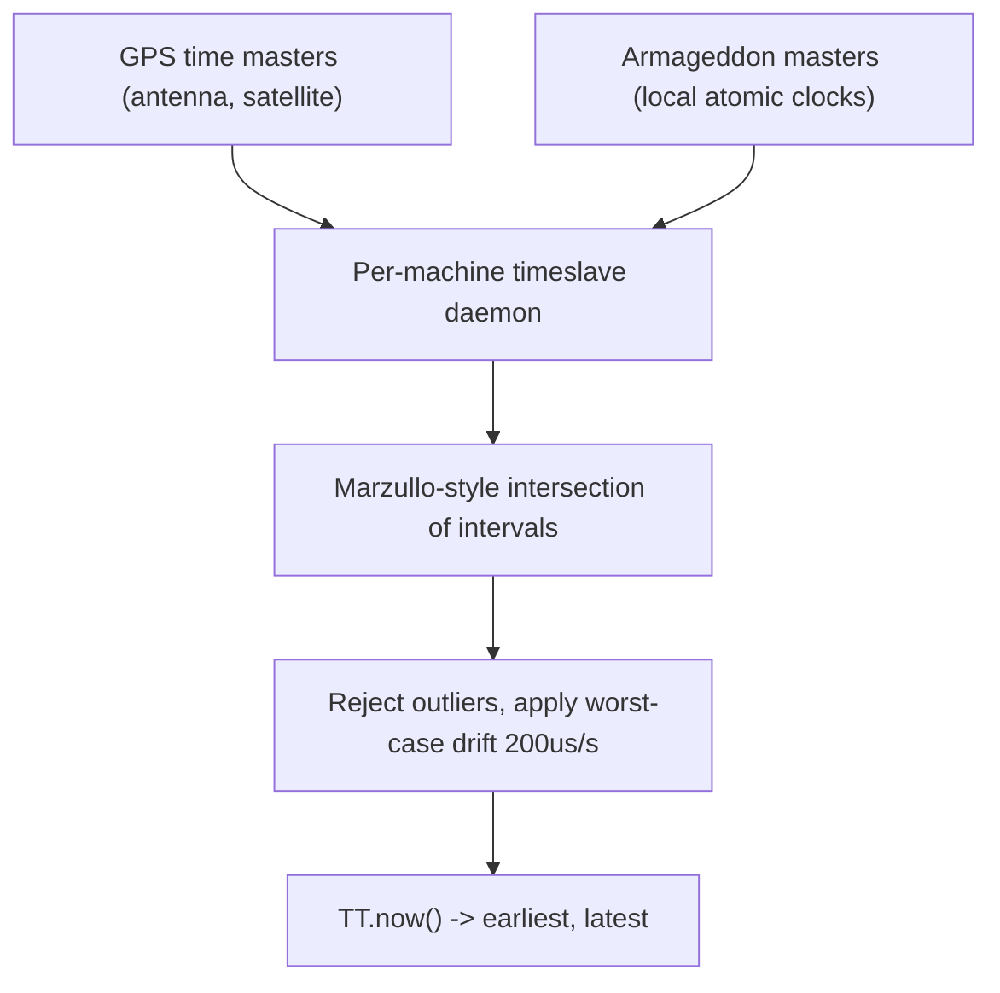
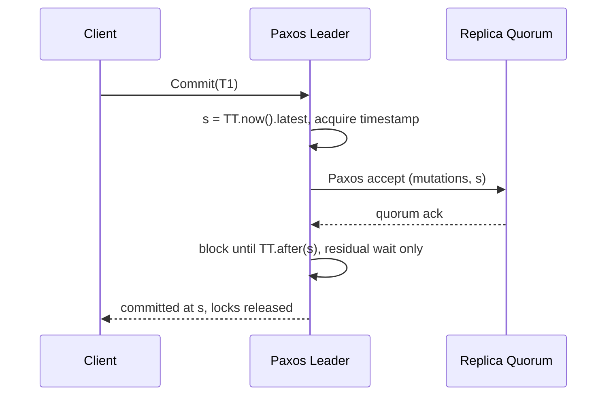

Diğer tüm saat API'leri eksiltme yoluyla yalan söyler: `clock_gettime` bir an döndürür ve ne kadar yanlış olduğuna dair hiçbir şey söylemez. TrueTime bir aralık döndürür, `[earliest, latest]`, ve gerçek zamanın bu aralığın içinde olduğunu garanti eder. Mühendislik sonucu NTP tabanlı her tasarımın tam tersidir: Spanner hatanın yok sayılacak kadar küçük olmasını ummak yerine hatayı birinci sınıf bir girdi yapar ve bedelini nadir, açıklanamayan sıralama anomalileriyle değil, açık ve ölçülebilir yazma gecikmesiyle öder.
 
## API ve Garanti Ettiği Şey
 
TrueTime üç işlem sunar:
 
- `TT.now()`, `earliest <= t_abs <= latest` koşulunu sağladığı garanti edilen mutlak zamanla birlikte `[earliest, latest]` döndürür.
- `TT.after(t)`, `t` kanıtlanabilir biçimde geçmişteyse, yani `t < earliest` ise doğrudur.
- `TT.before(t)`, `t` kanıtlanabilir biçimde gelecekteyse, yani `t > latest` ise doğrudur.
Yarı genişlik `eps = (latest - earliest) / 2` anlık belirsizliktir. Yayımlanan Spanner dağıtımında testere dişi bir eğri izler: bir zaman master yoklamasının hemen ardından yaklaşık 1ms, uygulanan en kötü durum kayma hızı olan saniyede 200 mikrosaniye ile büyür ve her 30 saniyede sıfırlanır; tepe değeri 7ms'ye yakın, ortalaması 4ms civarındadır. Bu sayılar tesadüfi değildir; her commit'e eklenen gecikmenin doğrudan çarpanıdırlar.
 
Sınır, ancak arkasındaki donanım kadar iyidir. Her veri merkezi iki bağımsız türde zaman master'ı çalıştırır, tam olarak hata modları ilintili olmadığı için:
 

*İlintisiz iki referans sınıfı, aday aralıkları kesiştiren, yalancıları eleyen ve sonucu son başarılı yoklamadan bu yana varsayılan kaymayla genişleten makine başına bir daemon'u besler.*
 
GPS; anten hasarı, radyo paraziti, spoofing ve alıcı hatalarıyla arızalanır. Atomik saatler ise osilatörleri bozulduktan sonra yavaş frekans kaymasıyla arızalanır ve bu, bir uydunun yaptığı hiçbir şeyle ilintili değildir. Daemon her ikisinden karışık yoklar, aralıkları çoğunlukla örtüşmeyen makineleri elemek için Marzullo tarzı aralık kesişimi uygular ve ardından kendi aralığını son yoklamadan bu yana biriken varsayılan kaymayla genişletir. Belirsizlik yoklamalar arasında monoton büyür; testere dişini yaratan budur ve tüm zaman master'larından kopan bir makineyi sessizce yanlış hale getirmek yerine giderek işe yaramaz hale getiren mekanizma da budur.
 
## Commit Wait: External Consistency'yi Gecikmeyle Satın Almak
 
External consistency, gerçek zamanda `T1` işlemi `T2` başlamadan önce commit ediyorsa `T1`'in zaman damgasının `T2`'ninkinden küçük olması garantisidir; ikisi ayrık veriye dokunup hiç haberleşmese bile. Hiçbir mantıksal saat bunu sağlayamaz, çünkü aralarında mesaj yoksa yayılacak bir `max` de yoktur. HLC de sağlayamaz; bkz. [Hibrit Mantıksal Saatler](/distributed-systems/tr/foundations/time-and-ordering/hybrid-logical-clocks/).
 
Spanner'ın protokolü iki kuraldır ve bütün numara ikincisindedir:
 
1. **Başlangıç kuralı.** Koordinatör commit zaman damgasını `s = TT.now().latest` olarak atar; bu, atama anındaki gerçek zamanda veya sonrasında olduğu garanti edilen bir değerdir.
2. **Commit wait.** Koordinatör, `TT.after(s)` doğru olana dek, yani `s` kanıtlanabilir biçimde geçmişte kalana dek kilitleri bırakmaz ve istemciye yanıt vermez.
Bu ikisi birlikte zaman damgası sırasının, görünür commit olaylarının gerçek zaman sırasıyla eşleşmesini sağlar. `T1`, `s1` geçmişte kalmadan yanıt veremez ve `T2` başlangıcındaki gerçek zamanın altında bir damga seçemez; dolayısıyla `T1`, `T2` başlamadan bittiğinde `s1 < s2` olur.
 

*Commit wait, Paxos replikasyonuyla eşzamanlı ilerler. Replikasyon `2 * eps` değerinden uzun sürerse kalan bekleme sıfırdır ve garanti bedavaya gelir.*
 
Bu örtüşme, "bu her yazıma 8ms ekliyor mu" sorusunun pratik cevabıdır. Beklenen bekleme kabaca `2 * eps`, yayımlanan testere dişinde 8 ila 10ms'dir; ancak veri merkezleri arası Paxos replikasyonu zaten benzer veya daha yüksek bir maliyet taşır. Bekleme yalnızca replikasyon hızlı olduğunda görünür hale gelir ki tek bölgeli dağıtımlarda çoğu zaman öyledir. Beklemenin örtüştüremediği şey kilit tutma süresidir: kilitler bekleme boyunca tutulur, dolayısıyla sıcak satırlardaki çekişme tam olarak belirsizlik penceresi kadar büyür. Tek bir sıcak anahtarı olan bir iş yükü, o anahtarda saniyede yaklaşık `1 / (2 * eps)` işlemle sınırlanır.
 
Salt okunur işlemler hiçbir bedel ödemez. Bir zaman damgası atanır ve güvenli zamanı o damganın ötesine geçmiş herhangi bir replikadan sunulurlar; kilit almazlar ve hiçbir yazıcıyı bloke etmezler. Bu asimetri tasarımın asıl getirisidir: external consistency'nin tüm maliyeti yazımlara itilir ve okumalar, seçilen bir zaman noktasında kilitsiz snapshot okumalarına dönüşür.
 
## Uygulamanın Biçimi
 
```go
package spanner
 
import (
	"context"
	"errors"
	"fmt"
	"time"
)
 
// Interval is the TrueTime return value. True time is guaranteed to fall
// within [Earliest, Latest]; no narrower claim may be made anywhere.
type Interval struct {
	Earliest time.Time
	Latest   time.Time
}
 
func (i Interval) Epsilon() time.Duration { return i.Latest.Sub(i.Earliest) / 2 }
 
// After reports TT.after(t): t is provably in the past.
func (i Interval) After(t time.Time) bool { return i.Earliest.After(t) }
 
type TrueTime interface {
	Now(ctx context.Context) (Interval, error)
}
 
var ErrClockUncertainty = errors.New("spanner: uncertainty exceeds budget")
 
// CommitAt implements the start rule plus commit wait. replicate must return
// only after the mutation is durable on a quorum at timestamp s.
func CommitAt(
	ctx context.Context,
	tt TrueTime,
	budget time.Duration,
	replicate func(context.Context, time.Time) error,
) (time.Time, error) {
	iv, err := tt.Now(ctx)
	if err != nil {
		// No bound means no timestamp may be assigned. Failing the commit
		// is correct; guessing is how external consistency is lost.
		return time.Time{}, fmt.Errorf("spanner: truetime unavailable: %w", err)
	}
	if eps := iv.Epsilon(); eps > budget {
		// A widening interval means the time masters are unreachable or a
		// local oscillator is suspect. Resign leadership rather than serve
		// commits whose wait would exceed the latency SLO.
		return time.Time{}, fmt.Errorf("%w: eps=%s budget=%s", ErrClockUncertainty, eps, budget)
	}
 
	s := iv.Latest
 
	// Replication overlaps the wait. Both must complete before the ack.
	if err := replicate(ctx, s); err != nil {
		return time.Time{}, fmt.Errorf("spanner: replicate at %s: %w", s, err)
	}
 
	for {
		cur, err := tt.Now(ctx)
		if err != nil {
			// Locks are still held here. The caller must abort and release.
			return time.Time{}, fmt.Errorf("spanner: truetime during commit wait: %w", err)
		}
		if cur.After(s) {
			return s, nil
		}
		remaining := s.Sub(cur.Earliest)
		select {
		case <-ctx.Done():
			return time.Time{}, ctx.Err()
		case <-time.After(remaining):
		}
	}
}
```
 
Tasarımı taşıyan şey hata yollarıdır. Bir sınır elde edemeyen commit, çıplak bir saat okumasına düşmek yerine başarısız olmalıdır; `eps` değeri bütçeyi aşmış bir lider ise yavaş commit sunmak yerine liderliği bırakmalıdır, çünkü büyüyen bir `eps` yalnızca bir gecikme sorununun değil, bir zaman kaynağı sorununun kanıtıdır.
 
## Yalnızca Yazılımla Yapılan Tasarımlarla Karşılaştırma
 
| Boyut | TrueTime artı commit wait | HLC artı belirsizlik yeniden başlatmaları | NTP duvar saati artı LWW |
|---|---|---|---|
| External consistency | Evet | Hayır | Hayır |
| Yazma gecikmesi maliyeti | `2 * eps`, replikasyonla örtüşür | Yok | Yok |
| Okuma maliyeti | Kilitsiz snapshot okumaları | Pencereye düşen değerde yeniden başlatma | Yok |
| Sıcak anahtar verimi | Kilit tutma artı beklemeyle sınırlı | Yeniden başlatma oranıyla sınırlı | Sınırsız, yanlış |
| Donanım gereksinimi | GPS ve atomik zaman master'ları | Standart NTP | Standart NTP |
| Saat kaymasında davranış | Gecikme artar, doğruluk korunur | Yeniden başlatma artar, doğruluk korunur | Sessiz güncelleme kaybı |
| Ne zaman tercih edilir | Doğruluğun sözleşmesel olduğu bölgeler arası serileştirilebilir iş yükleri | Sıradan altyapı, yeniden başlatmaya toleranslı iş yükleri | Sıralama için asla |
 
En önemli satır sondan bir önceki hata satırıdır. Üç tasarım da saat kayması altında bozulur; yalnızca ilk ikisi operatörün bir dashboard'da görebileceği yönde bozulur. Spanner'ı dağıtabiliyor olun ya da olmayın, ondan çıkarılacak genel ilke budur: saat hatasını gecikmeye veya yeniden denemeye çevirin, asla sessiz ayrışmaya değil.
 
Sıradan donanımda eşdeğerleri artık mevcut. Amazon Time Sync ile ClockBound, standart EC2 makineleri üzerinde bir hata aralığı sunar ve aynı commit-wait kurgusu bunun üzerine uygulanabilir. TrueTime'ı 2012'de yalnızca Google'a özgü kılan donanım hendeği büyük ölçüde aşındı; protokol tasarımı aşınmadı.
 
## Hata Modları ve Operasyonel Tuzaklar
 
**Zaman master partition'ı `eps` değerini doğrusal şişirir.** Tüm master'larını kaybeden bir makine hizmet vermeye devam eder ve aralığı saniyede 200 mikrosaniye genişler. Beş dakika sonra `eps` 60ms'dir ve commit wait her yazıma hakim olur; bir saat sonra düğüm kullanılamaz. Belirti: yükte hiçbir değişiklik olmadan düzgün biçimde tırmanan ve tek bir zone ile ilintili p99 yazma gecikmesi. Tespit: `eps` değerinin kendisini gauge olarak dışa verin ve değerine değil eğimine alarm kurun. Kurtarma: düğümü liderlikten çıkarın, üzerinden hizmet vermeyi denemeyin.
 
:::danger
Commit wait'i atlamak veya istemciye `TT.after(s)` doğru olmadan yanıt vermek, tüm fonksiyonel testleri geçen ve external consistency'yi yalnızca eşzamanlı, partition'lar arası iş yükleri altında ihlal eden bir sistem üretir. Ne hata, ne log satırı, ne metrik vardır. Anomali, bir istemcinin nedensel olarak daha önceki `T1` henüz görünür değilken `T2`'yi gözlemlemesi olarak yüzeye çıkar ve tipik olarak aylar sonra tekrarlanamayan bir destek kaydı olarak bildirilir.
:::
 
**TrueTime'ın mutabakat ihtiyacını ortadan kaldırdığını sanmak.** Zaman damgaları işlemleri sıralar; onları replike etmez, lider seçmez. Spanner hâlâ shard başına Paxos çalıştırır ve tüm dayanıklılık ile erişilebilirlik özellikleri saatten değil ondan gelir. Mutabakatı senkronize saatlerle değiştiren bir tasarım, kanıtlanmış bir anlaşma protokolünü donanım hakkındaki bir varsayımla değiştirmiştir.
 
**İlintili zaman kaynağı arızası.** Yalnızca GPS master'ları kurmak veya tüm atomik referansları tek bir üretici partisinden almak, tüm yedeklilik argümanını çürütür. GPS spoofing, ortak bir kanaldan geçen anten kablosunun kopması ve tek bir alıcı modelindeki firmware hatası; hepsi çok sayıda master'ı birlikte kaydırabilecek tekil olaylardır. Marzullo kesişimi ancak dürüst çoğunluk gerçekten bağımsızsa aykırıları eler.
 
**Artık saniye politikası uyuşmazlığı.** Bir kısmı smear eden, bir kısmı adım atan bir filo, smear penceresi boyunca bir saniyeye varan uyuşmazlık yaşar. Garanti gerçek zamanı içeren bir aralık olduğundan, adım atan bir makinenin aralığı kısa süreliğine sadece geniş değil yanlış olur; bu, garantiyi bozmak yerine ihlal etmektir. Burada filo genelinde politika birliği hijyen değil doğruluk gereksinimidir.
 
**Sıcak anahtarların beklemeyle çarpışması.** Kilitler bekleme boyunca tutulduğu için, tek artan sayaç satırı olan kuyruk benzeri bir tablo yaklaşık `1 / (2 * eps)` hızında serileşir. Çözüm saat ayarı değil, çekişmeli satırın uygulama düzeyinde sharding'idir; gerçekçi hiçbir `eps` değeri tek satırlık bir hot spot'u hızlandırmaz.
 
**`latest` okuyup onu zaman sanmak.** API'yi çağırıp aralığın yalnızca bir ucunu kullanan uygulama kodu, API'nin ortadan kaldırmak için var olduğu yalanı geri getirmiştir. Bir TrueTime değeriyle yapılan her karşılaştırma, ikisi de muhafazakar olan `After` veya `Before` olmalıdır; `earliest` veya `latest` ile doğrudan karşılaştırma, API'nin hiç yapmadığı bir iddiadır.
 
## Ne Zaman Kullanmalı, Ne Zaman Kullanmamalı
 
Sıralama garantisinin sözleşmesel olduğu yerlerde aralık tabanlı zaman kullanın: bölgelere yayılan finansal defterler, bir denetçinin iki işlemi dışarıdan gözlemleyip kayıtlı sıralarının eşleşmesini talep edebildiği sistemler ve küresel bir sequencer olmadan serileştirilebilir okuma sunan çok bölgeli veritabanları. Okumaların baskın olduğu ve seçilen bir zaman damgasında kilitsiz tutarlı snapshot istediğiniz yerde kullanın; tasarımın maliyet yapısı orada kendini amorti eder. Ve saat hatasının şu anda sessiz anomaliler olarak tezahür ettiği her sistemde, an yerine hata sınırı sunma desenini kullanın.
 
Shard başına tek Paxos lideri olan tek bölgeli bir dağıtım size sıfır saat maliyetiyle zaten tam sıralama veriyorsa benimsemeyin; log konumu daha güçlü ve daha ucuzdur. Küçük bir anahtar kümesindeki çekişmenin baskın olduğu iş yükleri için benimsemeyin; orada bağlayıcı kısıt kilit tutma süresinin uzamasıdır. Operasyonel donanım olmadan, yani yedekli bağımsız zaman kaynakları, izlenen bir sinyal olarak `eps` ve otomatik liderlik bırakma politikası olmadan benimsemeyin; çünkü algoritmanın güvenlik argümanı bir donanım argümanıdır. Spanner'ın saatin ötesindeki replikasyon ve işlem makinesi için bkz. [Spanner: TrueTime, Paxos Grupları ve External Consistency](/distributed-systems/tr/case-studies/distributed-sql/spanner-architecture/).