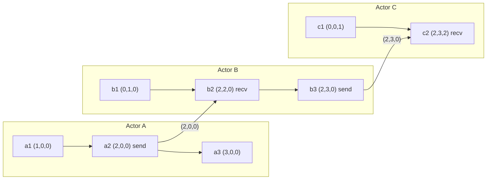

Vektör saat, Lamport zaman damgasının tek sayacını aktör başına bir sayaçla değiştirir ve garantiyi tek yönlü çıkarımdan denkliğe yükseltir: `VC(a) < VC(b)` **ancak ve ancak** `a -> b` olduğunda geçerlidir. Karşılaştırılamaz vektörler olayların eşzamanlı olduğu anlamına gelir ve bu, hiçbir skalerin taşıyamayacağı bir bilgidir. Bedeli olay veya versiyon başına `O(N)` meta veridir; üretimde vektör saatlerin bütün mühendislik zorluğu da algoritma değil, neyin aktör sayılacağı sorusudur, çünkü bu seçim `N`'i belirler ve meta verinin sınırlı kalıp kalmayacağına karar verir.
 
## Algoritma ve Karşılaştırma Kuralları
 
Her `p` aktörü, aktör ID'siyle indekslenen ve bulunmayan girdileri sıfır sayılan bir `V_p` vektörü tutar. İki kural onu korur:
 
- **Yerel olay veya gönderim.** `V_p[p] = V_p[p] + 1` yapılır, ardından `V_p`'nin bir kopyası mesaja iliştirilir.
- **`W` taşıyan bir mesajın alımı.** Her `k` için `V_p[k] = max(V_p[k], W[k])` uygulanır, sonra `V_p[p] = V_p[p] + 1`.
Kendi girdisini yalnızca aktörün kendisi artırabilir; diğer tüm girdiler saf noktasal `max` ile hareket eder. Bu asimetri, her girdiyi "`k` aktöründen en az bu kadar olay gözlemledim" biçiminde doğru bir ifadeye dönüştürür ve karşılaştırmanın sömürdüğü şey tam olarak budur.
 
`U` ve `V` vektörleri verildiğinde dört durumdan tam olarak biri geçerlidir:
 
| İlişki | Test | Anlamı |
|---|---|---|
| `U == V` | Tüm girdiler eşit | Aynı olay veya birebir aynı nedensel geçmiş |
| `U < V` | Her girdi için `U[k] <= V[k]`, en az birinde katı | `U` damgalı olay `V` damgalı olaydan önce gerçekleşti |
| `U > V` | Simetrik | Ters nedensel sıra |
| `U \|\| V` | Bir `k` için `U[k] > V[k]`, bir `j` için `U[j] < V[j]` | Eşzamanlı: hiçbiri diğerini gözlemlememiş |
 
Vektörlerin bedelini ödemenin tek sebebi dördüncü durumdur. İki boolean bayrak kuran tek bir geçişle tespit edilir; her iki bayrak da kurulduğunda erken çıkışla karşılaştırma `O(N)`'dir.
 

*Vektörler (A,B,C) sırasıyla. `a2 -> c2` geçerlidir çünkü `(2,0,0)` bileşen bazında `(2,3,2)` tarafından domine edilir. `a3 (3,0,0)` ile `b3 (2,3,0)` eşzamanlıdır: A kendi girdisinde, B kendi girdisinde öndedir.*
 
Skaler bir Lamport saati `a3` ile `b3` olaylarını `3 < 5` diye sıralayacakken vektör bu ayrımı korur, çünkü B, A'nın üçüncü olayını hiç gözlemlememiştir ve B'nin vektöründeki A girdisi bunu söylemek için `2` değerinde kalır.
 
## Kimlik Problemi: Aktör Kimdir?
 
`N`, kümedeki düğüm sayısı değildir. Kendi girdisini artırmasına izin verilen varlıkların sayısıdır ve bu kümeyi yanlış seçmek, vektör saatlerin üretimde çökmesinin en yaygın tek sebebidir.
 
- **Süreç başına vektör saat.** Aktörler süreçlerdir; vektör mesaj tesliminin nedensel geçmişini izler. Nedensel broadcast ve tutarlı anlık görüntülerde kullanılır. `N` süreç sayısıyla sınırlıdır ama vektörün her mesaja iliştirilmesi gerekir.
- **Anahtar başına version vector.** Aktörler o anahtarın replikalarıdır ve vektör mesajları değil, depodaki versiyonları etiketler. `N` replikasyon faktörüdür, tipik olarak üç ila beş; dolayısıyla meta veri küçük ve sabittir. Dynamo tarzı depoların gerçekten istediği budur.
- **Dotted version vector.** Bir version vector artı, o belirli yazma olayını tanımlayan tek `(aktör, sayaç)` çifti olan **dot**; yazıcının okumuş olduğu nedensel bağlamdan ayrı tutulur. Dot olmadan, aynı istemcinin farklı koordinatörler üzerinden yaptığı iki ardışık yazım, eşzamanlı yazımlardan ayırt edilemez ve her yazım yeni bir sibling doğurur.
Pratikte çarpılan duvar, istemcileri aktör saymaktır. Tek bir anahtara yazan on bin istemci on bin girdili bir vektör üretir ve istemciler gelip gittiği için vektör sınırsız büyürken etiketlediği değer büyümez. Çözüm bir ayar parametresi değil yapısaldır: aktör kimliğini sunucu tarafına taşıyın ve istemci başına yazım sıralamasını korumak için dot kullanın.
 
## Uygulama
 
```go
package vclock
 
import (
	"errors"
	"fmt"
)
 
// Clock maps an actor ID to its event counter. A missing key means zero, so
// the sparse encoding costs nothing for actors that never wrote.
type Clock map[string]uint64
 
// Ordering is the result of comparing two clocks.
type Ordering int
 
const (
	Equal Ordering = iota
	Before
	After
	Concurrent
)
 
// Compare decides the happened-before relation exactly. One pass over the
// union of keys, with an early exit once both directions are witnessed.
func Compare(u, v Clock) Ordering {
	var uAhead, vAhead bool
	for k, a := range u {
		if a > v[k] {
			uAhead = true
			break
		}
	}
	for k, b := range v {
		if b > u[k] {
			vAhead = true
			break
		}
	}
	switch {
	case uAhead && vAhead:
		return Concurrent
	case uAhead:
		return After
	case vAhead:
		return Before
	default:
		return Equal
	}
}
 
// Merge returns the pointwise maximum, the least upper bound of both causal
// histories. Neither input is mutated.
func Merge(u, v Clock) Clock {
	out := make(Clock, len(u)+len(v))
	for k, a := range u {
		out[k] = a
	}
	for k, b := range v {
		if b > out[k] {
			out[k] = b
		}
	}
	return out
}
 
// Actor is an identity plus an incarnation. Reusing a bare ID after a state
// loss moves counters backwards and silently corrupts every comparison.
type Actor struct {
	ID          string
	Incarnation uint64
}
 
func (a Actor) Key() string { return fmt.Sprintf("%s.%d", a.ID, a.Incarnation) }
 
var ErrCounterRegression = errors.New("vclock: counter regression for actor")
 
// Advance applies a local write. The regression check catches restored
// backups and reused identities before they can produce false ordering.
func Advance(c Clock, self Actor, lastKnown uint64) (Clock, error) {
	cur := c[self.Key()]
	if cur < lastKnown {
		return nil, fmt.Errorf("%w: %s at %d, durable state at %d",
			ErrCounterRegression, self.Key(), cur, lastKnown)
	}
	out := make(Clock, len(c)+1)
	for k, n := range c {
		out[k] = n
	}
	out[self.Key()] = cur + 1
	return out, nil
}
 
// Prune drops entries that every replica has already observed, as reported
// by watermark. Dropping anything else can turn a concurrent pair into an
// ordered one, which is silent data loss rather than a spurious conflict.
func Prune(c Clock, watermark Clock) Clock {
	out := make(Clock, len(c))
	for k, n := range c {
		if w, ok := watermark[k]; ok && n <= w {
			continue
		}
		out[k] = n
	}
	return out
}
```
 
`Compare`, sibling uzlaştırması gerektiren her okumanın sıcak yoludur ve biçimi önemlidir. Yoğun bir dizi yerine anahtar kümelerinin birleşimi üzerinde dönmek, aktörlerin çoğunun belirli bir anahtara hiç dokunmadığı durumda version vector'ı ucuz tutan şeydir. `k` boyutundaki bir sibling kümesini uzlaştırmak en kötü durumda `O(k^2 * N)`'dir; bu `k = 3` için sorunsuz, `k = 500` için patolojiktir.
 
## Hata Modları ve Operasyonel Tuzaklar
 
**Aktör kimliğinin yeniden kullanımı.** Durumunu kaybedip aynı ID ile kümeye dönen bir replika, kendi girdisini sıfırdan başlatır. O girdi için daha yüksek bir değer tutan eşler artık bu replikanın yeni yazımlarını domine eder; dolayısıyla o yazımlar eskimiş sayılıp merge sırasında düşürülür. Belirti, yazımları normal kabul eden, istemcilere başarı dönen, ama verisi hiçbir read repair'den sağ çıkmayan bir düğümdür. Yukarıdaki `Incarnation` alanı çözümdür: kalıcı durum sağ çıkmadıysa kimlik değişmek zorundadır. Bir replikayı snapshot'tan geri yüklemek de birebir aynı tehlikeyi taşır.
 
:::danger
Girdileri yaşa veya boyut sınırına göre budamak, eşzamanlı bir çifti görünüşte sıralı bir çifte dönüştürebilir; merge o zaman gerçek bir güncellemeyi hatasız atar. Riak'in klasik vektör saat budaması bu özelliği taşıyordu ve sınırlı, replika kapsamlı aktörlere sahip dotted version vector'ların onun yerini almasının sebeplerinden biri budur. Yalnızca küme genelindeki bir watermark tarafından domine edilen girdileri budayın ya da hiç budamayın.
:::
 
**Sibling patlaması.** Çakışmada sibling dönen bir depoda, okuduğu nedensel bağlamı geri yansıtmadan yazan bir istemci sisteme "hiçbir şey gözlemlemedim" demiş olur; dolayısıyla her yazımı önceki her yazımla eşzamanlıdır. Sibling sayısı o anahtarın istek hızıyla doğrusal büyür, okuma gecikmesi sibling sayısıyla artar ve nesne eninde sonunda azami değer boyutunu aşar. Tespit: p99'da okuma başına sibling metriği ve küçük bir sabiti aşan her anahtar için alarm. Kurtarma: tüm sibling'leri birleştiren uzlaştırıcı bir yazım zorlayın, ardından bağlamı gidiş-dönüş taşıması için istemciyi düzeltin.
 
**Meta verinin yükü gölgede bırakması.** Bin girdili bir vektör, yüz bayt olabilecek bir değeri etiketleyen onlarca kilobaytlık aktör ID'si ve sayaç demektir. Belirti; depolama amplifikasyonu, ağ egress büyümesi ve istek hızından daha hızlı yükselen deserialization CPU'sudur. Tasarımın uygulanamaz olduğuna karar vermeden önce aktör ID'lerini küme başına bir sözlükte internleyin ve sayaçları varint olarak kodlayın; ancak `N` tasarım gereği sınırsızsa yalnızca aktör kimliğini yeniden kapsamlandırmak işe yarar.
 
**Eşzamanlılık tespitini çakışma çözümü sanmak.** Vektör saat iki versiyonun eşzamanlı olduğunu bildirir. Neyin değiştiğini veya değerlerin nasıl birleştirileceğini söylemez ve bunun genel geçer doğru bir cevabı yoktur. Ya sibling'leri uygulamaya yüzeye çıkarın ya da merge işlemi değişmeli, birleşmeli ve idempotent olacak şekilde tanımlanmış bir veri tipi kullanın; bkz. [CRDT'ler](/distributed-systems/tr/data-management/consistency-models/crdts/).
 
**Tam sıralama olduğunu varsaymak.** Versiyonları vektör saate göre sıralamak tanımsızdır, çünkü sıralama kısmidir. Vektörleri karşılaştırma tabanlı bir sort'a besleyen kod, girdi sırasına göre farklı sonuçlar üretir ve bunu denetleyen dillerde sort'un kendi sözleşmesini ihlal edebilir. Gösterim için eşitliği bozulmuş bir Lamport değerine göre sıralayın, vektörü yalnızca ikili karara ayırın.
 
**Saat karşılaştırmasını yanlış katmanda yapmak.** Vektörleri API gateway'de veya istemci SDK'sında, yani kodun tüm sibling kümesine sahip olmadığı yerde karşılaştırmak, ikili düzeyde doğru ama küresel düzeyde yanlış bir cevap verir: karşılıklı olarak eşzamanlı üç versiyonun maksimumu yoktur, dolayısıyla çiftler üzerinde dönen her "daha yenisini seç" döngüsü, iterasyon sırasına bağlı olarak veri atar.
 
## Ne Zaman Kullanmalı, Ne Zaman Kullanmamalı
 
Eşzamanlı yazımların sessizce çözülmesi değil tespit edilmesi gerektiğinde vektör saat kullanın: leaderless veya multi-leader replikasyon, yeniden bağlandığında uzlaşan offline-first istemciler, ortak durum ve bir güncellemeyi kaybetmenin doğruluk hatası olduğu alışveriş sepeti benzeri nesneler. Karşılaştırmanın depolamayı değil tamponlamayı sürdüğü nedensel teslim veya nedensel tutarlı anlık görüntülere ihtiyacınız olduğunda kullanın. Aktör kümesi sınırlı ve sunucu tarafında olduğunda kullanın; pratikte bu, bir anahtarın replikalarıyla kapsamlanmış version vector demektir.
 
Partition başına tek lider yazımları zaten tam sıralıyorsa kullanmayın; log offset'i kesinlikle daha güçlüdür ve tek bir tam sayıya mal olur. Uygulamanın çakışma politikası gerçekten last-write-wins ise ve ara sıra kaybolan bir güncelleme kabul edilebilirse kullanmayın; sonra atacağınız bir ayrımı hesaplamak için `O(N)` meta veri ödemiş olursunuz. Eskimiş aktörleri reddetmek için kullanmayın; orada skaler bir epoch yeterli ve daha ucuzdur, bkz. [Lamport Zaman Damgaları](/distributed-systems/tr/foundations/time-and-ordering/lamport-timestamps/). Ve zaman damgalarının saklama, TTL veya hata ayıklama için fiziksel zamanla da karşılaştırılabilir olması gereken yerlerde kullanmayın; [Hibrit Mantıksal Saatlerin](/distributed-systems/tr/foundations/time-and-ordering/hybrid-logical-clocks/) kapatmak için var olduğu boşluk budur.
 
Vektörlerin karar verdiği ilişki için [Happened-Before İlişkisi](/distributed-systems/tr/foundations/time-and-ordering/happened-before/) sayfasına, Dynamo tasarımının ve çakışma yönetiminin üretimdeki sonuçları için [Dynamo Makalesinde Vektör Saatler](/distributed-systems/tr/case-studies/dynamodb-cassandra/vector-clocks-conflict-resolution/) sayfasına bakın.